# ESP32-CAM module

## Physical drawing of the module

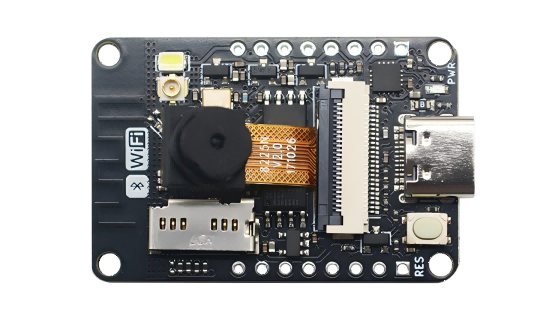

## Overview

ESP32-CAM V2 is a small-sized camera module developed based on the LeXin ESP32-DOWD-V3 chip. This module can work independently as the smallest system, with a size of only `27*40*4.5mm`.This product is developed based on the existing ESP32-CAM optimization on the market, which mainly solves the problems of the download program on the market, which needs to be connected to the bottom of the external download, huge heating, and instability. The size and functionality are fully compatible with existing ESP32-CAM, and there are a large number of tutorials available on the Internet for direct reference. 

## Motherboard parameters

- It uses Espressif's original ESP32-DOWD-V3 chip, on-board antenna and IPEX antenna mount
- The chip has a built-in 448 KB ROM, 520 KB SRAM, 4M SPI FLASH, and 2M PSRAM
- Type-C interface, USB to serial port chip is Qinheng's CH343P 
- Input voltage: 5V 1A
- On-board reset button
- Onboard micro-SD card slot
- The OV2640 camera supports 2 megapixels and has a built-in LED flash 
- Dimensions: 27mmx40mmx4.5mm

## Board dimensions

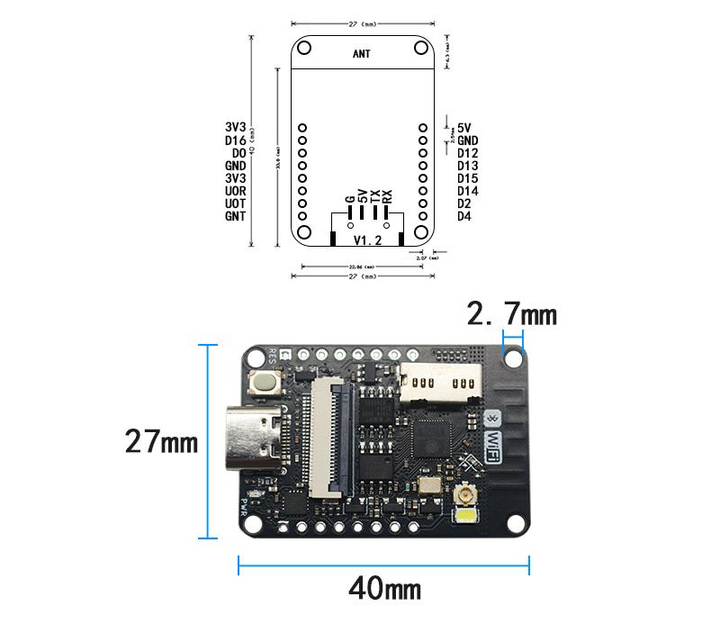

### [Schematic](zh-cn/esp32/ESP32_CAM/esp32-cam2.0.pdf)

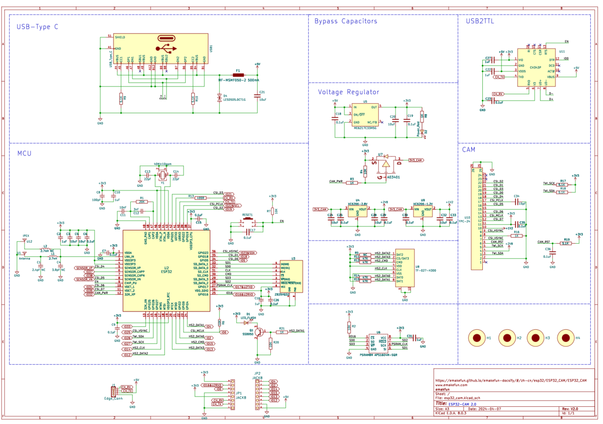

### Install the CH343P driver

[Click here to download the CH343P driver](https://www.wch.cn/downloads/CH343SER_EXE.html)

[Click here to find out how to install the driver]([CH343芯片应用—Windows驱动安装与使用_ch343驱动-CSDN博客](https://blog.csdn.net/wch_techgroup/article/details/124801135))

### Configure the board in Arduino

For details about how to upload an Arduino IDE, click [ESP32 Series Upload Program Methods](en/esp32/esp32_software_instructions/esp32_software_instructions.md)

After the installation is complete, you can select the corresponding development board:

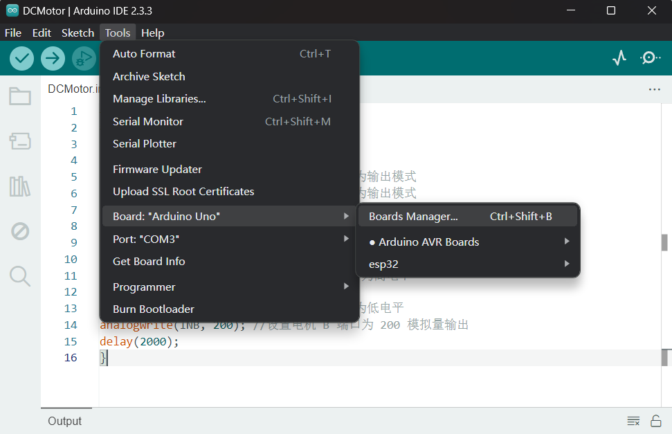

### Upload the sample program

\1. Connect the USB to serial port module to the computer, and then select the corresponding port in the serial port in the toolbar, if the port is not found, please check whether the driver is installed, or restart Arduino.

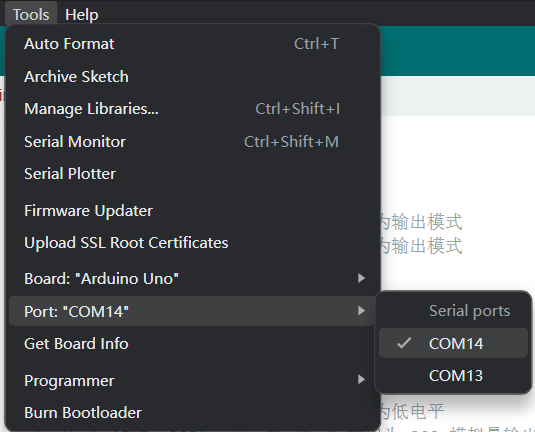

\2. Open the example routine CameraWebServer

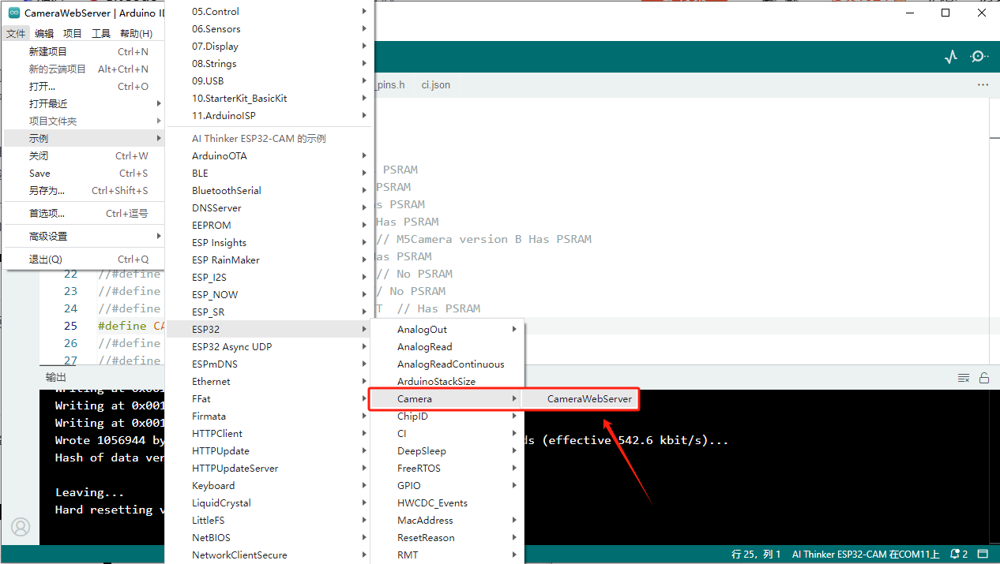

\3. Modify the code

**To uncomment the following macro definitions, you can comment out the other macro definitions (failure to do so will result in an error)**

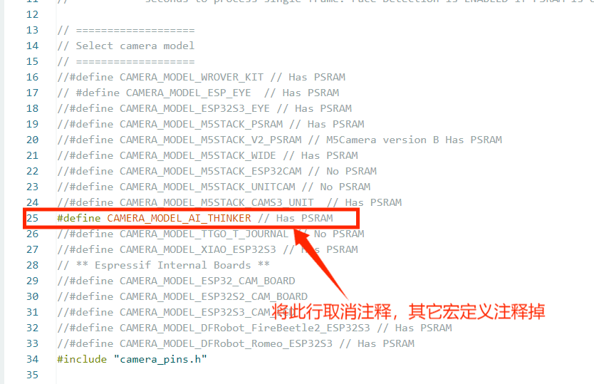

Then fill in the router information and upload the program.

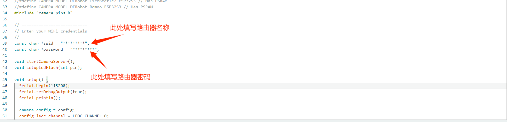

### Test the results

Open the serial port monitor, open the web page, and enter the following link to enter the camera debugging page.

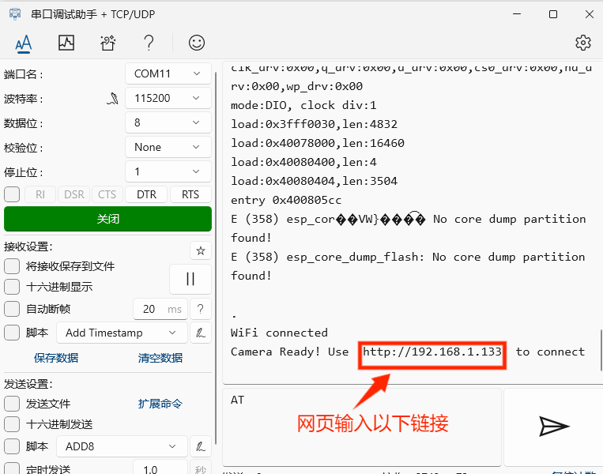

If the above information does not appear, you need to follow the above steps to compare them one by one.

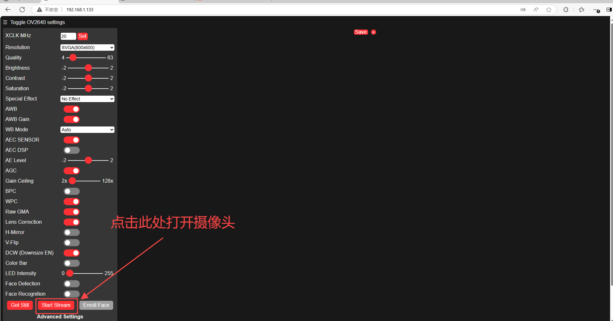

 Click Start Stream to open the camera parameters. 

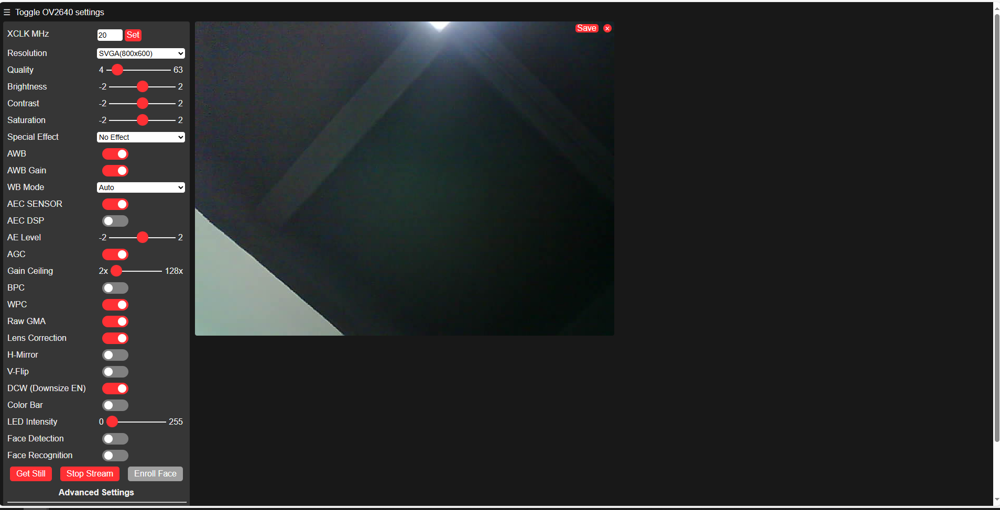

 

## Micropython applications

Direct access to ESP32-cam's open source project https://github.com/lemariva/micropython-camera-driver

## Edge Impuls AI Tutorial

## APP monitoring and control

Please contact customer service for the above information.