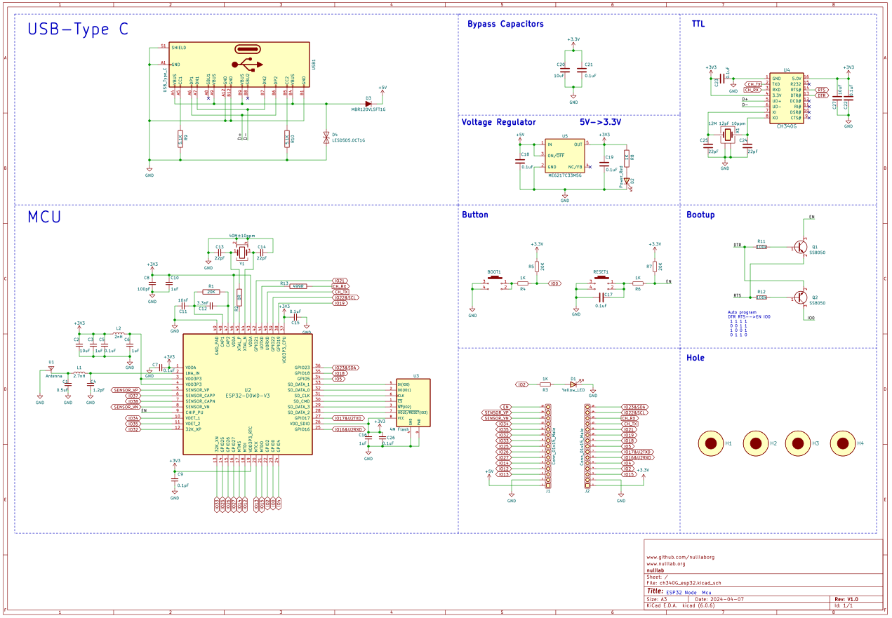

# ESP32 DevKit 32E Instructions

## 1. [Taobao purchase link](https://item.taobao.com/item.htm?ali_refid=a3_430582_1006:1209150026:N:bHry0KBYQUueXMqvQBLQ7A==:ae7ad87b821c162939f1053fd9a53067&ali_trackid=162_ae7ad87b821c162939f1053fd9a53067&id=778630577370&skuId=5318380828567&spm=a21n57.1.0.0)

## 2. Product introduction

The ESP32 DevKit 32E development board is based on the ESP32-DOWD-V3 chip developed by Lexin Technology, and is fully compatible with Node MCU products in terms of size and functionality. It is mainly designed to solve the problems of large heat generation, instability, and easy damage caused by the use of non original modules in the market.

### 2.1 Parameters of the main control chip

- 448 KB ROM，520 KB SRAM，16 KB RTC SRAM
- QSPI supports multiple flash/SRAM
- Built-in 8 MHz oscillator
- Self-calibration is supported
- Built-in RC oscillator supports self-calibration
- Supports external 2 MHz to 60 MHz main crystal oscillator (only 40 MHz crystal oscillator is currently supported if using Wi-Fi/Bluetooth function)
- Supports external 32 kHz crystal oscillator for RTC and supports self-calibration
- 2 timer groups, each consisting of 2 64-bit general-purpose timers and 1 master system watchdog
- 1 RTC timer
- RTC watchdog
- Ethernet MAC interface with dedicated DMA, IEEE 1588 support
- Two-Wire Automotive Interface (TWAI,® ISO11898-1 compatible) x IR (TX/RX)

### 2.2 Motherboard Parameters

- Espressif's original ESP32-DOWD-V3 chip is used, and the antenna is onboard
- The chip has a built-in 448 KB ROM, 520 KB SRAM, and an external 4M SPI FLASH
- Type-C interface, USB to serial port chip is Qinheng's CH340G
- Input voltage: 5V 1A
- M3 positioning hole diameter: 3mm
- On-board reset button and BOOT button
- 15pin-2.54mm pitch double row pins

### 2.3 Pin Description

The table below shows which pins are best used as inputs and outputs, and which ones need to be used cautiously.

| The name of the port | input     | output | Remarks information                                          |
| -------------------- | --------- | ------ | ------------------------------------------------------------ |
| 3.3V                 |           |        | 3.3V power output                                            |
| VIN                  |           |        | 5V power input                                               |
| GND                  |           |        | Power Ground                                                 |
| 0                    | pulled up | be     |                                                              |
| 1                    | TX Pin    | be     |                                                              |
| 2                    | be        | be     | Strapping pin, high level cannot enter the serial port download mode |
| 3                    | be        | RX Pin |                                                              |
| 4                    | be        | be     |                                                              |
| 5                    | be        | be     | The strapping pin is connected to a low level and cannot be burned |
| 6-11                 | not       | not    | Module integrated SPI flash cannot be used                   |
| 12-14，16-33         | be        | be     |                                                              |
| 15                   | be        | be     | U0TX Power-On Log Print 1: Print 0: Do Not Print             |
| 34-35                | be        | not    | There is only an input function                              |
| 36（VP）             | be        | not    | There is only an input function                              |
| 39（VN）             | be        | not    | There is only an input function                              |

- Pins 6, 7, 8, 9, 10, and 11 are not recommended to be used as inputs or outputs because they are occupied by SPI-FLASH.
- You can't use the ADC2 pins when using Wi-Fi. So, if you're using Wi-Fi and can't get values from the ADC2 GPIO, you might consider using the ADC1 GPIO instead.
- Enable (EN) is the enable pin of the 3.3V regulator. It was pulled up, so the ground disable the 3.3V regulator. This means that you can use that pin connected to the button to restart the ESP32.

### 2.4 <a href="en/esp32/esp32_devkit_32e/ch340G_esp32.pdf" target="_blank">Schematic</a>

## 2.5 Product Dimension Drawing

### 2.5 <a href="en/esp32/esp32_devkit_32e/ch340G_esp32_pico.step" target="_blank">Three-dimensional drawing of the product</a>

## 3. Install the ESP32 DevKit 32E driver

For details about how to install the driver, see this document: [Installing the CH340G Driver](en/driver/ch340_driver/ch340_driver.md)

## 4. ESP32 DevKit 32E download program

For details on how to upload programs on each platform, please refer to: [ESP32 Series Upload Program Methods](en/esp32/esp32_software_instructions/esp32_software_instructions.md)
