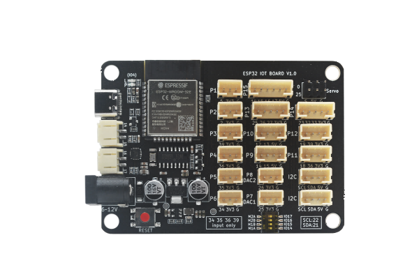
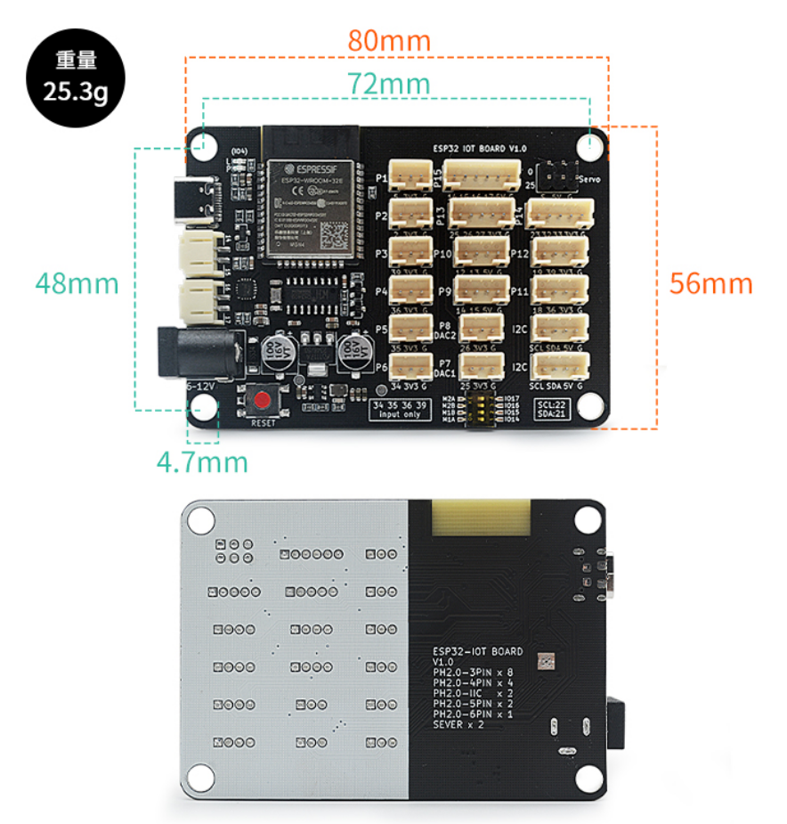

# ESP32-IOT-BOARD Instructions

## [1. Taobao purchase link](https://item.taobao.com/item.htm?ali_refid=a3_430582_1006:1209150026:N:bHry0KBYQUueXMqvQBLQ7A==:ae7ad87b821c162939f1053fd9a53067&ali_trackid=162_ae7ad87b821c162939f1053fd9a53067&id=778630577370&skuId=5318380828567&spm=a21n57.1.0.0)

## 2. Product introduction

The new product is being produced urgently, please wait. It is expected to be launched for sale in mid February 2025. The ESP32 IOT BOARD is based on Lexin Technology <a href="https://www.espressif.com/sites/default/files/documentation/esp32-wroom-32_datasheet_cn.pdf" target="_blank">ESP32-WROOM-32</a> A product developed based on the original module for maker education. The Flash is 4MB in size and integrates a single-chip solution with 2.4 GHz, Wi-Fi, and Bluetooth dual-mode. This motherboard is equipped with 2 AT8833 motor driver chips, with a maximum current of 1.2A. Supports DC head power supply, and all available pins are led out through PH2.0 interface, making it convenient to connect external sensors and build application scenarios.

### 2.1 Module Parameters

- 448 KB ROM,520 KB SRAM,16 KB RTC SRAM
- QSPI supports multiple flash/SRAM
- Built in 8 MHz oscillator
- Support self calibration
- Built in RC oscillator, supports self calibration
- Supports external main crystal oscillators ranging from 2 MHz to 60 MHz (currently only 40 MHz crystal oscillators are supported if Wi Fi/Bluetooth functionality is used)
- Supports external 32 kHz crystal oscillator for RTC, supports self calibration
- 2 timer groups, each consisting of 2 64 bit universal timers and 1 main system watchdog
- 1 RTC timer
- RTC watchdog
- 34 GPIO ports • 12 bit SAR ADC, up to 18 channels
- Ethernet MAC interface with dedicated DMA, supporting IEEE 1588
- Dual Line Automotive Interface (TWAI) ®， Compatible with ISO11898-1) • IR (TX/RX)

### 2.2 Main board parameters

- Adopting the original V3 version module ESP32-WROOM-32E from Lexin
- Using PH2.0 port to prevent reverse connection, which may cause component short circuit and burnout
- Burn port using Type-C interface
- Two DC motor ports (14 and 15, 16 and 17); The maximum current reaches 1.2A
- 2 I2C pin interfaces (SCL SDA 5V G)
- 2 servo motor interfaces (25,0)
- Input voltage: DC input 5.5-2.1mm 6-12V
- Product size: 80mm × 56mm; PCB thickness: 1.6mm; Net weight: 25.3g
- M4 positioning hole diameter: 4.7mm, compatible with Lego

### 2.3 Size Description

### 2.4 Pinouts

**Note**:

1. Motor and IO Switch: When the dip switch is turned to the IO port, the M1 and M2 motor ports do not work and cannot drive the motor. The pins are ordinary ports; When the dip switch is turned to M1A/M1B/M2A/M2B, M1 and M2 are motor ports that can drive the motor.
2. Power indicator light P.
3. The onboard LED light L (IO4) can be used for download detection.
4. The reset button can reset the motherboard.
5. Due to the characteristics of the ESP32 chip, pins 34, 35, 36, and 39 of the motherboard cannot be used as outputs in Arduino mode; And when pins 34, 35, 36, and 39 are used as inputs, the pull-up or pull-down mode cannot be set.

## 3. ESP32-IOT-BOARD Driver Installation

Please refer to this document for driver installation: [CH340G Driver Installation](en/driver/ch340_driver/ch340_driver.md)

## 4. ESP32-IOT-BOARD Upload Methods

This motherboard supports code programming using Arduino IDE, MicroPython, and other programming tools, as well as graphical programming such as Mixly and Mind+.

### 4.1 Download the program through Arduino IDE

Please refer to [esp32 series upload program method](en/esp32/esp32_software_instructions/esp32_software_instructions.md) for the upload methods of programs on various platforms

**Note**: when developing with Arduino IDE, please update esp32 to the latest version.

### FAQ

**Q**: Mixly failed to download the program?

**A**: the installation path of mixly should not contain special characters such as Chinese, spaces, etc; Put it under the root directory of the computer drive letter, and the hierarchical directory should not be too deep; For example, d:\mixly2.0-win32-x64 is the root directory installation;

1. check whether the serial port is selected correctly. If there is no serial port, please install the ch340g driver first; The serial port should not be occupied by other applications;
2. check whether there are errors in the procedure;

**Q**: the motor program is uploaded successfully, but the motor does not rotate?

**A**: The motor needs DC head power supply, 6-12V. It is recommended to use 7.4v lithium battery. Whether the power switch is turned on;

1. if the first step has been completed and there are still problems, please check whether the motor and IO switch is turned to the motor direction (i.e. the direction marked with on);
2. check whether the motor pin set by the program corresponds to the actual motor pin.
