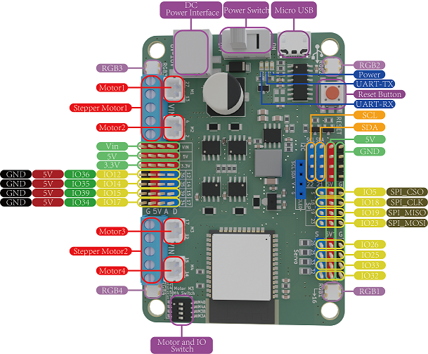

# Maker-ESP32 Instruction Manual

## [1. Taobao purchase link](https://item.taobao.com/item.htm?spm=a21dvs.23580594.0.0.3c3a3d0dhaSOlC&ft=t&id=688324885925)

## 2. Product Introduction

 Based on Espressif's [ESP32-WROOM-32](https://www.espressif.com/sites/default/files/documentation/esp32-wroom-32_datasheet_cn.pdf) module, the Maker-ESP32 is  a 4MB Flash and 2.4 GHz, Wi-Fi, and Bluetooth dual-mode single-chip solution. Using Toshiba's motor driver chip, the current can reach up to 3.5A. 

## 3. ESP32 module parameters

- 448 KB ROM,520 KB SRAM,16 KB RTC SRAM
- QSPI supports multiple flash/SRAM
- Built-in 8 MHz oscillator
- Self-calibration is supported
- Built-in RC oscillator supports self-calibration
- Supports external 2 MHz to 60 MHz main crystal oscillator (only 40 MHz crystal oscillator is currently supported if using Wi-Fi/Bluetooth function)
- Supports external 32 kHz crystal oscillator for RTC and supports self-calibration
- 2 timer groups, each consisting of 2 64-bit general-purpose timers and 1 master system watchdog
- 1 RTC timer
- RTC watchdog
- 34 GPIO ports • 12-bit SAR ADC with up to 18 channels
- Ethernet MAC interface with dedicated DMA, IEEE 1588 support
- Two-Wire Automotive Interface (TWAI,® ISO11898-1 compatible) • IR (TX/RX)

## 4. Product parameters

- 4 motor ports; 2 stepper motor ports; The maximum current is 3.5A
- Onboard 4 RGB lamps (16 pins)
- 5 x I2C pin connectors, 1 x SPI pin connector
- 4 servo interfaces (25, 26, 32, 33)
- 8 IO pins (12, 14, 15, 17, 34, 35, 36, 39)
- Input voltage: 6-16V
- Product size: 80mm×57mm; PCB thickness: 1.6mm, net weight: 35g
- M4 positioning hole diameter: 4.6mm, compatible with Lego
- The software supports Mixly, Arduino IDE, and Python

## 5. Pin Description

**Concentrate:**  

1. Motor and IO Switch: When the DIP switch hits the IO port, the M3 and M4 motor ports do not work and cannot drive the motor, and the pins are ordinary ports; When the DIP switch hits M3A/M3B/M4A/M4B, M3 and M4 are the motor ports, which can drive the motor.

2. Due to the characteristics of the ESP32 chip, pins 34, 35, 36, and 39 of the motherboard cannot be used as output under the Arduino framework; In addition, when pins 34, 35, 36, and 39 are used as inputs, the pull-up or pull-down mode cannot be set.

[Click to view the product schematic](en/esp32/maker_esp32/Esp32_V1.5.pdf)

[Click to view the 3D model diagram](en/esp32/maker_esp32/maker-esp32.step)

## 6. Install the Maker-ESP32 driver

For details about how to install the driver, see this document: [Installing the CH340G Driver](en/driver/ch340_driver/ch340_driver.md)

## 7. Maker-ESP32 Uploader Method

For details on how to upload programs on each platform, please refer to: [ESP32 Series Upload Program Methods](en/esp32/esp32_software_instructions/esp32_software_instructions.md)

**Note**: When developing with the Arduino IDE, please update esp32 to the latest version. 

## 8. Mixly sample program

[Click to download a sample program for the motor](en/esp32/maker_esp32/esp32_mixly/esp32_motor_test.zip)

[Click to download a sample program for RGB lights](en/esp32/maker_esp32/esp32_mixly/esp32_rgb_test.zip)

[Click to download the pilot example program](en/esp32/maker_esp32/esp32_mixly/esp32_servo_test.zip)

[Click to download the OLED sample program](en/esp32/maker_esp32/esp32_mixly/esp32_oled_test.zip)

[Click to download the comprehensive example program](en/esp32/maker_esp32/esp32_mixly/esp32_motor_servo_test.zip)

When the motor and servo are used together, do not use the motor drive block that comes with Mixly, but use the operation pin to control it, because when the servo motor is used together, the PWM pipe conflict of the drive block that comes with mixly belongs to the problem of the mixly software library itself.

[Click here to download a sample program for stepper motors](en/esp32/maker_esp32/esp32_mixly/esp32_stepper_test.zip)

Take the 28BYJ-48 stepper motor with Stepper1 interface as an example, and the wiring method is as follows:

| The color of the stepper motor line | Pins (silkscreened on the back of the motherboard) |
| :---------------------------------: | :------------------------------------------------: |
|               orange                |                        A01                         |
|                pink                 |                        A02                         |
|                 red                 |                        VIN                         |
|                blue                 |                        A03                         |
|               Yellow                |                        A04                         |

## 9. Arduino sample program

[Click here to download a sample program for the motor](en/esp32/maker_esp32/esp32_arduino/motorTest.zip)

[Click here to download a sample program for RGB lights](en/esp32/maker_esp32/esp32_arduino/rgbTest.zip)

[Click here to download a sample servo program](en/esp32/maker_esp32/esp32_arduino/servoTest.zip)

[Click here to download the OLED sample program](en/esp32/maker_esp32/esp32_arduino/oledTest.zip)

[Click here to download a comprehensive sample program for motor servos](en/esp32/maker_esp32/esp32_arduino/motorServotTest.zip)

[Click here to download a sample program for stepper motors](en/esp32/maker_esp32/esp32_arduino/stepperTest.zip)

Take the 28BYJ-48 stepper motor with Stepper1 interface as an example, the wiring method is as follows:

| The color of the stepper motor line | Pins (silkscreened on the back of the motherboard) |
| :---------------------------------: | :------------------------------------------------: |
|               orange                |                        A01                         |
|                pink                 |                        A02                         |
|                 red                 |                        VIN                         |
|                blue                 |                        A03                         |
|               Yellow                |                        A04                         |

## 10. The ESP32 series connects using the PS3 Bluetooth wireless controller

[Click here to view the ESP32 series connected using the PS3 Bluetooth wireless controller](en/peripheral/bluetooth_gamepad_ps3/bluetooth_gamepad_ps3.md)

[Click here to download the PS3 control motor servo case](en/esp32/maker_esp32/esp32_arduino/esp32PS3ControlTest.zip)

[Click to download the Mixly library PS3 controller](en/esp32/maker_esp32/esp32_mixly/esp32_emakefun_sensors_mixly.zip)

[Click here to download the PS3 controller Mixly sample](en/esp32/maker_esp32/esp32_mixly/esp32_ps3_rock_test.zip)

[Click here to download the PS3 controller Mind+ library](en/esp32/maker_esp32/esp32_mindplus/emakefun-ps3.zip)

[Click here to download the PS3 controller Mind+ sample](en/esp32/maker_esp32/esp32_mindplus/ps3_test.zip)

## Mind+ sample program

[Click here to download a sample program for the motor](en/esp32/maker_esp32/esp32_mindplus/esp32MindplusMotor.zip)

[Click here to download the Maker-esp32Mind+ library](en/esp32/maker_esp32/esp32_mindplus/emakefun-em_maker_esp32-thirdex-V0.0.2.mpext)

## FAQ

**Q**: The Mixly downloader is unsuccessful? 

**A**：1. The installation path of Mixly should not contain special characters such as Chinese and spaces; Put it in the root directory of the computer, and the hierarchical directory should not be too deep; For example, D:\mixly2.0-win32-x64 is the root directory installation; 

\2. Check whether the serial port is selected correctly, if there is no serial port, please install the CH340G driver first; The serial port should not be occupied by other applications;

\3. Check the program for errors;

**Q**: The motor program is uploaded successfully, but the motor does not rotate? 

**A**: 1. The motor needs DC head power supply, 6-24V, it is recommended to use two 3.7V lithium batteries, whether the power switch is on or not

\2. If the first step has been completed, and there is still a problem, please check whether the Motor and IO Switch switch is dialed to the direction of the motor (i.e. the direction marked ON);

\3. Check whether the motor pins set by the program correspond to the actual pins of the motor;
