# MAKER-ESP32-PRO Instruction Manual

## 1. Physical drawing of the module

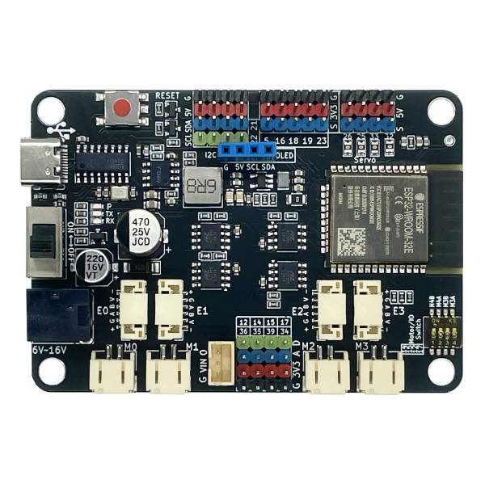

## 2. Overview

Based on Espressif's <a href="https://www.espressif.com/sites/default/files/documentation/esp32-wroom-32_datasheet_cn.pdf" target="_blank">ESP32-WROOM-32</a> module, the  MAKER-ESP32-PRO is  a 4MB flash and integrated 2.4 GHz, Wi-Fi, and Bluetooth dual-mode single-chip solution. There are 4 encoded motors and DC motors on board, the maximum driving current is 3A, and the encoded motor and DC motor are multiplexed with drive pins, that is, the same port, which cannot drive the encoded motor and DC motor at the same time.

## 3. ESP32 module parameters

- 448 KB ROM,520 KB SRAM,16 KB RTC SRAM
- QSPI supports multiple flash/SRAM
- Built-in 8 MHz oscillator
- Self-calibration is supported
- Built-in RC oscillator supports self-calibration
- Supports external 2 MHz to 60 MHz main crystal oscillator (only 40 MHz crystal oscillator is currently supported if using Wi-Fi/Bluetooth function)
- Supports external 32 kHz crystal oscillator for RTC and supports self-calibration
- 2 timer groups, each consisting of 2 64-bit general-purpose timers and 1 master system watchdog
- 1 RTC timer
- RTC watchdog
- 34 GPIO ports • 12-bit SAR ADC with up to 18 channels
- Ethernet MAC interface with dedicated DMA, IEEE 1588 support
- Two-Wire Automotive Interface (TWAI,® ISO11898-1 compatible) • IR (TX/RX)

## 4. Schematic

<a href="en/esp32/maker_esp32_pro/maker-esp32_pro.pdf" target="_blank">Click to view schematic</a>

## 5. Product parameters

- 4 coded motor ports (E0, E1, E2, E3); 4 DC motor ports (M0, M1, M2, M3) ports are multiplexed with coding motors; The maximum current is 3.5A
- where E0 (A: 18 B: 19 +: 27 -: 13), E1 (A: 5 B: 23 +: 4 -: 2), E2 (A: 35 B: 36 +: 17 -: 12), E3 (A: 34 B: 39 +: 15 -: 14)
- 5 x I2C pin connectors, 1 x SPI pin connector
- 4 servo interfaces (25, 26, 32, 33)
- 13 IO Pins (5, 12, 14, 15, 16, 17, 18, 19, 23, 34, 35, 36, 39)
- Input voltage: 6-16V
- Product size: 80mm×57mm; PCB thickness: 1.6mm, net weight: 35g
- M4 positioning hole diameter: 4.6mm, compatible with Lego
- The software supports Mixly, Arduino IDE, and Python

## 6. Pin Description

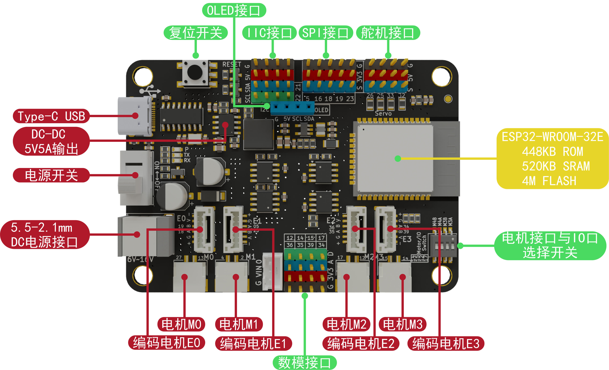

## 7. MAKER-ESP32-PRO driver installation

For details about how to install the driver, see this document: [Installing the CH340G Driver](en/driver/ch340_driver/ch340_driver.md)

## 8. How to use MAKER-ESP32-PRO Arduino, mixly, mind+

For details on how to use the programs on each platform, please refer to: [ESP32 Series Upload Program Methods](en/esp32/esp32_software_instructions/esp32_software_instructions.md)

**Note**: When developing with the Arduino IDE, please update esp32 to the latest version.

## 9. Mixly sample program

<a href="en/esp32/maker_esp32_pro/esp32_mixly/esp32_motor_servo_test.zip" download>Click here to download a sample program for motor servos</a>

<a href="en/esp32/maker_esp32_pro/esp32_mixly/esp32_servo_test.zip" download>Click here to download a sample servo program</a>

<a href="en/esp32/maker_esp32_pro/esp32_mixly/esp32_oled_test.zip" download>Click here to download the OLED sample program</a>

## 10. Mind+ sample program

   <a href="en/esp32/maker_esp32_pro/esp32_mindplus/esp32MindplusMotor.zip" download>Click here to download a sample program for the motor</a>

   <a href="en/esp32/maker_esp32_pro/esp32_mindplus/emakefun-em_maker_esp32-thirdex-V0.0.2.mpext" download>Click here to download the Maker-esp32Mind+ library</a>

## 11. Arduino sample program

<a href="en/esp32/maker_esp32_pro/esp32_arduino/servoTest.zip" download>Click here to download a sample servo program</a>

<a href="en/esp32/maker_esp32_pro/esp32_arduino/oledTest.zip" download>Click here to download the OLED sample program</a>

### Drive encoding motor and DC motor

<a href="https://emakefun-arduino-library.github.io/em_esp32_encoder_motor/html/zh-CN/index.html" target="_blank">Click here to view the coded motors as well as the DC motor library and sample programs</a>

Click on the link above to download the library file here

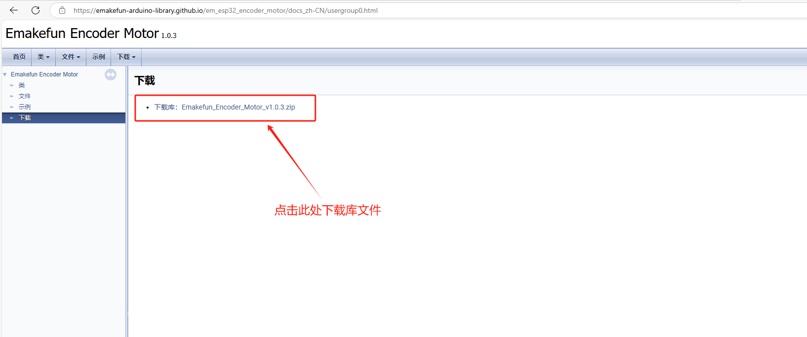

#### Example files of drive motors and descriptions of common functions

##### Sample file description ( [Emakefun Encoder Motor: Sample file](https://emakefun-arduino-library.github.io/em_esp32_encoder_motor/html/zh-CN/examples.html) )

Details can be found at the following locations of the above links:

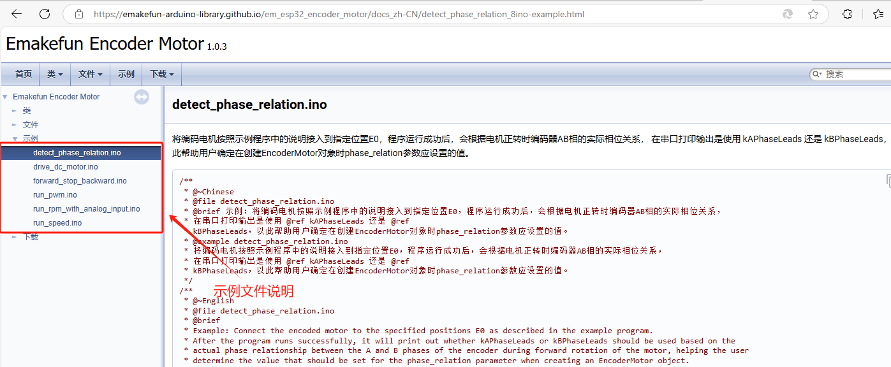

##### Descriptions of common functions ( [Emakefun Encoder Motor: Class Members - Functions](https://emakefun-arduino-library.github.io/em_esp32_encoder_motor/html/zh-CN/classem_1_1_encoder_motor.html#a69db8b9fc364d4d8f2509473d759ed0f) )

For more functions, please refer to the following locations linked above:

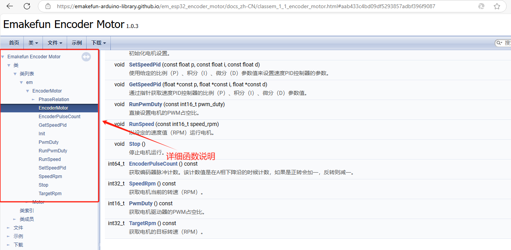

#### Use the Arduino IDE to debug the coded motor

##### Wiring instructions

Connect the signal cable of the encoded motor to the corresponding pin of the motor driver board, connect the external DC power supply, and connect the computer through the typeC interface. As shown in the figure below:

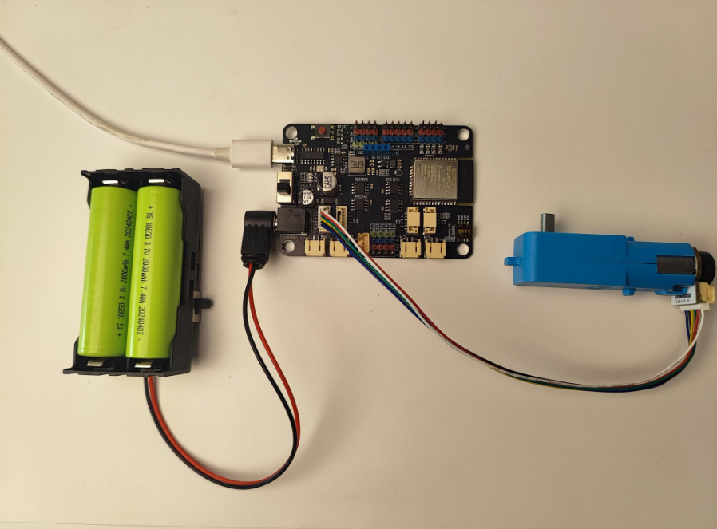

##### Add a library file

Open the Arduino IDE and click Project > Import Library > Add. ZIP library, select the downloaded library file, click Open, and then click OK.

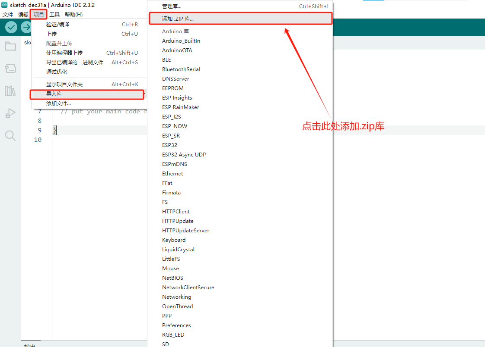

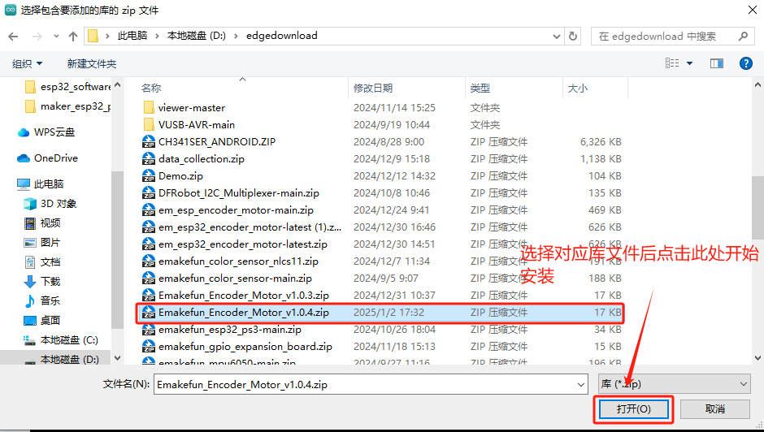

Wait for the library file to be installed.

Select the motherboard model, such as mine is ESP32 Dev Module, and click OK.

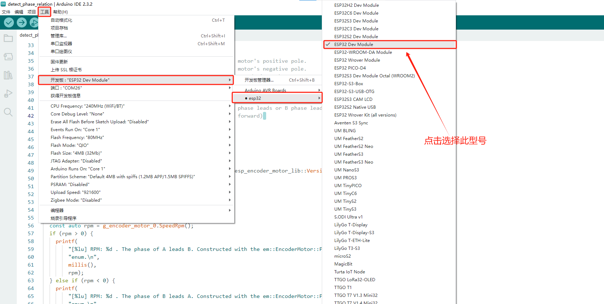

#### Open the sample program

Open the Arduino IDE, click on File - > Examples - > Emakefun Encoder Motor - >detect_phase_relation and click Open.

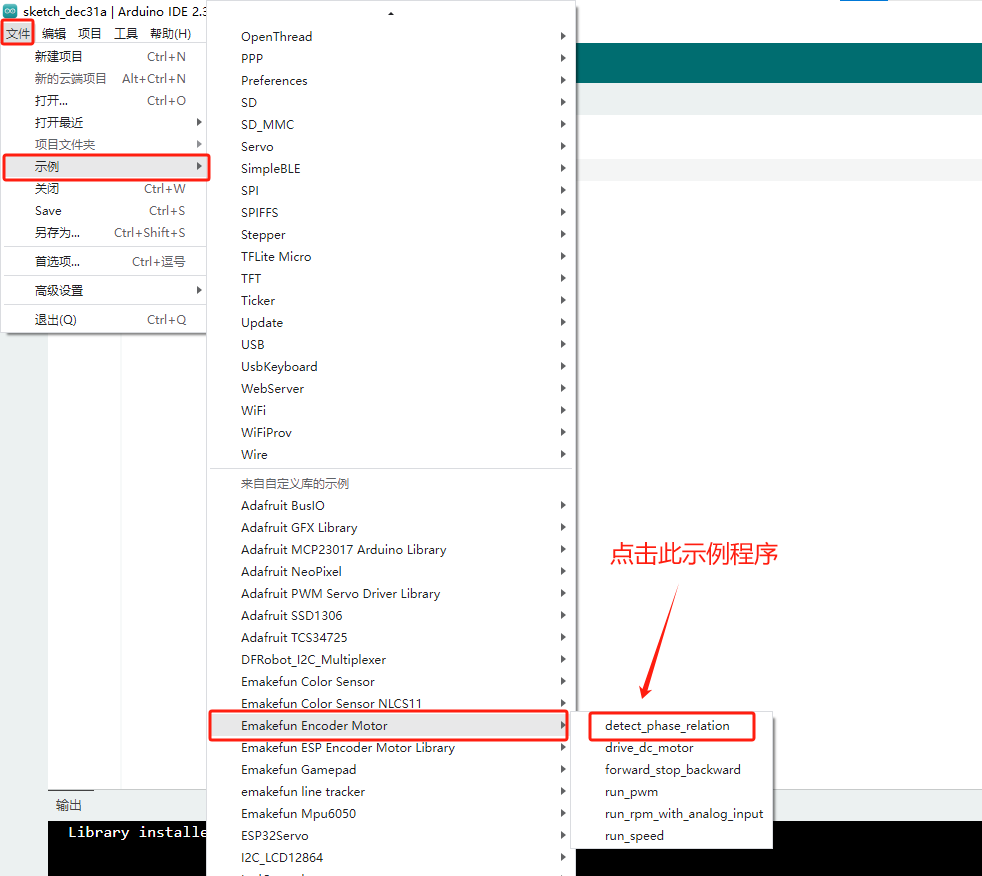

Select the COM port, and then click Upload.

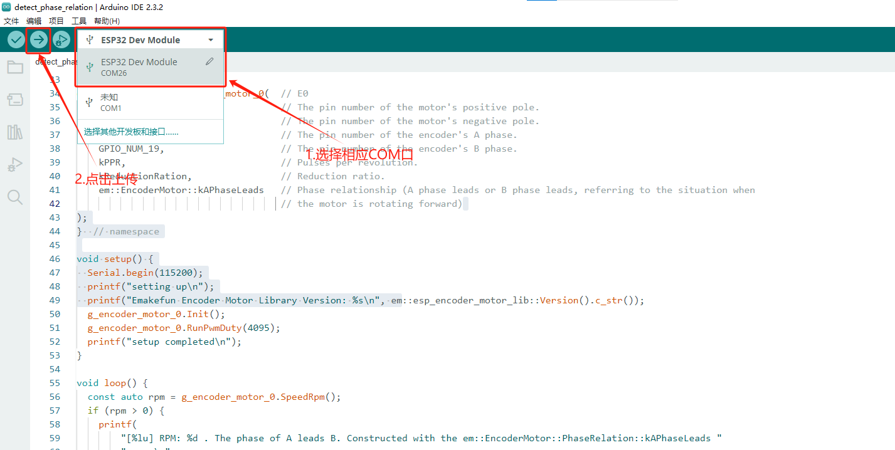

Turn on the power switch.

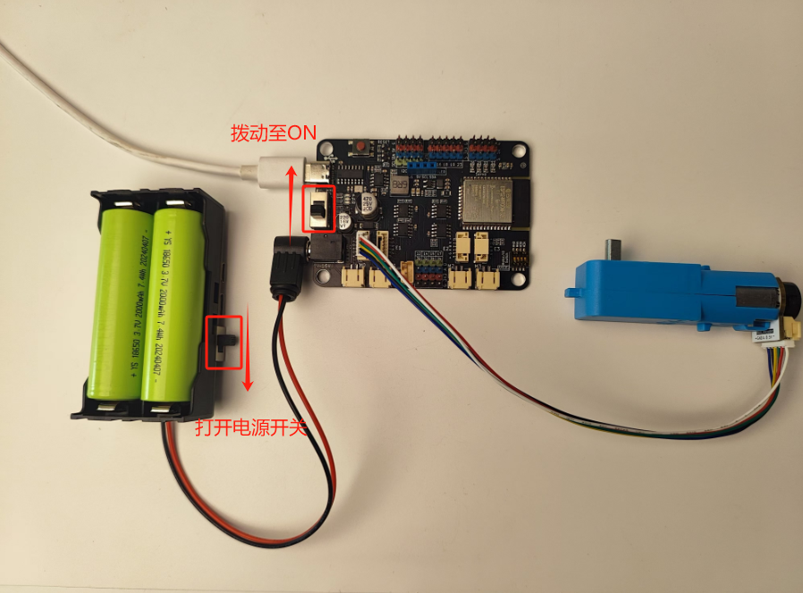

Turn on the serial monitor.

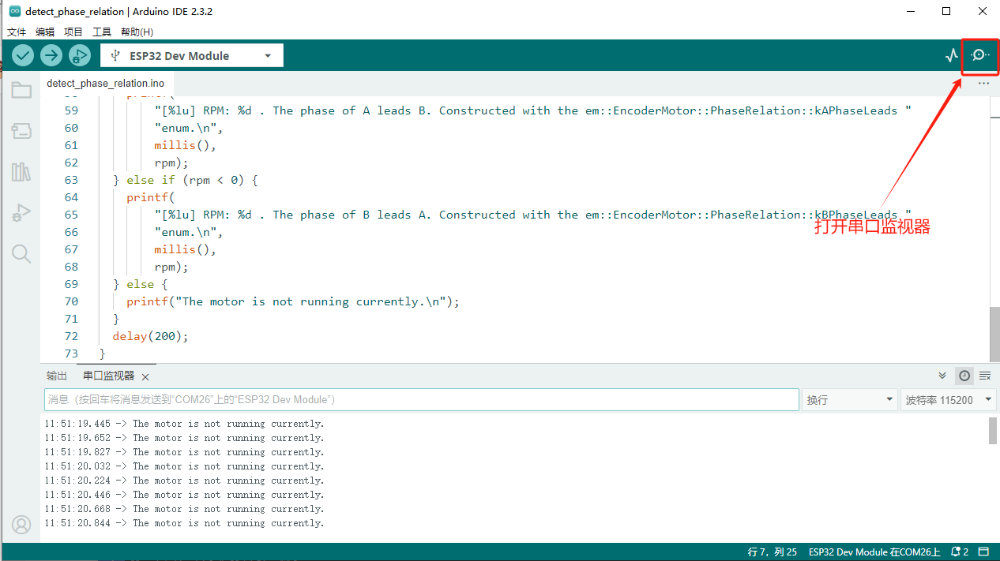

We found that the motor started to turn and the RPM in the serial monitor was negative. And we set the PWM to a positive value, so we should set the phase_relation parameter in the constructor to em::EncoderMotor::kBPhaseLeads.

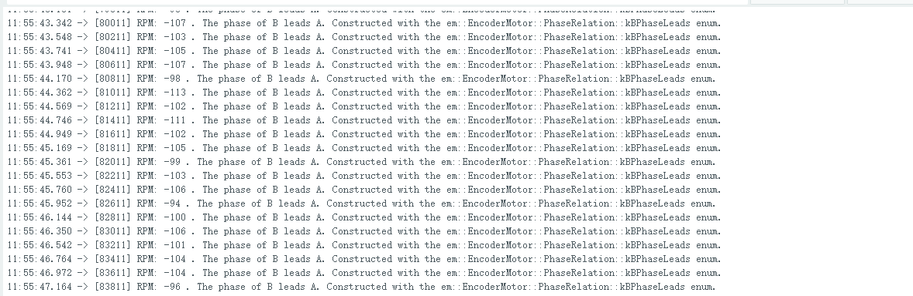

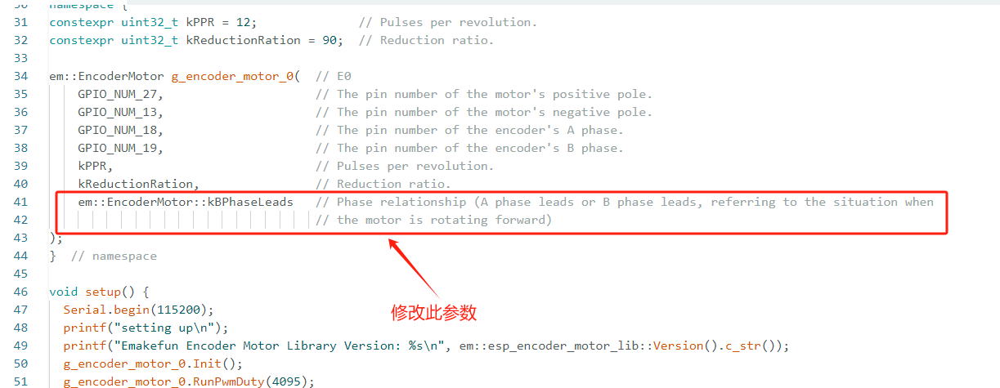

After modifying the parameters, we uploaded the program, and found that the motor started to rotate, and the RPM in the serial monitor was positive.

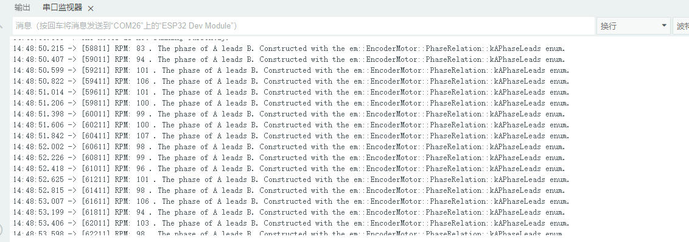

This is the end of our task for this example function. In the future, when we use this to encode the motor constructor, we can use the current parameter. For example, the next program: .  Open the sample program run_speed.

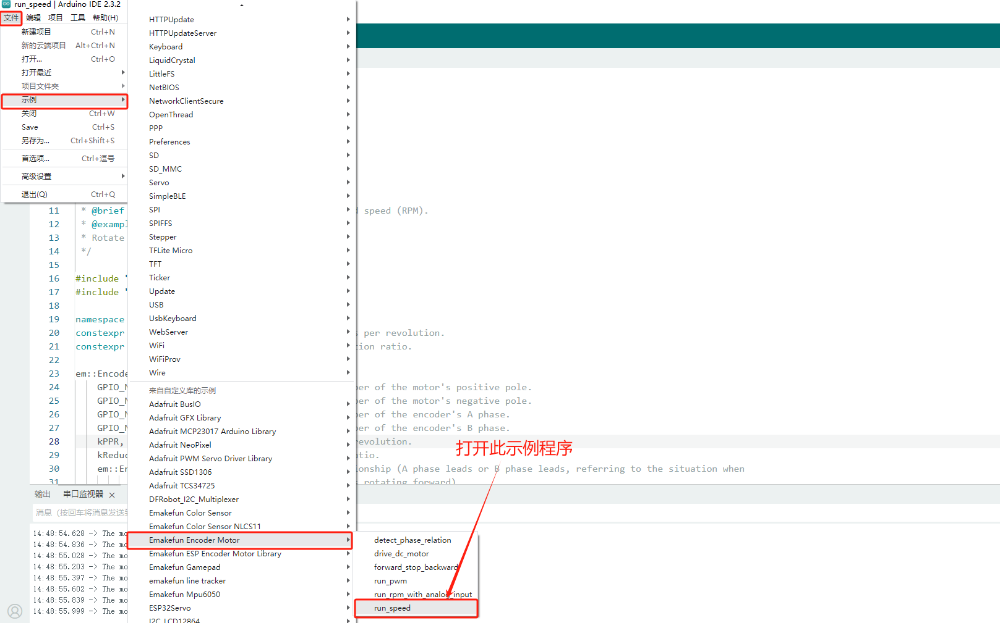

Let's use an encoded motor E0 and take the example parameter above, we should set the phase_relation parameter in the constructor to em::EncoderMotor::kBPhaseLeads.

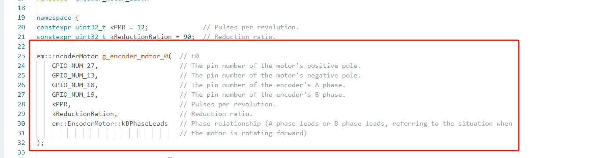

After modifying the parameters, we upload the program. Later, we found that the output of our RPM was basically the same as the RPM value we set.

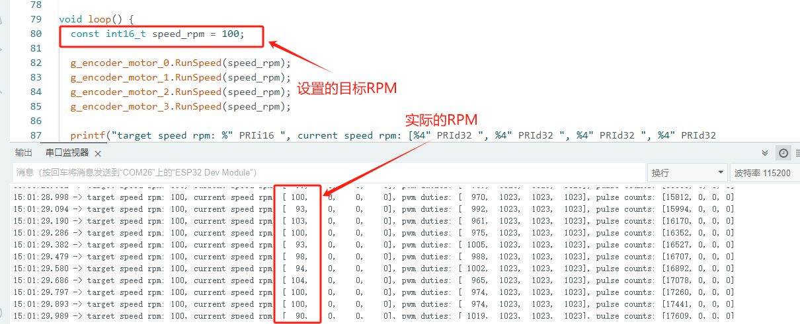

We're setting the target velocity to -20 and see how it works.

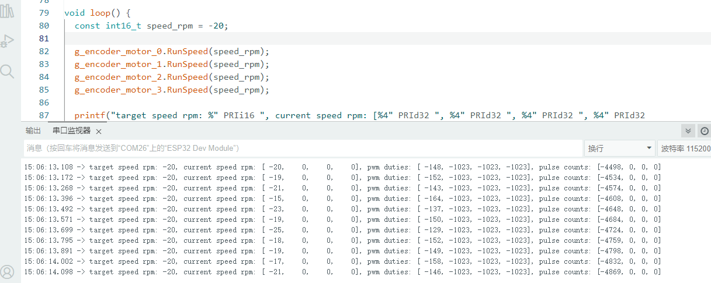

Observed that the RPM value is basically the same as the one we set, and the motor orientation is correct.

At this point, our coding motor has been debugged. If you find that it is not what we expected, please double-check that the motor is connected correctly, that there is no problem with the motor drive board, and that there is a problem with the motor.

## 12. The ESP32 series connects using the PS3 Bluetooth wireless controller

<a href="en/peripheral/bluetooth_gamepad_ps3/bluetooth_gamepad_ps3.md" target="_blank">Click here to view the ESP32 series connected using the PS3 Bluetooth wireless controller</a>

<a href="en/esp32/maker_esp32_pro/esp32_arduino/esp32PS3ControlTest.zip" download>Click here to download the PS3 control motor servo case</a>

<a href="en/esp32/maker_esp32_pro/esp32_mixly/esp32_emakefun_sensors_mixly.zip" download>Click to download the Mixly library PS3 controller</a>

<a href="en/esp32/maker_esp32_pro/esp32_mixly/esp32_ps3_rock_test.zip" download>Click here to download the PS3 controller Mixly sample</a>

<a href="en/esp32/maker_esp32_pro/esp32_mindplus/emakefun-ps3.zip" download>Click here to download the PS3 controller Mind+ library</a>

<a href="en/esp32/maker_esp32_pro/esp32_mindplus/ps3_test.zip" download>Click here to download the PS3 controller Mind+ sample</a>

## FAQ

**Q**: The Mixly downloader is unsuccessful?

**A**：

1. The installation path of Mixly should not contain special characters such as Chinese and spaces; Put it in the root directory of the computer, and the hierarchical directory should not be too deep; For example, D:\mixly2.0-win32-x64 is the root directory installation;
2. Check whether the serial port is selected correctly, if there is no serial port, please install the CH340G driver first; The serial port should not be occupied by other applications;
3. Check the program for errors;

**Q**: The motor program is uploaded successfully, but the motor does not rotate?

**A**:

1. The motor needs DC head power supply, 6-24V, it is recommended to use two 3.7V lithium batteries, whether the power switch is on or not;
2. If the first step has been completed and there is still a problem, please check whether the Motor and IO Switch switch is dialed to the direction of the motor (that is, the direction marked ON);
3. Check whether the motor pins set by the program correspond to the actual pins of the motor one by one;
