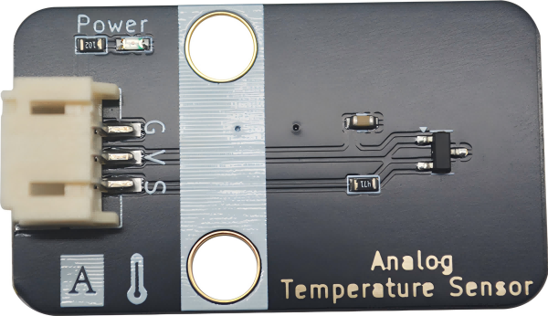

# NL50 Temperature Sensor

## Module physical picture

## Overview

NL50 is a temperature sensor independently developed by our company. This temperature sensor uses the basic principle of diode to measure known temperature values. As the temperature rises, the voltage across the diode increases at a known rate. By accurately amplifying the voltage change, a voltage signal proportional to the ambient temperature is generated, thereby obtaining the corresponding temperature value.

Therefore, the NL50 sensor has the advantages of high accuracy and simple connection. It has a temperature range of ±5℃ from 0℃ to 85℃, which is more accurate than similar compatible devices on the market.

### Schematic

<a href="en/ph2.0_sensors/sensors/temperature_sensor_nl50/nl50.pdf" target="_blank">Click to download NL50 schematic diagram</a>

### Chip Specifications

To be supplemented

### Dimensions

To be supplemented

## Module parameters

- Supply voltage: 3.3-5V
- Wide temperature measurement range: -40℃ to +150℃
- Connection method: 3PIN anti-reverse connection DuPont line
- Module size: 22.4*38.4mm, compatible with Lego bricks and M4 screw fixing holes
- Installation method: M4 screw compatible with Lego socket

## Pin Definition

| Pin Name | describe                    |
| -------- | --------------------------- |
| G        | GND                         |
| In       | VCC                         |
| S        | Signal line (analog output) |

## Arduino Example Program (C/C++)

| Supported development board series |
| ---------------------------------- |
| Arduino UNO R3                     |
| Arduino Nano                       |
| Arduino Mega 2560                  |
| ESP32                              |

<a href="en/ph2.0_sensors/sensors/temperature_sensor_nl50/emakefun_temperature_sensor_nl50.zip" download>Click to download Arduino library and sample program</a>

## Microython sample programs

<a href="en/ph2.0_sensors/sensors/temperature_sensor_nl50/nl50_py.zip" download>Click to download Micropython library and sample programs</a>

## Mixly graphical example

To be supplemented

## Mind + Graphical Example

To be supplemented
