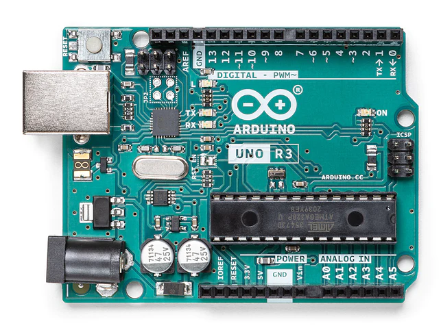
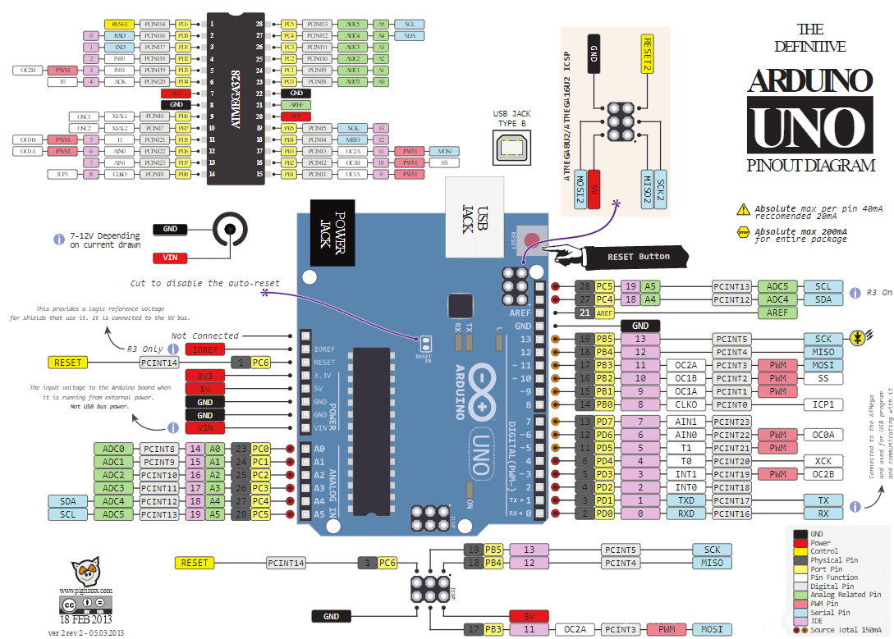
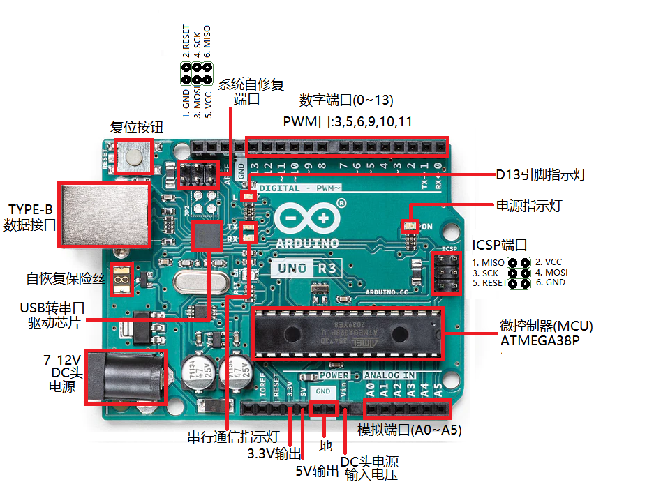
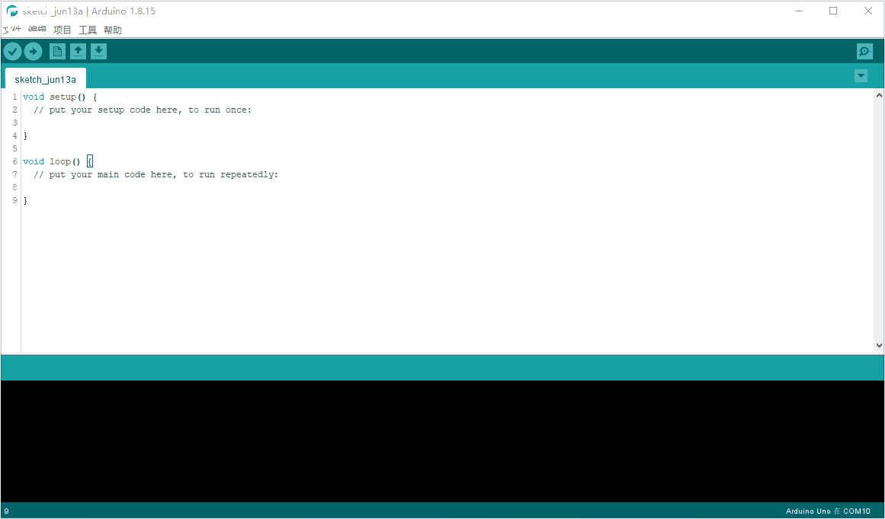

# **Arduino Uno R3介绍**

## 概述

Massimo Banzi之前是意大利**Ivrea**一家高科技设计学校的老师。他的学生们经常抱怨找不到便宜好用的微控制器。 2005年冬天， Massimo Banzi跟David Cuartielles讨论了这个问题。 David Cuartielles是一个西班牙籍晶片工程师，当时在这所学校做访问学者。两人决定设计自己的电路板，并引入了Banzi的学生David Mellis为电路板设计编程语言。两天以后，David Mellis就写出了程式码。又过了三天，电路板就完工了。Massimo Banzi喜欢去一家名叫di Re Arduino的酒吧，该酒吧是以1000年前意大利国王Arduin的名字命名的。为了纪念这个地方，他将这块电路板命名为Arduino 。现在Arduino是包含Uno、Mega、Leonardo等多个型号的电路板与集成开发环境（IED）两部分核心组成。 

Arduino Uno R3是一款基于ATmega328P微控制器的开发板。它是一个开源的跨平台电子原型开发平台，广泛应用于各种DIY电子设计、机器人、智能家居以及教育用途。 

它有14个数字输入/输出引脚（其中6个可用于PWM输出）、6个模拟输入引脚，一个16 MHz的晶体振荡器，一个USB接口，一个DC接口，一个ICSP接口，一个复位按钮。它包含了微控制器所需的一切，你只用简单地把它连接到计算机的USB接口，或者使用AC-DC适配器，再或者用电池，就可以驱动它。

Arduino Uno R3的引脚布局如下图所示：

## 技术参数

| 型号                 | Arduino Uno R3                  |
| -------------------- | ------------------------------- |
| 微控制器             | ATmega328P-PU                   |
| 串口驱动芯片         | ATmega16u2                      |
| 工作电压             | 5V                              |
| DC头输入电压（推荐） | 7-12V                           |
| 数字I/O引脚          | 14                              |
| PWM通道              | 6                               |
| 模拟输入通道（ADC）  | 6                               |
| 每个I/O直流输出能力  | 20 mA                           |
| 3.3V端口输出能力     | 50 mA                           |
| FlASH                | 32 KB（其中引导程序使用0.5 KB） |
| SRAM                 | 2 KB                            |
| EEPROM               | 1 KB                            |
| 时钟速度             | 16 MHz                          |
| 板载LED引脚          | 13                              |
| 长度                 | 68.6 mm                         |
| 宽度                 | 53.4 mm                         |
| 重量                 | 25 g                            |

Arduino Uno R3支持多种编程语言，包括C、C++、Arduino语言。Arduino IDE是开发Arduino Uno的主要工具，可以通过USB接口连接电脑，利用简单的代码实现各种控制和交互功能。

主板硬件详细原理请直接查看<a href="zh-cn/arduino_products/uno/arduino_uno_r3/arduino_uno_r3-schematic.pdf" target="_blank">Arduino Uno R3主板原理图</a>

除了Arduino Uno主板外，Arduino公司还推出了多种型号的开发板，如Arduino Nano、Arduino Mega、leonardo等。这些板子通常具有相似的架构和接口，但在具体的规格参数和尺寸上有所不同，可以根据项目需求选择合适的型号。

### 电源

USB口或者（5.5-2.1）DC头电源座（7~12V）给Arduino Uno R3供电。Arduino Uno R3带有自动切换功能。

**电源引脚如下：**

- **Vin** ：电源输入引脚。当使用外部电源通过DC电源座供电时，这个引脚可以输出电源电压。
- **5V**：5V电源引脚。使用USB供电时，直接输出USB提供的5V电压；使用外部DC电源供电时，输出板子上LDO稳压后的5V电压。
- **3V3**：3.3V 电源引脚，最大输出能力为500mA。
- **GND**：电源地

接地引脚

### IOREF

I/O参考电压。其他设备可通过该引脚识别开发板I/O参考电压。

### 存储空间

ATmega328p有32KB Flash存储空间（其中0.5KB被用于存储bootloader），2KB的SRAM和1KB的EEPROM。
可以使用官方提供的EEPROM库读写EEPROM空间。

### 输入输出

Arduino Uno有14个数字输入输出引脚，可使用pinMode()、digitalWrite()和digitalRead()控制。
其中一些带有特殊功能，这些引脚如下：

### Serial

0（RX）、1（TX），被用于接收和发送串口数据。这两个引脚通过连接到ATmega16u2/CH340G等串口驱动芯片来与计算机进行串口通信。

### 外部中断

2、3，可以输入外部中断信号。中断有四种触发模式：低电平触发、电平改变触发、上升沿触发、下降沿触发。

### PWM输出

3、5、6、9、10、11，可用于输出8-bit PWM波。对应函数 analogWrite()。

### SPI

10（SS）、11（MOSI）、12（MISO）、13（SCK），可用于SPI通信。可以使用官方提供的SPI库操纵。

### L-LED

13号引脚连接了一个LED，当引脚输出高电平时打开LED，当引脚输出低电平时关闭LED。

### TWI

A4（SDA）、A5（SCL）和TWI接口，可用于TWI通信，兼容I²C通信。可以使用官方提供的Wire库操纵。

### ADC

Arduino Uno 6个模拟输入引脚，可使用analogRead()读取模拟值。每个模拟输入都有10位分辨率（即1024个不同的值）。默认情况下，模拟输入电压范围为0～5V，可使用 AREF引脚和analogReference()函数设置其他参考电压。

相关引脚如下：

### AREF

模拟输入参考电压输入引脚。

### Reset

复位端口。接低电平会使Arduino复位，复位按键按下时，会使该端口接到低电平，从而让Arduino复位。

### 指示灯（LED）

Arduino Uno R3带有4个LED指示灯，作用分别如下：

#### ON

电源指示灯。当Arduino通电时，ON灯会点亮。

#### TX

串口发送指示灯。当使用USB连接到计算机且Arduino向计算机传输数据时，TX灯会点亮。

#### RX

串口接收指示灯。当使用USB连接到计算机且Arduino接收到计算机传来的数据时，RX灯会点亮

#### L

功能一、bootloard指示灯，当硬件复位Arduino时，bootloard会让L灯快速闪3下； 
功能二、可编程控制指示灯。该LED通过特殊电路连接到Arduino的13号引脚，当13号引脚为高电平或高阻态时，该LED 会点亮；低电平时，不会点亮。可以通过程序或者外部输入信号，控制该LED亮灭。

### 通信

Arduino Uno具备多种通信接口，可以和计算机、其他Arduino或者其他控制器通信。 
ATmega328p 提供了UART TTL (5V)串口通信，其位于0 (RX) 和1 (TX)两个引脚上。Uno上的ATmega16U2串口转串口芯片会在计算机上模拟出一个USB串口，使得ATmega328p 能和计算机通信。Arduino IDE提供了串口监视器，使用它可以收发简单文本数据。Uno上的RX/TX两个LED可以指示当前Uno的通信状态。

SoftwareSerial库可以将Uno的任意数字引脚模拟成串口，从而进行串口通信。

ATmega328p也支持I2C (TWI)和SPI通信。Arduino IDE自带的Wire库，可用于驱动I2C总线，自带的SPI库，可用于SPI通信。

### 自动复位

一些开发板在上传程序前需要手动复位，而Arduino Uno的设计不需要如此，在Arduino Uno连接电脑后可以由程序控制其复位。在ATmega16U2/CH340G等串口驱动芯片上的DTR信号端，经过一个100nf 的电容，连接到ATmega328p 的复位引脚。 
当计算机发出DTR信号时（低电平），复位端将得到一个足够长的脉冲信号，从而复位ATmega328p。在Arduino IDE中点击上传程序，在上传前即会触发复位，从而运行引导程序，完成程序上传。

### 注意事项

Arduino Uno上有一个自恢复保险丝，当短路或过流时，电流超过500mA，其可以自动断开供电，从而保护计算机的USB端口和Arduino。虽然大多数计算机USB端口都提供了内部保护，但是此保险丝可以提供了额外的保护。

## 编程

可通过Arduino IDE对Arduino Uno编程。 
在Arduino Uno使用ATmega328p芯片上，存储有bootloader程序，使得用户可以上传程序到开发板上，而不需要使用额外的编程器。这个上传程序的过程使用STK500协议完成。
你也可以不使用bootloader，通过ICSP接口连接编程器给Arduino Uno上传程序。

<a href="zh-cn/arduino_products/uno/arduino_uno_r3/arduino_grammar_handbook.pdf" target="_blank">点击查看《Arduino语法手册》</a>

## Arduino IED安装

请点击查看[Arduino IED安装](zh-cn/software/arduino_ide/arduino_ide.zh-CN.md)

## Windows安装Arduino Uno R3（官方版、官方兼容版）驱动

请点击查看[Arduino Uno官方驱动程序](zh-cn/driver/arduino_official_driver/arduino_official_driver.md)

## Arduino IDE上传Blink程序

上传成功之后，我们可以看到主板的13引脚L指示灯亮1秒，灭1秒，如此循环。(不同的电脑端口不一样，请在电脑的设备管理器里面查看驱动端口号，并选择对应的端口)

如果需要了解更多芯片技术细节，请参阅<a href="zh-cn/arduino_products/uno/arduino_uno_r3/atmega328P_datasheet.pdf" target="_blank">ATmega328P芯片数据手册</a>
