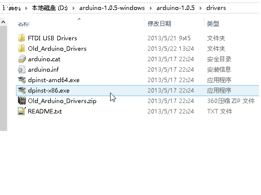

# Arduino官方驱动安装

打开解压后的文件，打开**“drivers”**文件夹如果你的电脑是32位系统，就运行dpinst-x86.exe如果是64位系统，就运行dpinst-amd64.exe然后在弹出的对话框中点击“下一步”，即可完成安装，如下图：

## 可能遇到的问题

1、问题：“这个INF中的服务安装段落无效”、“系统找不到指定文件”。

原因：您使用了精简版系统，缺少系统文件。

解决办法1：

[【图文教程】驱动安装故障解决办法之系统文件缺失](http://www.dfrobot.com.cn/community/forum.php?mod=viewthread&tid=23706&fromuid=724121)

解决办法2：

[Arduino无法安装驱动找不到指定文件问题的解决方法](http://mc.dfrobot.com.cn/forum.php?mod=viewthread&tid=361&fromuid=724121)

2、问题：“Windows无法验证此设备所需的驱动程序的数字签名”。

原因：win7及以上版本系统安装驱动需要签名。