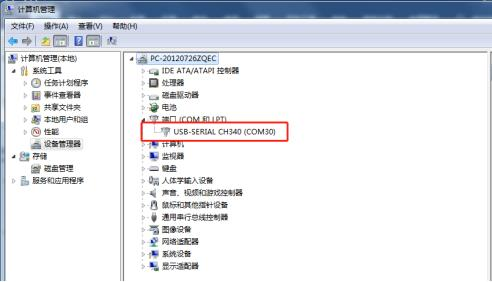
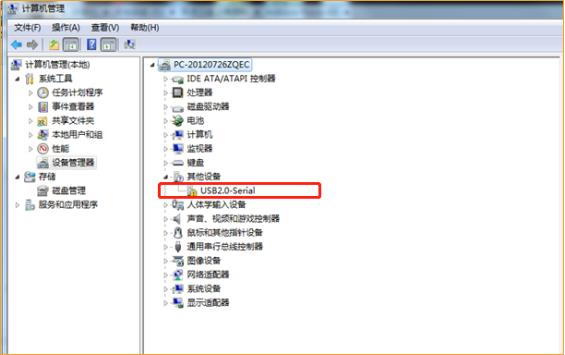
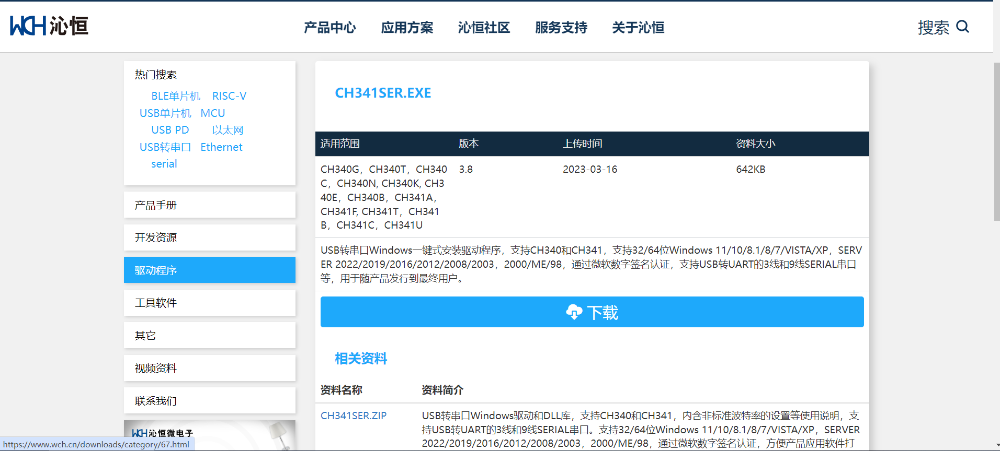
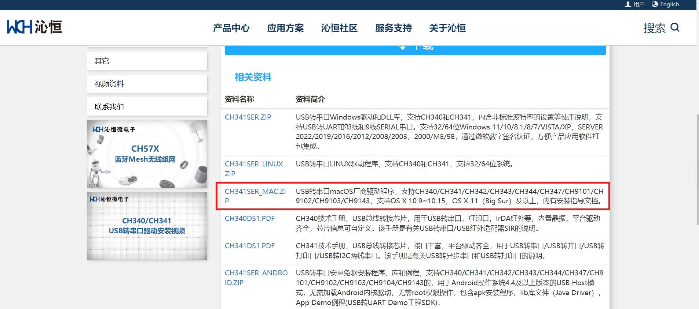

# CH340驱动安装说明

## 一、支持的主板

本驱动适用于maker-uno、rf-nano、maker-esp32、esp32-devkit-32e等以ch340系类芯片为usb转串口的芯片主板。

## 二、安装示例

### 2.1 自动安装

1.接上主板，右键点击“我的电脑-->属性-->设备管理器-->端口（COM和LTP）”，如果看到下图所示，则说明驱动已安装。

2.如果没有显示端口或者显示以下状态时，说明驱动没有安装成功。

### 2.2 手动安装

#### 1. Windows安装CH340系类芯片驱动

1）建议从官方网站下载最新驱动程序。[CH340官方下载地址](https://www.wch.cn/downloads/CH341SER_EXE.html)

2）打开下载的驱动程序，根据安装向导的提示完成安装。在安装过程中，可能需要选择操作系统类型和设备类型。如下图（如果动图不显示，请点击此**<a href="zh-cn/driver/ch340_driver/_media/drive.gif" download>gif动图</a>**）：

3）如果出现“Windows受限制”错误提示，可以通过以下步骤解决：

- 右键单击桌面上的“此电脑”，选择“管理”。
- 在左窗格中，选择“本地用户和组”，然后选择“用户”。
- 右键单击“Administrators”组，选择“属性”。
- 在“属性”对话框中，取消选中“账户已禁用”选项，然后点击“确定”按钮。
- 关闭“计算机管理”窗口，然后重新启动电脑。

4）安装完成后，重新连接CH340设备，然后查看设备管理器中是否已经正确识别设备并启用驱动程序。

#### 2. Mac系统驱动

请参考以下链接:

[https://www.wch.cn/downloads/CH341SER_EXE.html](https://www.wch.cn/downloads/CH341SER_EXE.html)

####
