# ESP32S3 USB驱动安装

我们在使用ESP32S3自带的usb时候，就不得不考虑驱动问题，尤其是老旧电脑win7系统，非常麻烦，不同版本，不同系统出现的问题也不一样。但是耐心操作，绝大部分情况下能安装成功。

## Windows10/11

右击windows的开始图标（或者 “win + x”）选择**设备管理器**

或者直接在桌面按“Win+R”组合键，呼出运行菜单 ，然后在“打开”对话框内输入“devmgmt.msc”命令，敲击“回车”，即可打开任务管理器。

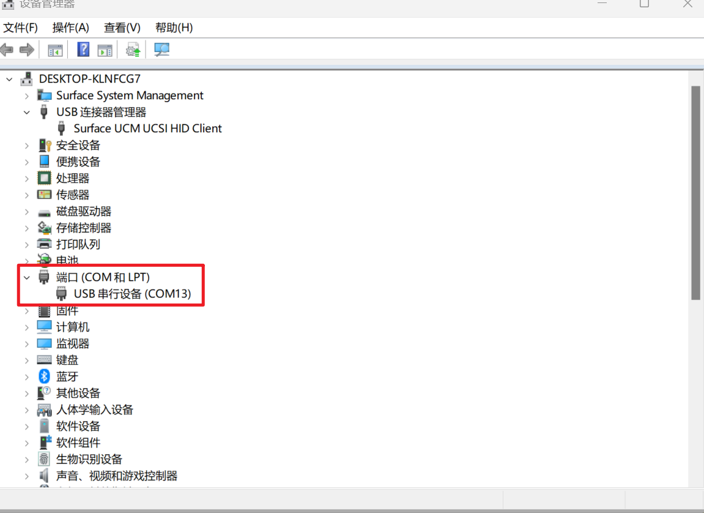

如果看到如上已经有端口直接显示了，拔掉usb数据线，端口消失，那就代表系统已自带驱动不需要额外再安装。

## macOS

系统自带驱动不需要额外安装。

## Windows 7

### 安装方法一

单击windows 7的开始图标，右击**计算机**，选择**设备管理器**

1、 先按住ESP32S3 boot按键，然后按一下复位按键，让ESP32S3进入，连接电脑ESP32S3自带USB接口，系统会尝试自动检测并安装驱动。如果未能成功，可以通过设备管理器，右键选择”扫描检测硬件改动“。查看如下感叹号设备。

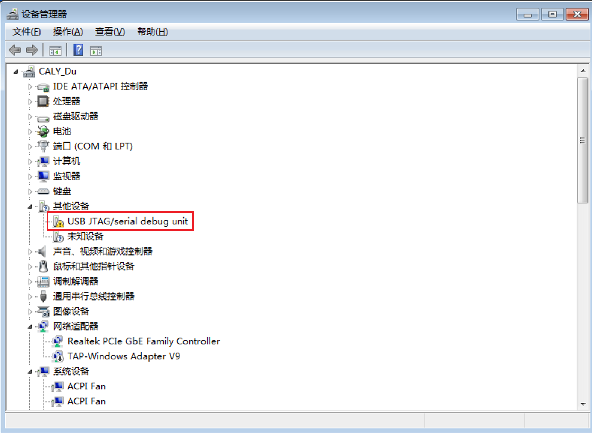

2、需要<a href="zh-cn/driver/esp32_driver/idf-driver-esp32-usb-jtag-2021-07-15.zip" download>下载ESP32S3官方驱动程序</a>，然后解压。按如下步骤浏览我的电脑选择，下载驱动程序文件夹

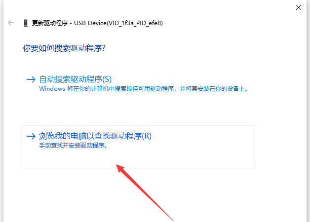

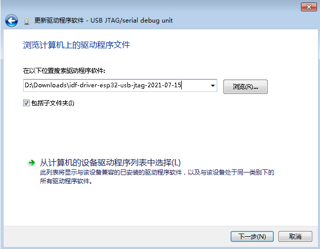

3、点击下一步，勾选信任，点击安装

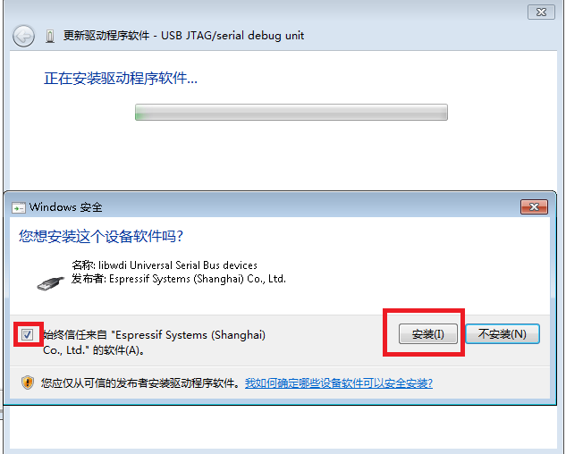

4、验证安装 : 如果出现如下截图，就代表USB JTAG 和USB CDC已经安装成功了。

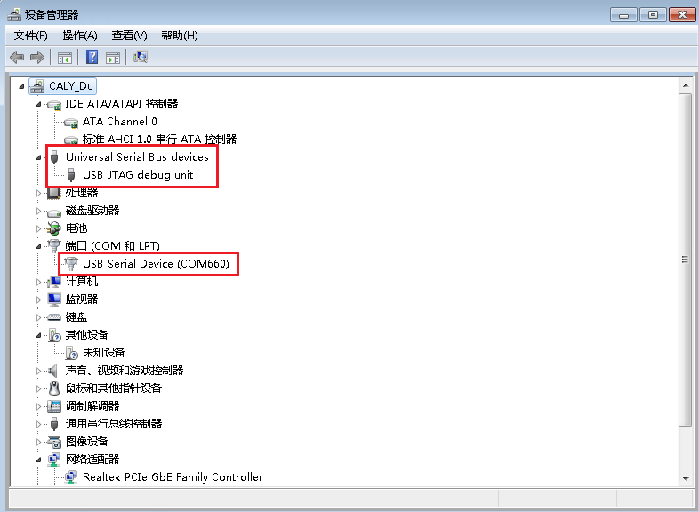

### 安装方法二

不管你是win7还是win10都可以尝试。

如果没有出现上面安装成功的截图，提示失败，或者任意一个有黄色感叹号，那就代表安装还是不成功，则说明win7缺乏系统文件，或者驱动被误识别，就需要用终极大招-------大名鼎鼎的<a href="zh-cn/driver/esp32_driver/zadig-2.9.exe" download>下载zadig</a> 来修复驱动

到这里 我和大家理一下，ESP32S3 USB其实是有三种用法和驱动

- 烧录模式下，usb jtag dbug调试功能，需要usb jtag debug驱动；
- 烧录模式下，需要cdc做串口下载，这个时候需要usb cdc驱动；
- 用户模式下，代码开启了usb（Tinyusb）功能，比如usb转串口，usb键盘鼠标等hid，usb需要安装和程序对应的驱动程序。

1、首先我们把之前的驱动程序卸载删除干净。

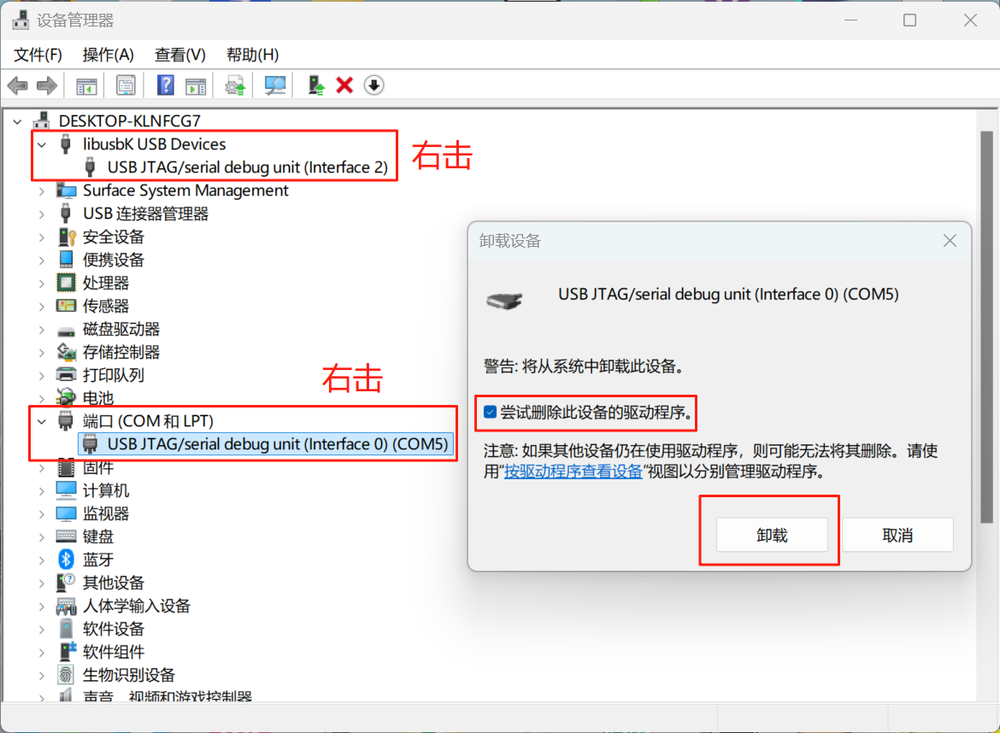

然后我们查看，驱动全部没有达到如下状态

2、然后需要先安装usb jtag debug驱动。

先按住ESP32S3 的boot按键，然后按一下 reset按键，让esp32s3进入烧录模式。

**Options** -> **List ALL Dvices**

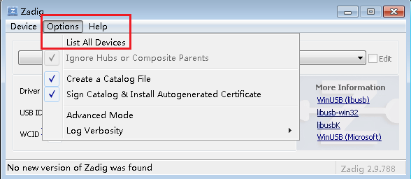

选择 **USB JTAG/serial debug_unit (Interface 2)**选择**Install Driver**或者**Replace Driver**如下

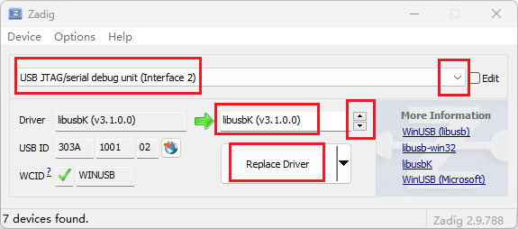

成功后，我们在设备管理器就可以看到如下，就代表USB JTAG 调试驱动安装成功了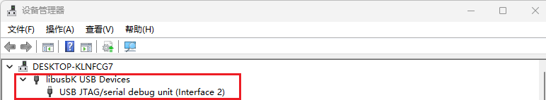

2、烧录模式下安装串口CDC驱动

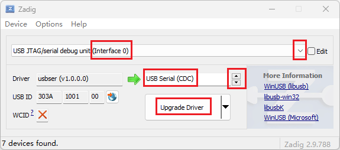

选择 **USB JTAG/serial debug_unit (Interface 0)**选择**Install Driver**或者**Replace Driver**如下

3、ESP32S3在正常工作模式下（不需要按住boot按键复位），也有可能没有驱动，就会显示如下状态

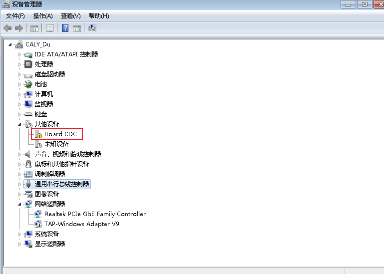

这个时候 我们也可以直接用zadig安装一个CDC驱动

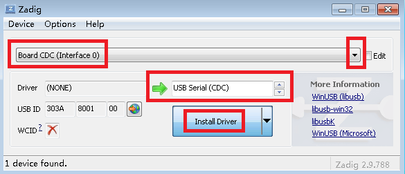

这样ESP32S3在工作代码打开usb转串口（CDC）功能驱动也可以使用了。
