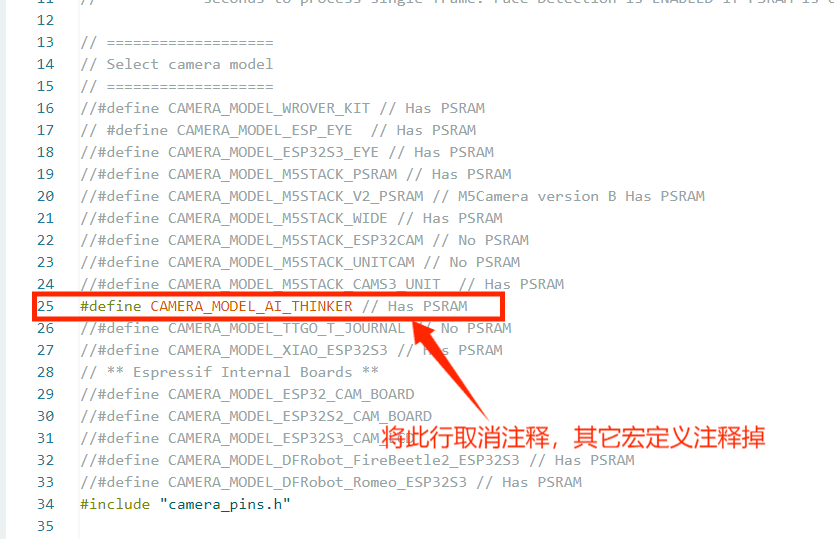
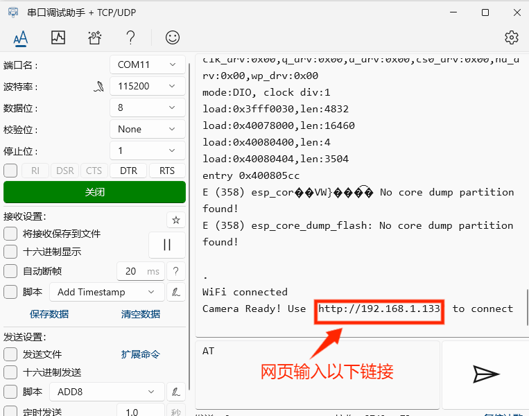

# ESP32-CAM模块

## 模块实物图

## 概述

ESP32-CAM是小尺寸的摄像头模组该模块可以作为最小系统独立工作，尺寸仅为 `27*40.5*4.5mm`，可广泛应用于各种物联网场合，适用于家庭智能设备、工业无线控制、无线监控、QR无线识别，无线定位系统信号以及其它物联网应用，是物联网应用的理想解决方案。

## 模块使用方法

### 安装CH343驱动

[安装驱动方法点击此处查看]([CH343芯片应用—Windows驱动安装与使用_ch343驱动-CSDN博客](https://blog.csdn.net/wch_techgroup/article/details/124801135))

[点击此处下载CH343驱动](zh-cn/esp32/ESP32_CAM/CH343SER.EXE ':ignore')

### 配置Arduino中的开发板

Arduino IDE上传方法请参考：[ESP32系列上传程序方法](zh-cn/esp32/esp32_software_instructions/esp32_software_instructions.md)

安装完成后即可选择对应的开发板：

### 上传示例程序

1.将usb转串口模块连接电脑，然后在工具栏串口选择对应的端口，如果未找到端口请检查驱动是否安装，或重启arduino。

2.打开示例例程CameraWebServer

3.修改代码

**要先将如下宏定义取消注释，把其他的宏定义注释掉即可（若未这样做，则会导致报错）**

再将路由器信息给填好再上传程序即可。

### 测试效果

打开串口监视器，打开网页输入以下链接进入相机调试页面。

串口显示以上信息，说明程序植入正确，若未出现以上信息，需要按上面的步骤逐一对照。

点击Start Stream即可打开摄像头调参。

