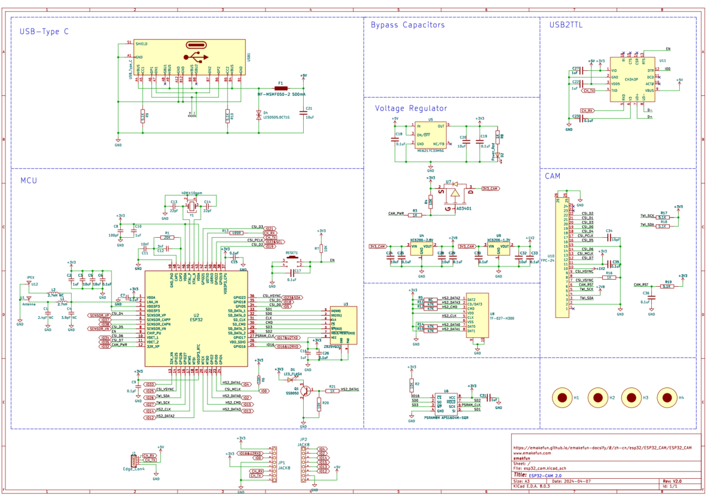
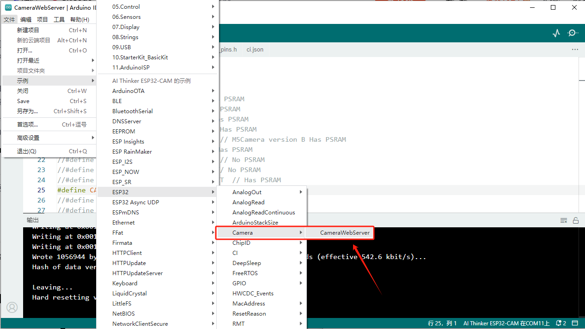

# ESP32-CAM模块

## 模块实物图

## 概述

ESP32-CAM V2是基于乐鑫ESP32-DOWD-V3芯片而开发的一款小尺寸的摄像头模组该模块可以作为最小系统独立工作，尺寸仅为 `27*40*4.5mm`。本产品基于市面上已存在的ESP32-CAM优化而开发，主要解决市面上，下载程序需要外接下载底部，发热巨大，不稳定等问题。尺寸和使用功能完全兼容现有的ESP32-CAM，网上有大量使用教程，可以直接使用参考。

## 主板参数

- 采用乐鑫原装 ESP32-DOWD-V3芯片，板载天线和IPEX天线座

- 芯片内置448 KB ROM，520 KB SRAM，外挂4M SPI FLASH，2M PSRAM

- Type-C接口，usb转串口芯片为沁恒的CH343P

- 输入电压：5V 1A

- 板载复位按键

- 板载micro-SD卡插槽

- 支持2百万像素的OV2640摄像头， 内置 LED 闪光灯

- 尺寸27mmx40mmx4.5mm

## 板子尺寸标注

### <a href="zh-cn/esp32/ESP32_CAM/esp32-cam2.0.pdf" target="_blank">原理图</a>

### 安装CH343P驱动

[点击此处下载CH343P驱动](https://www.wch.cn/downloads/CH343SER_EXE.html)

[安装驱动方法点击此处查看](https://blog.csdn.net/wch_techgroup/article/details/124801135)

### 配置Arduino中的开发板

Arduino IDE上传方法请参考：[ESP32系列上传程序方法](zh-cn/esp32/esp32_software_instructions/esp32_software_instructions.md)

安装完成后即可选择对应的开发板：

### 上传示例程序

1.将usb转串口模块连接电脑，然后在工具栏串口选择对应的端口，如果未找到端口请检查驱动是否安装，或重启arduino。

2.打开示例例程CameraWebServer

3.修改代码

**要先将如下宏定义取消注释，把其他的宏定义注释掉即可（若未这样做，则会导致报错）**

再将路由器信息给填好再上传程序即可。

### 测试效果

打开串口监视器，打开网页输入以下链接进入相机调试页面。

串口显示以上信息，说明程序植入正确，若未出现以上信息，需要按上面的步骤逐一对照。

点击Start Stream即可打开摄像头调参。

## micropython应用

直接访问esp32-cam的开源项目<https://github.com/lemariva/micropython-camera-driver>

        使用Thonny编辑器或其他micropython编辑器时，在设备管理器里面选择ESP32-CAM的端口，右键端口---->属性----->端口设置----->高级---->选中“禁用Modem流控”----->点击确定，然后重启计算机，如下图：

        

## Edge Impuls AI教程

## APP监控和控制

如上资料请联系客服获取资料
