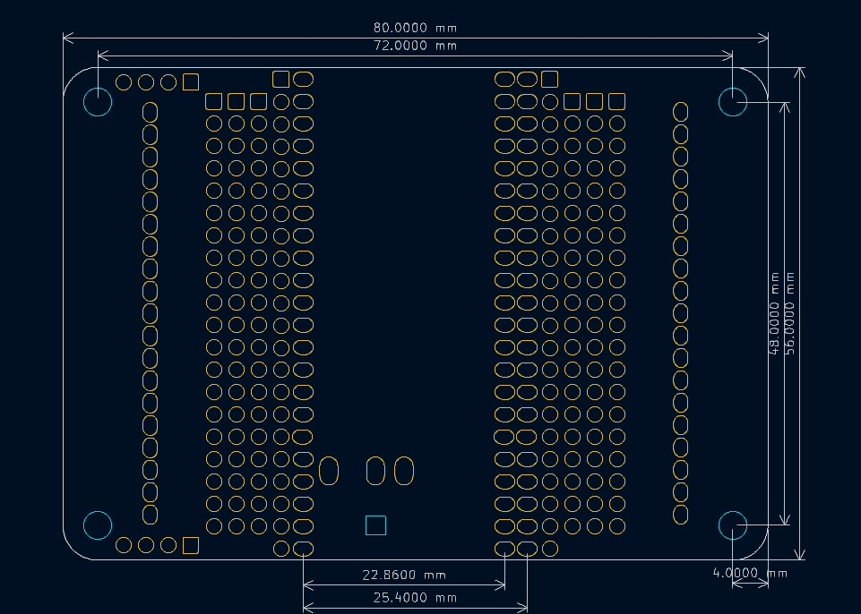

# ESP32-S3-EXPANSION BOARD 说明书

## 模块实物图

## 概述

esp32-s3-expansion-board是一款专为esp32-s3-devkitc开发板设计的扩展板，板载电源指示灯，并提供了丰富的接口类型，包括2.54mm间距排针、2.54mm间距接线端子、PH2.0防反接电源输入接口以及2.54排针接口和DC电源插座。该扩展板还集成了可直接驱动OV3660摄像头的驱动电路及FPC连接器，支持3.7V～12V的宽电压输入，并采用BUCK-BOOST电路，最大可输出3A电流，能够轻松驱动舵机等大电流外设。esp32-s3-expansion-board不仅将esp32-s3-devkitc的所有引脚完全引出，还额外增加了VIN接口和I2C预留接口。在兼容性方面，它既兼容乐鑫官方esp32-s3-devkitc主板（整板宽度 25.4mm），也兼容市面上大部分宽度为28.4mm的esp32-s3-devkitc主板。

## 原理图

<a href="zh-cn/esp32/esp32-s3-expansion_board/esp32_s3_expansion_board.pdf" target="_blank">点击查看原理图</a>

## 产品参数

- 电源输入接口：PH2.0接口；DC电源插座；2.54排针
- 宽输入电压；电流最大达到3A
- 两个预留I2C接口
- 板载OV3660摄像头电路及FPC座子
- 板载2.54接线端子
- 输入电压：3.7V-12V
- 产品尺寸：80mm×56mm
- PCB厚度：1.6mm
- M3定位孔直径：3mm
- 电池供电：单节18650；锂电池包；双节18650
- 兼容主板针脚：22pin

## 摄像头接口引脚说明

| IO口 | OV3660 | 备注  |
| :--- | :----- | :---  |
| IO4  | SDA    |      |
| IO5  | SCL    |      |
| NULL | RES    |不受控 |
| IO6  | VSYNC  |      |
| NULL | PWDM   |不受控 |
| IO7  | HREF   |      |
| IO16 | D9     |      |
| IO15 | MCLK   |      |
| IO17 | D8     |      |
| IO18 | D7     |      |
| IO13 | PCLK   |      |
| IO12 | D6     |      |
| IO11 | D2     |      |
| IO10 | D5     |      |
| IO8  | D4     |      |
| IO9  | D3     |      |

## 机械尺寸图

## 兼容主板参考

>注意：该主板是参考，所有与这个尺寸一致及IO口与此主板一致的，都可以兼容。[nl-esp32-s3-devkitc](zh-cn/esp32/nl-esp32-s3-devkitc/README_zh.md)。
兼容乐鑫官方[ESP32-S3-DevKitC-1开发板](https://docs.espressif.com/projects/esp-dev-kits/zh_CN/latest/esp32s3/esp32-s3-devkitc-1/index.html)。