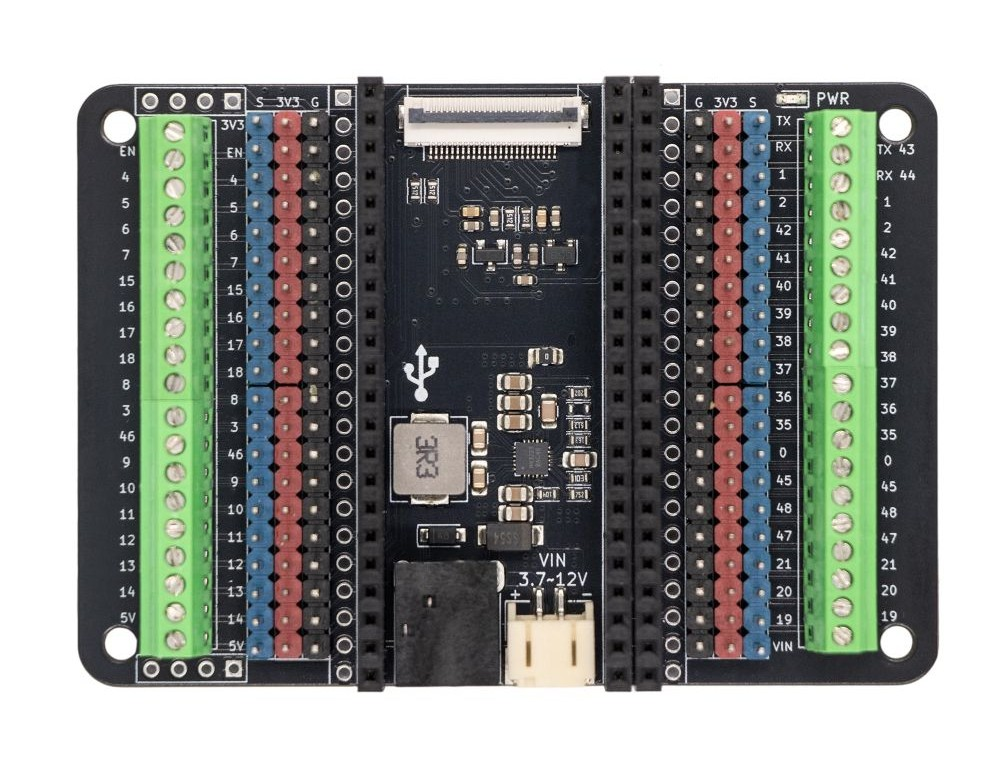
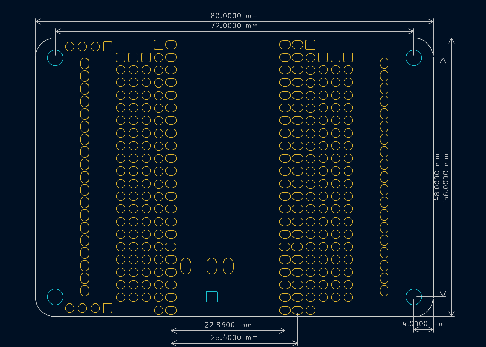
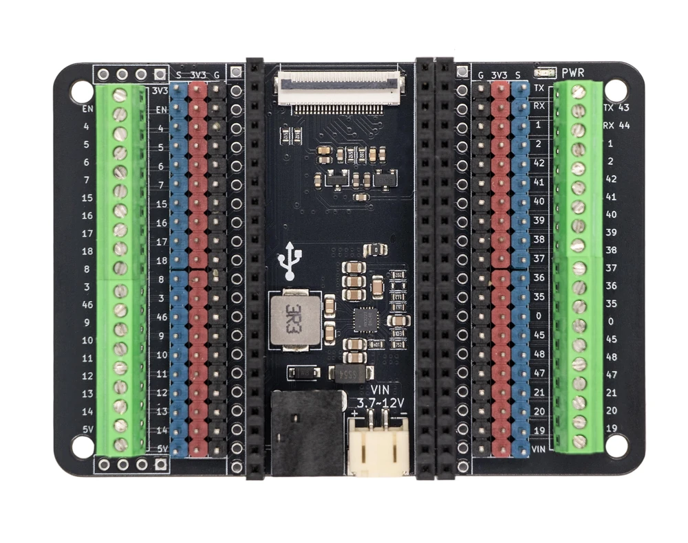

# ESP32-S3 扩展板

## 模块实物图

## 概述

ESP32-S3 扩展板专为 ESP32-S3-DevKitC 开发板设计，板载电源指示灯，并提供丰富的接口类型，包括 2.54mm 间距排针、2.54mm 间距接线端子、PH2.0 防反接电源输入接口以及 DC 电源插座。扩展板还集成了可直接驱动 OV3660 摄像头的驱动电路及 FPC 连接器，支持 3.7V-12V 宽电压输入，采用 BUCK-BOOST 电路，最大可输出 3A 电流，能够轻松驱动舵机等大电流外设。

ESP32-S3 扩展板不仅将 ESP32-S3-DevKitC 的所有引脚完全引出，还额外增加了 VIN 接口和 I2C 预留接口。在兼容性方面，它既兼容乐鑫官方 ESP32-S3-DevKitC 主板（整板宽度 25.4mm），也兼容市面上大部分宽度为 28.4mm 的 ESP32-S3-DevKitC 主板。

## 原理图

<a href="zh-cn/esp32/esp32-s3-expansion_board/esp32_s3_expansion_board.pdf" target="_blank">点击查看原理图</a>

## 产品参数

- 电源输入接口：PH2.0 接口；DC 电源插座；2.54mm 排针
- 输入电压：3.7V-12V（BUCK-BOOST 电路，最大输出电流 3A）
- 预留 I2C 接口 ×2
- 板载 OV3660 摄像头驱动电路及 FPC 座子
- 板载 2.54mm 接线端子
- 产品尺寸：80mm×56mm
- PCB 厚度：1.6mm
- M3 定位孔直径：3mm
- 电池供电：单节 18650；3.7V 锂电池包；双节 18650
- 兼容主板针脚：22pin

## 摄像头接口引脚说明

| IO 口 | OV3660 | 备注        |
| :--- | :----- | :---       |
| IO4  | SDA    |            |
| IO5  | SCL    |            |
| —    | RES    | 不受主控控制 |
| IO6  | VSYNC  |            |
| —    | PWDM   | 不受主控控制 |
| IO7  | HREF   |            |
| IO16 | D9     |            |
| IO15 | MCLK   |            |
| IO17 | D8     |            |
| IO18 | D7     |            |
| IO13 | PCLK   |            |
| IO12 | D6     |            |
| IO11 | D2     |            |
| IO10 | D5     |            |
| IO8  | D4     |            |
| IO9  | D3     |            |

## 机械尺寸图

## 兼容主板参考

> 注意：以上主板仅作参考，凡是尺寸及 IO 口与其一致的主板均可兼容，如 [nl-esp32-s3-devkitc](zh-cn/esp32/nl-esp32-s3-devkitc/README_zh.md)。
> 同时兼容乐鑫官方 [ESP32-S3-DevKitC-1 开发板](https://docs.espressif.com/projects/esp-dev-kits/zh_CN/latest/esp32s3/esp32-s3-devkitc-1/index.html)。

## 主板插接扩展板动图

