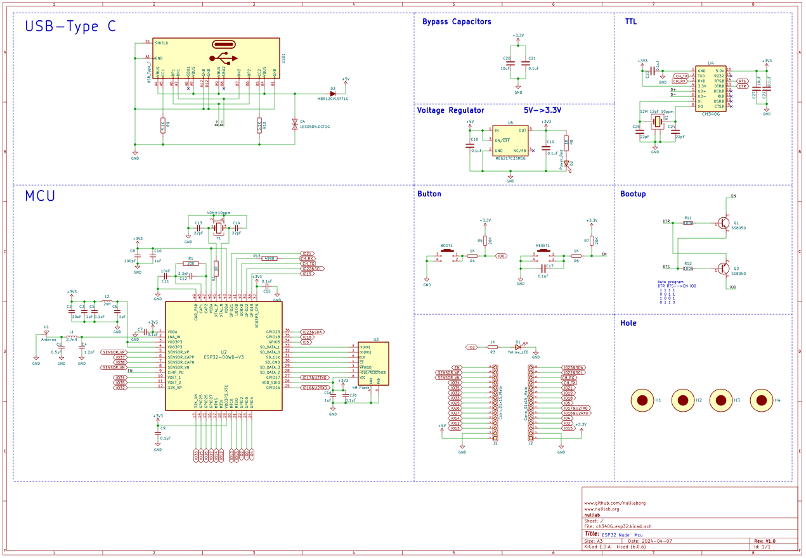

# ESP32 DevKit 32E 使用说明

## 一、[淘宝购买链接](https://item.taobao.com/item.htm?ali_refid=a3_430582_1006:1209150026:N:bHry0KBYQUueXMqvQBLQ7A==:ae7ad87b821c162939f1053fd9a53067&ali_trackid=162_ae7ad87b821c162939f1053fd9a53067&id=778630577370&skuId=5318380828567&spm=a21n57.1.0.0)

## 二、产品介绍

ESP32 DevKit 32E是基于乐鑫科技的 ESP32-WROOM-32基础上开发的一款适用于创客教育的标志性产品，Flash大小4MB，集成 2.4 GHz、Wi-Fi 和蓝牙双模的单芯片方案。

| 产品尺寸     | 51.5*28.4mm | ROM          | 4M         |
| ------------ | ----------- | ------------ | ---------- |
| **电源输入** | **Type-C**  | **串口芯片** | **GH340G** |

### 2.1 ESP32 DevKit 32E 芯片参数

- 448 KB ROM,520 KB SRAM,16 KB RTC SRAM
- QSPI 支持多个 flash/SRAM
- 内置 8 MHz 振荡器
- 支持自校准
- 内置 RC 振荡器，支持自校准
- 支持外置 2 MHz 至 60 MHz 的主晶振（如果使用 Wi-Fi/蓝牙功能，则目前仅支持 40 MHz 晶振）
- 支持外置 32 kHz 晶振，用于 RTC，支持自校准
- 2 个定时器群组，每组包括 2 个 64-bit 通用定时器和 1 个主系统看门狗
- 1 个 RTC 定时器
- RTC 看门狗
- 带有专用 DMA 的以太网 MAC 接口，支持 IEEE 1588
- 双线汽车接口（TWAI®，兼容 ISO11898-1） x IR (TX/RX)

### 2.2 产品参数

- 采用乐鑫原装V3版本芯片ESP32-WROOM-32E
- 烧录端口使用Type-C接口
- 输入电压： 6-12V
- M3定位孔直径：3mm
- 软件支持Mixly、Arduino IDE、MicroPython等

### 2.3 引脚说明

1. GH340G模块，用于USB转串口与ESP32对接
2. Type-C接口，用于程序下载、固件升级和电源输入
3. ESP32-WROOM-32E芯片
4. 复位按键
5. BOOT按键
6. ESP32模组引出GPIO

下表显示了哪些管脚最适合用作输入和输出，哪些管脚需要谨慎使用。

| 端口     | 输入      | 输出   | 备注信息          |
| -------- | --------- | ------ | ----------------- |
| 3.3V     |           |        | 3.3V电源输出      |
| 5V       |           |        | 5V电源输出        |
| GND      |           |        | 接地              |
| 0        | pulled up | 是     |                   |
| 1        | TX Pin    | 是     |                   |
| 2        | 是        | 是     |                   |
| 3        | 是        | RX Pin |                   |
| 4-5      | 是        | 是     |                   |
| 6-11     | 否        | 否     | 模组集成SPI flash |
| 12-33    | 是        | 是     |                   |
| 34-35    | 是        | 否     | 输入引脚          |
| 36（VP） | 是        | 否     | 输入引脚          |
| 39（VN） | 是        | 否     | 输入引脚          |

- 不建议将6、7、8、9、10、11管脚用作输入或输出，因为被模组中 SPI-FLASH 占用。
- 使用 Wi-Fi 时不能使用 ADC2 管脚。因此，如果您使用 Wi-Fi，并且无 法从 ADC2 GPIO 获取值，则可以考虑改用 ADC1 GPIO。
- 启用（EN）是 3.3V 调节器的启用引脚。它被拉起来了，所以接地使 3.3V 调节器失效。这意味着您可以使用连接到按钮的该管脚来重新启动 ESP32。

### 2.4 [原理图](zh-cn/esp32/esp32_devkit_32e/ch340G_esp32.pdf ':ignore')

### 2.5 [产品三维图](zh-cn/esp32/esp32_devkit_32e/ch340G_esp32_pico.step ':ignore')

## 三、ESP32 DevKit 32E 驱动安装

驱动安装请参考此文档：[CH340G驱动安装](zh-cn/driver/ch340_driver/ch340_driver.md)

## 四、ESP32 DevKit 32E下载程序

各平台程序上传方法请参考：[ESP32系列上传程序方法](zh-cn/esp32/esp32_software_instructions/esp32_software_instructions.md)
