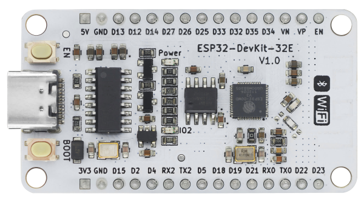
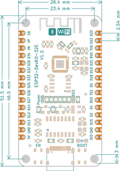

# ESP32 DevKit 32E 使用说明

## 一、[淘宝购买链接](https://item.taobao.com/item.htm?ali_refid=a3_430582_1006:1209150026:N:bHry0KBYQUueXMqvQBLQ7A==:ae7ad87b821c162939f1053fd9a53067&ali_trackid=162_ae7ad87b821c162939f1053fd9a53067&id=778630577370&skuId=5318380828567&spm=a21n57.1.0.0)

## 二、产品介绍

ESP32 DevKit 32E开发板是基于乐鑫科技的 ESP32-DOWD-V3芯片开发的一款尺寸和功能完全兼容Node-MCU产品，主要是为了解决市面上采用非原装模组，在使用中发热巨大，不稳定且容易损坏问题。

### 2.1 主控芯片参数

- 448 KB ROM，520 KB SRAM，16 KB RTC SRAM
- QSPI 支持多个 flash/SRAM
- 内置 8 MHz 振荡器
- 支持自校准
- 内置 RC 振荡器，支持自校准
- 支持外置 2 MHz 至 60 MHz 的主晶振（如果使用 Wi-Fi/蓝牙功能，则目前仅支持 40 MHz 晶振）
- 支持外置 32 kHz 晶振，用于 RTC，支持自校准
- 2 个定时器群组，每组包括 2 个 64-bit 通用定时器和 1 个主系统看门狗
- 1 个 RTC 定时器
- RTC 看门狗
- 带有专用 DMA 的以太网 MAC 接口，支持 IEEE 1588
- 双线汽车接口（TWAI®，兼容 ISO11898-1） x IR (TX/RX)

### 2.2 主板参数

- 采用乐鑫原装 ESP32-DOWD-V3芯片，板载天线
- 芯片内置448 KB ROM，520 KB SRAM，外挂4M SPI FLASH
- Type-C接口，usb转串口芯片为沁恒的CH340G
- 输入电压：5V 1A
- M3定位孔直径：3mm
- 板载复位按键和BOOT按键
- 15pin-2.54mm间距双排针

### 2.3 引脚说明

下表显示了哪些管脚最适合用作输入和输出，哪些管脚需要谨慎使用。

| 端口名字     | 输入      | 输出   | 备注信息                                  |
| ------------ | --------- | ------ | ----------------------------------------- |
| 3.3V         |           |        | 3.3V电源输出                              |
| VIN          |           |        | 5V电源输入                                |
| GND          |           |        | 电源地                                    |
| 0            | pulled up | 是     |                                           |
| 1            | TX Pin    | 是     |                                           |
| 2            | 是        | 是     | Strapping管脚，高电平无法进入串口下载模式 |
| 3            | 是        | RX Pin |                                           |
| 4            | 是        | 是     |                                           |
| 5            | 是        | 是     | Strapping管脚接低电平无法烧录             |
| 6-11         | 否        | 否     | 模组集成SPI flash 不可使用                |
| 12-14，16-33 | 是        | 是     |                                           |
| 15           | 是        | 是     | U0TX上电日志打印 1：打印 0：不打印        |
| 34-35        | 是        | 否     | 只有输入功能                              |
| 36（VP）     | 是        | 否     | 只有输入功能                              |
| 39（VN）     | 是        | 否     | 只有输入功能                              |

- 不建议将6、7、8、9、10、11管脚用作输入或输出，因为被 SPI-FLASH 占用。
- 使用 Wi-Fi 时不能使用 ADC2 管脚。因此，如果您使用 Wi-Fi，并且无 法从 ADC2 GPIO 获取值，则可以考虑改用 ADC1 GPIO。
- 启用（EN）是 3.3V 调节器的启用引脚。它被拉起来了，所以接地使 3.3V 调节器失效。这意味着您可以使用连接到按钮的该管脚来重新启动 ESP32。

### 2.4 <a href="zh-cn/esp32/esp32_devkit_32e/ch340G_esp32.pdf" target="_blank">原理图</a>

## 2.5 产品尺寸图

### 2.5 <a href="zh-cn/esp32/esp32_devkit_32e/ch340G_esp32_pico.step" target="_blank">产品三维图</a>

## 三、ESP32 DevKit 32E 驱动安装

驱动安装请参考此文档：[CH340G驱动安装](zh-cn/driver/ch340_driver/ch340_driver.md)

## 四、ESP32 DevKit 32E下载程序

各平台程序上传方法请参考：[ESP32系列上传程序方法](zh-cn/esp32/esp32_software_instructions/esp32_software_instructions.md)
