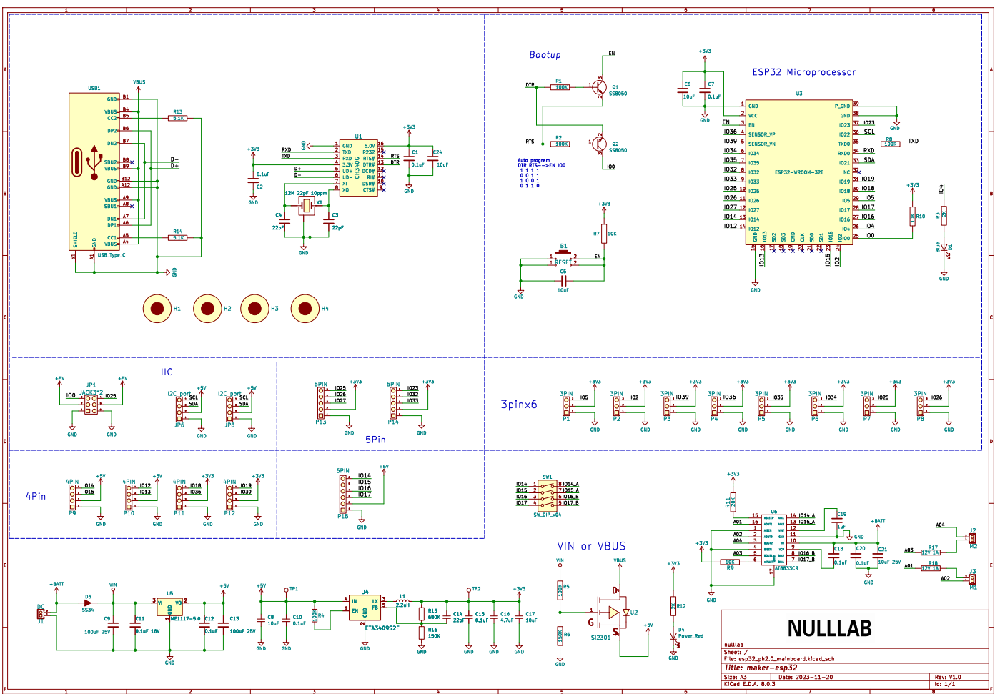
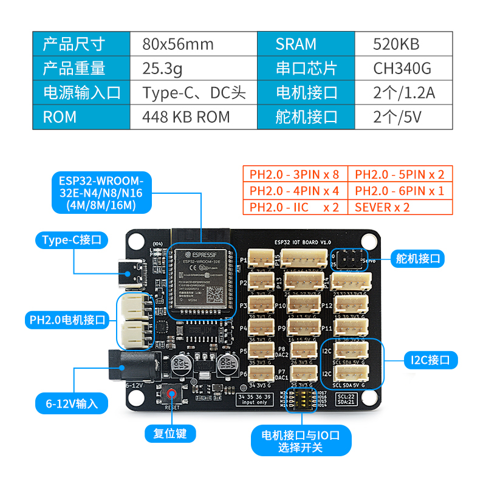

# ESP32-IOT-BOARD 使用说明

## [一、淘宝购买链接](https://item.taobao.com/item.htm?ali_refid=a3_430582_1006:1209150026:N:bHry0KBYQUueXMqvQBLQ7A==:ae7ad87b821c162939f1053fd9a53067&ali_trackid=162_ae7ad87b821c162939f1053fd9a53067&id=778630577370&skuId=5318380828567&spm=a21n57.1.0.0)

## 二、产品介绍

ESP32 IOT BOARD是基于乐鑫科技的 <a href="https://www.espressif.com/sites/default/files/documentation/esp32-wroom-32_datasheet_cn.pdf" target="_blank">ESP32-WROOM-32</a> 原装模组基础上开发的一款适用于创客教育的产品。Flash大小4MB，集成 2.4 GHz、Wi-Fi 和蓝牙双模的单芯片方案。本主板板载2路AT8833电机驱动芯片，电流最大可达1.2A。支持DC头供电，所有可用引脚全部PH2.0接口的方式引出，方便外接传感器，搭建应用场景。

### 2.1 模组参数

- 448 KB ROM,520 KB SRAM,16 KB RTC SRAM
- QSPI 支持多个 flash/SRAM
- 内置 8 MHz 振荡器
- 支持自校准
- 内置 RC 振荡器，支持自校准
- 支持外置 2 MHz 至 60 MHz 的主晶振（如果使用 Wi-Fi/蓝牙功能，则目前仅支持 40 MHz 晶振）
- 支持外置 32 kHz 晶振，用于 RTC，支持自校准
- 2 个定时器群组，每组包括 2 个 64-bit 通用定时器和 1 个主系统看门狗
- 1 个 RTC 定时器
- RTC 看门狗
- 34 个 GPIO 口 • 12-bit SAR ADC，多达 18 个通道
- 带有专用 DMA 的以太网 MAC 接口，支持 IEEE 1588
- 双线汽车接口（TWAI®，兼容 ISO11898-1） • IR (TX/RX)

### 2.2 主板参数

- 采用乐鑫原装V3版本模组ESP32-WROOM-32E
- 采用PH2.0端口，防止反接，导致元器件短路烧坏
- 烧录端口使用Type-C接口
- 2个直流电机端口(14和15,16和17)；电流最大达到1.2A
- 2个I2C插针接口(SCL SDA 5V G)
- 2个舵机接口(25,0)
- 输入电压：DC输入5.5-2.1mm  6-12V
- 产品尺寸：80mm×56mm；PCB厚度：1.6mm；净重：25.3g
- M4定位孔直径：4.7mm，兼容乐高

### 2.3 原理图

<a href="zh-cn/esp32/esp32_iot_board/esp32_ph2.0_mainboard.pdf" target="_blank">点击此处查看原理图</a>

### 2.4 尺寸说明

### 2.5 引脚说明

**注**:

1. Motor and IO Switch: 当拨码开关打到IO口端时，M1、M2电机端口不工作，不能驱动电机，引脚为普通端口；当拨码开关打到M1A/M1B/M2A/M2B时，M1、M2为电机端口，可以驱动电机。

2. 电源指示灯P。

3. 板载LED灯L（IO4）可作为下载检测使用。

4. 复位键能够复位主板。

5. 因为ESP32芯片特性，在Arduino模式下，主板的34、35、36、39引脚不能作为输出；并且34、35、36、39引脚作为输入时，不能设置上拉或下拉模式。

## 三、ESP32-IOT-BOARD 驱动安装

驱动安装请参考此文档：[CH340G驱动安装](zh-cn/driver/ch340_driver/ch340_driver.md)

## 四、ESP32-IOT-BOARD 上传程序方法

该主板支持使用Arduino IDE、MicroPython等代码编程，也支持Mixly、Mind+等图形化编程。

### 4.1 通过Arduino IDE下载程序

各平台程序上传方法请参考：[ESP32系列上传程序方法](zh-cn/esp32/esp32_software_instructions/esp32_software_instructions.md)

**注意**：使用Arduino IDE开发时，请将esp32更新至最新版本。

### FAQ

**Q**: Mixly下载程序不成功？

**A**：1. Mixly的安装路径不要包含中文、空格等特殊字符；放在电脑盘符的根目录下，层级目录不要太深；比如 D:\mixly2.0-win32-x64就是根目录安装；

1. 查看串口是否选择正确，如果没有串口，请先安装CH340G驱动；串口不要被其他应用占用；
2. 检查程序是否有错误；

**Q**: 电机程序上传成功，但是电机不转？

**A**: 1. 电机需要DC头供电，6-12V，建议使用7.4V锂电池，电源开关是否打到ON；

1. 第一步已经完成的话，还出现问题，请检查Motor and IO Switch开关是否拨到电机方向(即 标有ON的方 向)；
2. 检测程序设置的电机引脚是否和电机实际引脚对应；
