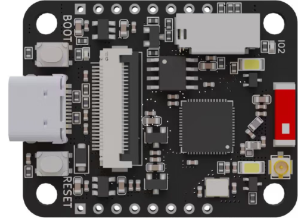
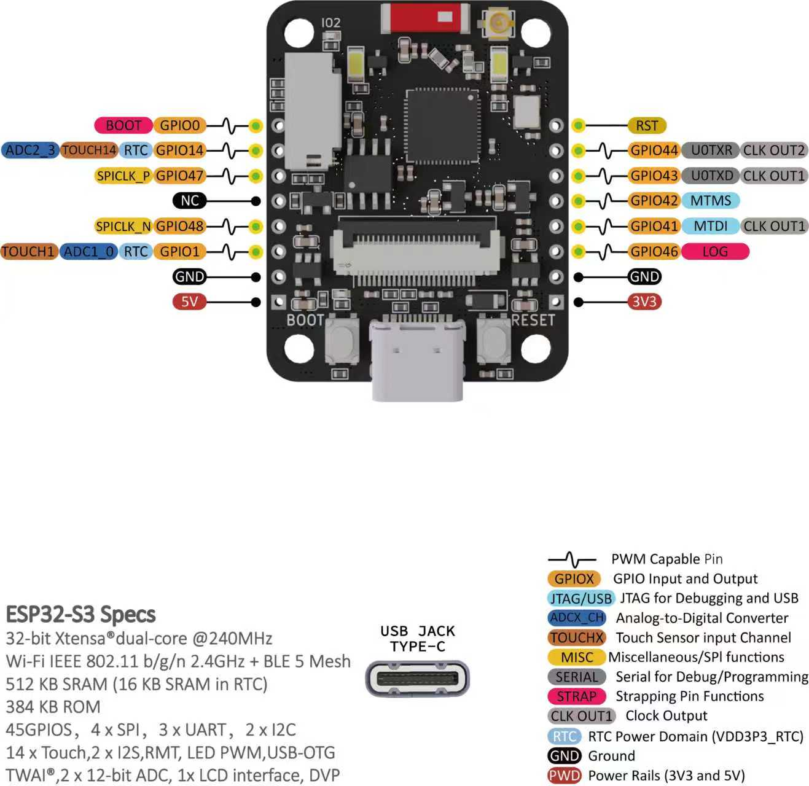
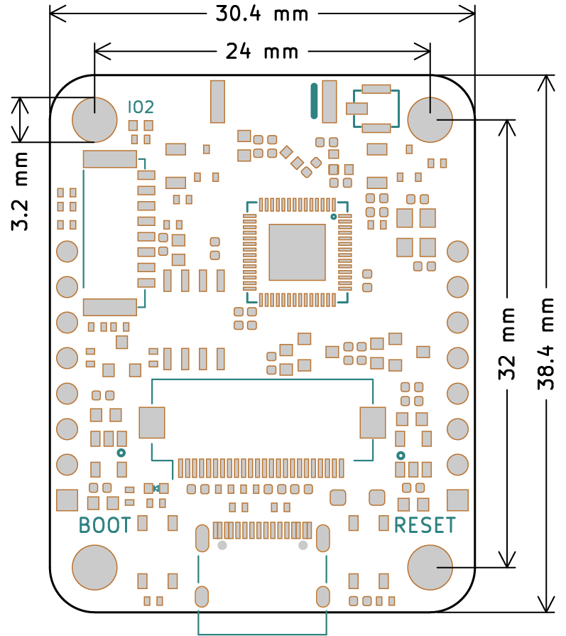
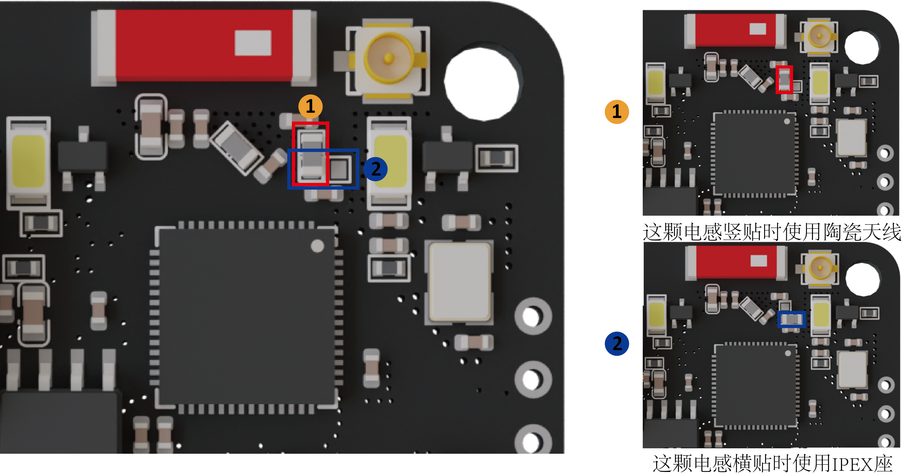
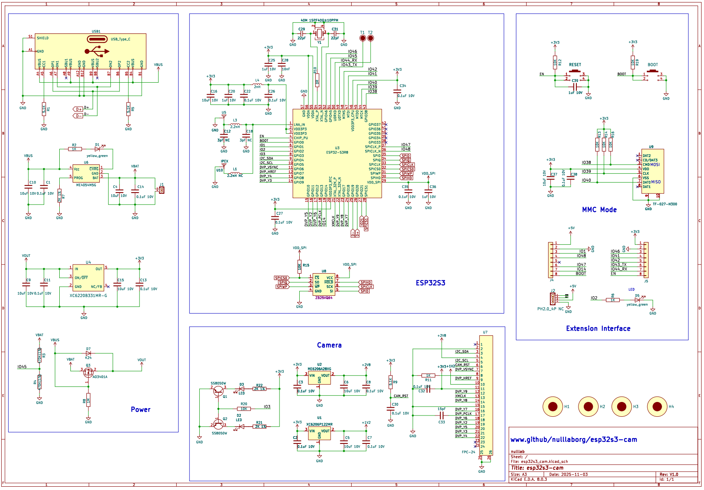
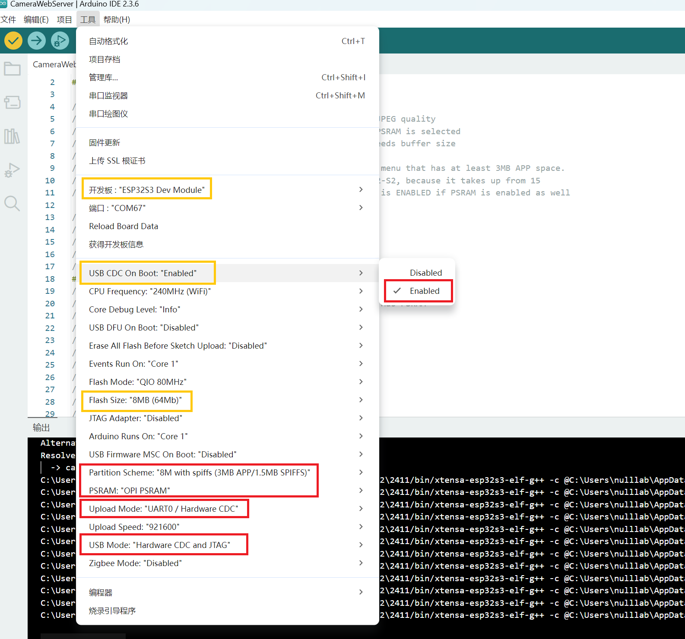

# ESP32S3-CAM

## 模块实物图



## 概述

​	ESP32S3-CAM是一款基于乐鑫[ESP32-S3R8芯片](https://documentation.espressif.com/esp32-s3_datasheet_cn.pdf )而开发的一款小尺寸的无线摄像头模块，该模块可以单独通过电池供电作为最小系统独立工作，尺寸仅为 `20.4*38.4*4.5mm`。本产品基于市面上已存在的ESP32S3-CAM优化而开发，主要解决市面上，下载程序需要外接下载底部，发热巨大，不稳定等问题。使用方法兼容现有的ESP32S3-CAM，网上有大量使用教程，可以直接参考使用。


## 引脚标注




## 主板参数

- 采用乐鑫原装ESP32-S3R8芯片，板载天线和IPEX天线座；
- 芯片内置384 KB ROM，520 KB SRAM，内置8M SPIRAM，外挂8M SPI FLASH；
- Type-C接口，usb直通ESP32S3芯片；
- 输入电压：typeC 5V 1A，背面预留3.7V电池焊点，板载充电电路；
- 背面预留PH2.0接口可以作为外设通信接口或者供电；
- 板载复位按键，和boot按键；
- 板载micro-SD卡插槽，MMC模式；
- 支持OV2640/OV3660摄像头， 内置2个 LED 闪光灯；
- 尺寸30.4mmx38.4mmx4.5mm；
- 2x8pin 2.54间距排针

## 板子尺寸标注

<a href="zh-cn/esp32/esp32s3-cam/esp32s3_cam_3d.zip" target="_blank">下载3D文件</a>




### 板载陶瓷天线和IPEX天线切换

### 

### <a href="zh-cn/esp32/esp32s3-cam/esp32s3_cam_sch.pdf" target="_blank">下载原理图</a>



### 安装驱动

win10以上或者mac系统都自动安装驱动无需安装驱动，如遇到特殊系统显示不出端口号请参考如下方法：

[安装驱动方法点击此处查看](/zh-cn/driver/esp32_driver/esp32_driver.md)

### 配置Arduino中的开发板

Arduino IDE上传方法请参考：[ESP32系列上传程序方法](zh-cn/esp32/esp32_software_instructions/esp32_software_instructions.md)

安装完成后即可选择对应的开发板：



### 上传示例程序

<a href="zh-cn/esp32/esp32s3-cam/CameraWebServer.zip" target="_blank">下载CameraWebServer程序</a>

### 测试效果

打开串口监视器，打开网页输入以下链接进入相机调试页面。


串口显示以上信息，说明程序植入正确，若未出现以上信息，需要按上面的步骤逐一对照。


点击Start Stream即可打开摄像头调参


拖动LED Intensity滑动条，可以调节摄像头闪光灯的亮度。

## micropython应用

<a href="zh-cn/esp32/esp32s3-cam/esp32s3-cam_micropython_demo.zip" target="_blank">下载ESP32S3-CAM micropython固件</a>

```
系统终端输入如下烧录命令
.\esptool.exe --chip esp32S3  -b 460800 write_flash  0 "firmware.bin"  --erase-all
```

编程工具推荐[Thonny](/zh-cn/software/thonny/thonny.zh-CN.md)

#### camera函数使用说明

#### `camera.init(*)`

初始化摄像头，必须初始化后才能使用摄像头拍照图片。

- **关键词参数**

  - `format`, 图片数据格式

    | 格式               | 说明                |
    | ------------------ | ------------------- |
    | `camera.JPEG`      | JPEG 格式（默认值） |
    | `camera.YUV422`    | YUV422              |
    | `camera.GRAYSCALE` | GRAYSCALE           |
    | `camera.RGB565`    | RGB565              |

  - `framesize`, 分辨率（帧尺寸）

    | 分辨率（帧尺寸）       | 说明              |
    | ---------------------- | ----------------- |
    | `camera.FRAME_96X96`   | 96X96             |
    | `camera.FRAME_QQVGA`   | 160x120           |
    | `camera.FRAME_QCIF`    | 176x144           |
    | `camera.FRAME_HQVGA`   | 240x160           |
    | `camera.FRAME_240X240` | 240X240           |
    | `camera.FRAME_QVGA`    | 320x240           |
    | `camera.FRAME_CIF`     | 352x288           |
    | `camera.FRAME_HVGA`    | 480x320           |
    | `camera.FRAME_VGA`     | 640x480（默认值） |
    | `camera.FRAME_SVGA`    | 800x600           |
    | `camera.FRAME_XGA`     | 1024x768          |
    | `camera.FRAME_HD`      | 1280x720          |
    | `camera.FRAME_SXGA`    | 1280x1024         |
    | `camera.FRAME_UXGA`    | 1900x1200         |
    | `camera.FRAME_FHD`     | 1920x1080         |
    | `camera.FRAME_P_HD`    | 2560x1440         |
    | `camera.FRAME_P_3MP`   | 2048x1536         |
    | `camera.FRAME_QXGA`    | 2048x1536         |
    | `camera.FRAME_QHD`     | 2560x1440         |
    | `camera.FRAME_WQXGA`   | 2560x1600         |
    | `camera.FRAME_P_FHD`   | 2560x1600         |
    | `camera.FRAME_QSXGA`   | 2560x2048         |

  - `quality`，JPEG 质量，默认值：12，可选范围：0~63

  - `d0`，D0 引脚，默认值：11（ESP32S3 CAM 引脚值）

  - `d1`，D1 引脚，默认值：9（ESP32S3 CAM 引脚值）

  - `d2`，D2 引脚，默认值：8（ESP32S3 CAM 引脚值）

  - `d3`，D3 引脚，默认值：10（ESP32S3 CAM 引脚值）

  - `d4`，D4 引脚，默认值：12（ESP32S3 CAM 引脚值）

  - `d5`，D5 引脚，默认值：18（ESP32S3 CAM 引脚值）

  - `d6`，D6 引脚，默认值：17（ESP32S3 CAM 引脚值）

  - `d7`，D7 引脚，默认值：16（ESP32S3 CAM 引脚值）

  - `vsync`，VSYNC 引脚，默认值：6（ESP32S3 CAM 引脚值）

  - `href`，HREF 引脚，默认值：7（ESP32S3 CAM 引脚值）

  - `pclk`，PCLK 引脚，默认值：13（ESP32S3 CAM 引脚值）

  - `pwdn`，POWER 引脚，默认值：-1（不使用）

  - `reset`，RESET 引脚，默认值：-1（不使用）

  - `xclk`，XCLK 引脚，默认值：15（ESP32S3 CAM 引脚值）

  - `sda`，SDA 引脚，默认值：4（ESP32S3 CAM 引脚值）

  - `scl`，SCL 引脚，默认值：5（ESP32S3 CAM 引脚值）

  - `xclk_freq`，XCLK 信号频率，默认值：`camera.XCLK_10MHz`，可选值：`camera.XCLK_20MHz`

  - `fb_size`，帧缓存数量，默认值：1

  - `fb_location`，帧缓存区，默认值：`camera.DRAM`，可选值：`camera.PSRAM`

#### `camera.deinit()`

卸载摄像头，释放使用的硬件资源。

#### `camera.capture()`

拍摄 1 帧图片。

#### `camera.flashlamp(enable)`

使用板载闪光灯（ESP32S3 CAM 硬件特有函数）。

### 画面设置函数

#### `camera.framesize(framesize)`

重新设置分辨率（帧尺寸），参数具体值见前文。

#### `camera.quality(quality)`

重新设置 JPEG 质量，可选范围：0~63

#### `camera.flip(enable)`

设置画面上下颠倒。

#### `camera.mirror(enable)`

设置画面左右镜像。

#### `camera.contrast(contrast)`

设置画面对比度，默认值：0，可选范围：-2~2（高对比度）。

#### `camera.saturation(saturation)`

设置画面饱和度，默认值：0，可选范围：-2（灰度）~2。

#### `camera.brightness(brightness)`

设置画面亮度，默认值：0，可选范围：-2~2（高亮度）。

#### `camera.speffect(effect)`

设置画面特效。

| 特效                       | 说明           |
| -------------------------- | -------------- |
| `camera.EFFECT_NONE`       | 原图（默认值） |
| `camera.EFFECT_NEGATIVE`   |                |
| `camera.EFFECT_GRAYSCALE`  |                |
| `camera.EFFECT_SEPIA`      |                |
| `camera.EFFECT_RED`        |                |
| `camera.EFFECT_GREEN`      |                |
| `camera.EFFECT_BLUE`       |                |
| `camera.EFFECT_ANTIQUE`    |                |
| `camera.EFFECT_SKETCH`     |                |
| `camera.EFFECT_SOLARIZE`   |                |
| `camera.EFFECT_POSTERIZE`  |                |
| `camera.EFFECT_WHITEBOARD` |                |
| `camera.EFFECT_BLACKBOARD` |                |
| `camera.EFFECT_AQUA`       |                |

#### `camera.whitebalance(whitebalance)`

设置画面白平衡。

| 白平衡             | 说明           |
| ------------------ | -------------- |
| `camera.WB_NONE`   | 原图（默认值） |
| `camera.WB_SUNNY`  | 晴天           |
| `camera.WB_CLOUDY` | 阴天           |
| `camera.WB_OFFICE` | 办公室         |
| `camera.WB_HOME`   | 家中           |

更详细的案例请购买后咨询客服。