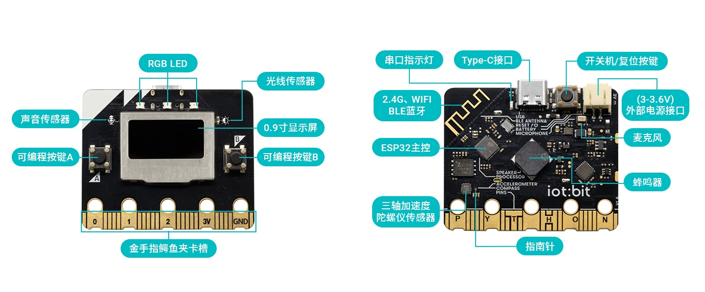

# 物联板iot:bit

## 概述

物联板iot:bit是易创空间基于乐鑫的ESP32-DOWD-V3芯片开发的一款尺寸microbit的产品，Flash大小 8MB，集成 2.4 G Wi-Fi 和蓝牙双模的单芯片方案。板载0.96寸OLED显示屏，3个RGB灯，三轴陀螺仪，声音传感器，光线传感器，无源蜂鸣器，A，B按键，地磁传感器，6路触摸输入，20个金手指IO接口。主板使用方式兼容microbit金手指，兼容microbit的扩展板生态。功能和盛思掌控板2.0兼容，但是金手指的方向和掌控板是相反的。

## ESP32-DOWD-V3芯片参数

* 448 KB ROM,520 KB SRAM,16 KB RTC SRAM
* QSPI 支持多个 flash/SRAM
* 内置 8 MHz 振荡器
* 支持自校准
* 内置 RC 振荡器，支持自校准
* 支持外置 2 MHz 至 60 MHz 的主晶振（如果使用 Wi-Fi/蓝牙功能，则目前仅支持 40 MHz 晶振）
* 支持外置 32 kHz 晶振，用于 RTC，支持自校准
* 2 个定时器群组，每组包括 2 个 64-bit 通用定时器和 1 个主系统看门狗
* 1 个 RTC 定时器
* RTC 看门狗
* 34 个 GPIO 口 • 12-bit SAR ADC，多达 18 个通道
* 带有专用 DMA 的以太网 MAC 接口，支持 IEEE 1588
* 双线汽车接口（TWAI®，兼容 ISO11898-1） • IR (TX/RX)

## 原理图

<a href="zh-cn/esp32/iotbit/iotbit_schematic.pdf" target="_blank">点击查看原理图</a>

## 主板参数

* 主控芯片ESP32-DOWD-V3，SRM:520KB，FLASH:8MB
* TypeC供电下载，支持C2C数据线，PH2.0 3V供电；
* USB转串口芯片为CH9102F芯片；
* OLED尺寸为0.96寸，驱动芯片为SSH1106；
* 三轴陀螺仪QMI8658C，地磁传感器MMC5603NJ；
* 板载无源蜂鸣器，3个WS2812B，光敏传感器，声音传感器；
* 6个触摸引脚 P，Y，T，H，O，N；
* 尺寸： 52x42mm兼容microbit尺寸

## 引脚映射图

