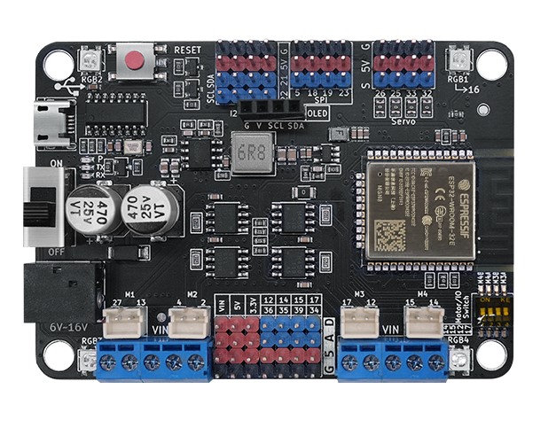

# Maker-ESP32 使用说明书

## [淘宝购买链接](https://item.taobao.com/item.htm?spm=a21dvs.23580594.0.0.3c3a3d0dhaSOlC&ft=t&id=688324885925)

## 产品简介

   Maker-ESP32是基于乐鑫科技的 [ESP32-WROOM-32](https://www.espressif.com/sites/default/files/documentation/esp32-wroom-32_datasheet_cn.pdf) 模组基础上开发的一款适用于创客教育的标志性产品，Flash大小4MB，集成 2.4 GHz、Wi-Fi 和蓝牙双模的单芯片方案。采用东芝的电机驱动芯片，电流最大可达3.5A。

## ESP32模组参数

* 448 KB ROM,520 KB SRAM,16 KB RTC SRAM

* QSPI 支持多个 flash/SRAM

* 内置 8 MHz 振荡器

* 支持自校准

* 内置 RC 振荡器，支持自校准

* 支持外置 2 MHz 至 60 MHz 的主晶振（如果使用 Wi-Fi/蓝牙功能，则目前仅支持 40 MHz 晶振）

* 支持外置 32 kHz 晶振，用于 RTC，支持自校准

* 2 个定时器群组，每组包括 2 个 64-bit 通用定时器和 1 个主系统看门狗

* 1 个 RTC 定时器

* RTC 看门狗

* 34 个 GPIO 口 • 12-bit SAR ADC，多达 18 个通道

* 带有专用 DMA 的以太网 MAC 接口，支持 IEEE 1588

* 双线汽车接口（TWAI®，兼容 ISO11898-1） • IR (TX/RX)

## 产品参数

* 4个电机端口；2个步进电机端口；电流最大达到3.5A
* 板载4个RGB灯(16引脚)
* 5个I2C插针接口,1个SPI插针接口
* 4个舵机接口（25、26、32、33）
* 8个IO引脚(12、14、15、17、34、35、36、39)
* 输入电压： 6-16V
* 产品尺寸：80mm×57mm；PCB厚度：1.6mm；净重：35g
* M4定位孔直径：4.6mm，兼容乐高
* 软件支持Mixly、Arduino IDE、Python

## 引脚说明

**注:**  

1.Motor and IO Switch: 当拨码开关打到IO口端时，M3、M4电机端口不工作，不能驱动电机，引脚为普通端口；当拨码开关打到M3A/M3B/M4A/M4B时，M3、M4为电机端口，可以驱动电机。

2.因为ESP32芯片特性，在Arduino框架下，主板的34、35、36、39引脚不能作为输出；并且34、35、36、39引脚做为输入时，不能设置上拉或下拉模式。

[点击查看产品原理图](zh-cn/esp32/maker_esp32/Esp32_V1.5.pdf ':ignore')

[点击查看三维模型图](zh-cn/esp32/maker_esp32/maker-esp32.step ':ignore')

## Maker-ESP32驱动安装

驱动安装请参考此文档：[CH340G驱动安装](zh-cn/driver/ch340_driver/ch340_driver.md)

## Maker-ESP32上传程序方法

各平台程序上传方法请参考：[ESP32系列上传程序方法](zh-cn/esp32/esp32_software_instructions/esp32_software_instructions.md)

**注意**：使用Arduino IDE开发时，请将esp32更新至最新版本。

## Mixly示例程序

[点击下载电机示例程序](zh-cn/esp32/maker_esp32/esp32_mixly/esp32_motor_test.zip ':ignore')

[点击下载RGB灯示例程序](zh-cn/esp32/maker_esp32/esp32_mixly/esp32_rgb_test.zip ':ignore')

[点击下载舵机示例程序](zh-cn/esp32/maker_esp32/esp32_mixly/esp32_servo_test.zip ':ignore')

[点击下载OLED示例程序](zh-cn/esp32/maker_esp32/esp32_mixly/esp32_oled_test.zip ':ignore')

[点击下载电机舵机综合示例程序](zh-cn/esp32/maker_esp32/esp32_mixly/esp32_motor_servo_test.zip ':ignore')

电机舵机一起用时，不要用Mixly自带的电机驱动块，需使用操作引脚来控制，因为舵机电机一起使用时，mixly自带的驱动块PWM管道冲突，属于mixly软件库本身的问题。

[点击下载步进电机示例程序](zh-cn/esp32/maker_esp32/esp32_mixly/esp32_stepper_test.zip ':ignore')

以28BYJ-48步进电机，接Stepper1接口为例, 接线方式如下表格：

| 步进电机线的颜色 | 引脚(主板背面丝印) |
|:--------:|:----------:|
| 橙色       | A01        |
| 粉色       | A02        |
| 红色       | VIN        |
| 蓝色       | A03        |
| 黄色       | A04        |

## Arduino示例程序

[点击下载电机示例程序](zh-cn/esp32/maker_esp32/esp32_arduino/motorTest.zip ':ignore')

[点击下载RGB灯示例程序](zh-cn/esp32/maker_esp32/esp32_arduino/rgbTest.zip ':ignore')

[点击下载舵机示例程序](zh-cn/esp32/maker_esp32/esp32_arduino/servoTest.zip ':ignore')

[点击下载OLED示例程序](zh-cn/esp32/maker_esp32/esp32_arduino/oledTest.zip ':ignore')

[点击下载电机舵机综合示例程序](zh-cn/esp32/maker_esp32/esp32_arduino/motorServotTest.zip ':ignore')

[点击下载步进电机示例程序](zh-cn/esp32/maker_esp32/esp32_arduino/stepperTest.zip ':ignore')

以28BYJ-48步进电机，接Stepper1接口为例,接线方式如下表格：

| 步进电机线的颜色 | 引脚(主板背面丝印) |
|:--------:|:----------:|
| 橙色       | A01        |
| 粉色       | A02        |
| 红色       | VIN        |
| 蓝色       | A03        |
| 黄色       | A04        |

## ESP32系列连接使用PS3蓝牙无线手柄

[点击查看ESP32系列连接使用PS3蓝牙无线手柄](zh-cn/peripheral/bluetooth_gamepad_ps3/bluetooth_gamepad_ps3.md)

[点击下载PS3控制电机舵机案例](zh-cn/esp32/maker_esp32/esp32_arduino/esp32PS3ControlTest.zip ':ignore')

[点击下载Mixly库PS3手柄](zh-cn/esp32/maker_esp32/esp32_mixly/esp32_emakefun_sensors_mixly.zip ':ignore')

[点击下载PS3手柄Mixly示例](zh-cn/esp32/maker_esp32/esp32_mixly/esp32_ps3_rock_test.zip ':ignore')

[点击下载PS3手柄 Mind+库](zh-cn/esp32/maker_esp32/esp32_mindplus/emakefun-ps3.zip ':ignore')

[点击下载PS3手柄 Mind+示例](zh-cn/esp32/maker_esp32/esp32_mindplus/ps3_test.zip ':ignore')

## Mind+示例程序

[点击下载电机示例程序](zh-cn/esp32/maker_esp32/esp32_mindplus/esp32MindplusMotor.zip ':ignore')

[点击下载Maker-esp32Mind+库文件](zh-cn/esp32/maker_esp32/esp32_mindplus/emakefun-em_maker_esp32-thirdex-V0.0.2.mpext ':ignore')

## FAQ

**Q**: Mixly下载程序不成功？

**A**：1.Mixly的安装路径不要包含中文、空格等特殊字符；放在电脑的根目录下，层级目录不要太深；比如                          D:\mixly2.0-win32-x64就是根目录安装；  

2.查看串口是否选择正确，如果没有串口，请先安装CH340G驱动；串口不要被其他应用占用；

3.检查程序是否有错误；

**Q**: 电机程序上传成功，但是电机不转？

**A**: 1.电机需要DC头供电，6-24V，建议使用两节3.7V锂电池，电源开关是否打到ON；

2.第一步已经完成的话，还出现问题，请检查Motor and IO Switch开关是否拨到电机方向(即 标有ON的方       向)；

3.检测程序设置的电机引脚是否和电机实际引脚一一对应；
