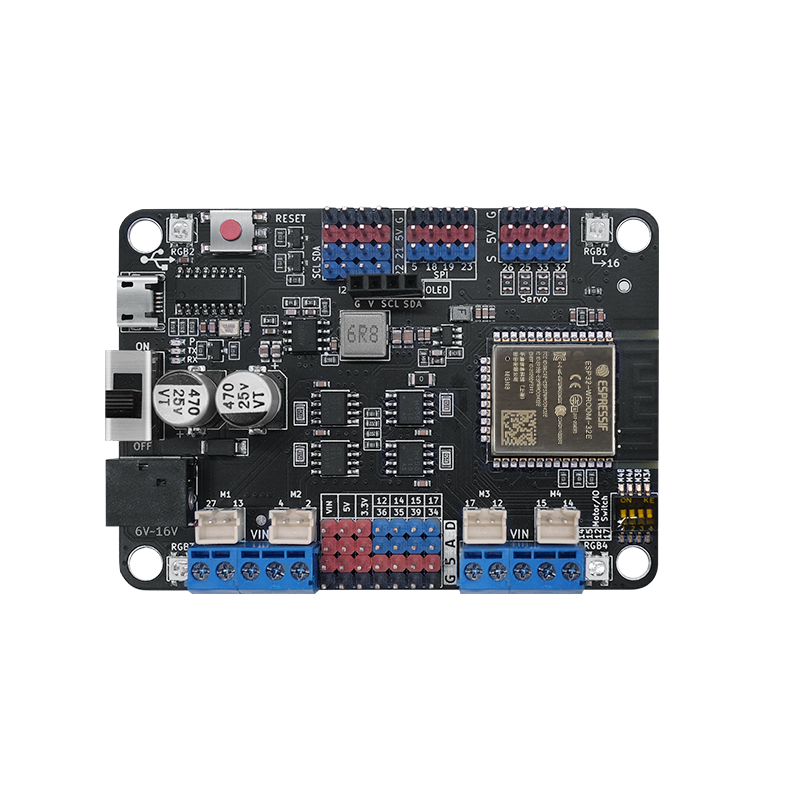
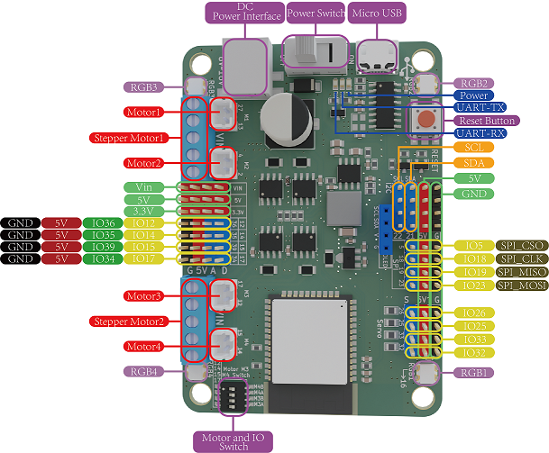

# Maker-ESP32 使用说明书

## [淘宝购买链接](https://item.taobao.com/item.htm?spm=a21dvs.23580594.0.0.3c3a3d0dhaSOlC&ft=t&id=688324885925)

## 产品简介

   Maker-ESP32是基于乐鑫科技的 <a href="https://www.espressif.com/sites/default/files/documentation/esp32-wroom-32_datasheet_cn.pdf" target="_blank">ESP32-WROOM-32E</a> 模组基础上开发的一款适用于创客教育的标志性产品，Flash大小4MB，集成 2.4 GHz、Wi-Fi 和蓝牙双模的单芯片方案。采用东芝的电机驱动芯片，单电机电流最大可达3.5A。

## ESP32模组参数

* 448 KB ROM,520 KB SRAM,16 KB RTC SRAM

* QSPI 支持多个 flash/SRAM

* 内置 8 MHz 振荡器

* 支持自校准

* 内置 RC 振荡器，支持自校准

* 支持外置 2 MHz 至 60 MHz 的主晶振（如果使用 Wi-Fi/蓝牙功能，则目前仅支持 40 MHz 晶振）

* 支持外置 32 kHz 晶振，用于 RTC，支持自校准

* 2 个定时器群组，每组包括 2 个 64-bit 通用定时器和 1 个主系统看门狗

* 1 个 RTC 定时器

* RTC 看门狗

* 34 个 GPIO 口 • 12-bit SAR ADC，多达 18 个通道

* 带有专用 DMA 的以太网 MAC 接口，支持 IEEE 1588

* 双线汽车接口（TWAI®，兼容 ISO11898-1） • IR (TX/RX)

## 产品参数

* 4个电机端口(M1: 27, 13; M2: 4, 2; M3: 17, 15; M4: 14, 15)；2个步进电机端口(Stepper1: 27, 13, 2, 4; Stepper2: 17, 12, 14, 15)；电流最大达到3.5A；步进电机和直流电机共用IO引脚，使用时注意引脚复用。
* 板载4个RGB灯(16引脚)
* 5个I2C插针接口,1个SPI插针接口
* 4个舵机接口（25、26、32、33）
* 8个IO引脚(12、14、15、17、34、35、36、39)
* DC头(5.5-2.1mm)输入电压： 6-16V
* 产品尺寸：80mm×57mm；PCB厚度：1.6mm；净重：35g
* M4定位孔直径：4.6mm，兼容乐高
* 软件支持Mixly、Arduino IDE、Micropython、Mind+

## 引脚说明

**注:**  

1. Motor and IO Switch: 当拨码开关打到IO口端时，M3、M4电机端口不工作，不能驱动电机，引脚为普通端口；当拨码开关打到M3A/M3B/M4A/M4B时，M3、M4为电机端口，可以驱动电机。

2. 因为ESP32芯片特性，在Arduino框架下，主板的34、35、36、39引脚不能作为输出；并且34、35、36、39引脚做为输入时，不能设置上拉或下拉模式。

3. 使用WIFI时，请使用2.4GHZ频段的网络，否则主板将无法连接上WIFI。

<a href="zh-cn/esp32/maker_esp32/Esp32_V1.5.pdf" target="_blank">点击查看产品原理图</a>

<a href="zh-cn/esp32/maker_esp32/maker-esp32.zip" target="_blank">点击下载三维模型图</a>

## Maker-ESP32驱动安装

驱动安装请参考此文档：[CH340G驱动安装](zh-cn/driver/ch340_driver/ch340_driver.md)

## Maker-ESP32上传程序方法

各平台程序上传方法请参考：[ESP32系列上传程序方法](zh-cn/esp32/esp32_software_instructions/esp32_software_instructions.md)

**注意**：使用Arduino IDE开发时，请将esp32更新至最新版本。

## Mixly示例程序

<a href="zh-cn/esp32/maker_esp32/esp32_mixly/esp32_motor_test.zip" download>点击下载电机示例程序</a>

<a href="zh-cn/esp32/maker_esp32/esp32_mixly/esp32_rgb_test.zip" download>点击下载RGB灯示例程序</a>

<a href="zh-cn/esp32/maker_esp32/esp32_mixly/esp32_servo_test.zip" download>点击下载舵机示例程序</a>

<a href="zh-cn/esp32/maker_esp32/esp32_mixly/esp32_oled_test.zip" download>点击下载OLED示例程序</a>

<a href="zh-cn/esp32/maker_esp32/esp32_mixly/esp32_motor_servo_test.zip" download>点击下载电机舵机综合示例程序</a>

电机舵机一起用时，不要用Mixly自带的电机驱动块，需使用操作引脚来控制，因为舵机电机一起使用时，mixly自带的驱动块PWM管道冲突，属于mixly软件库本身的问题。

<a href="zh-cn/esp32/maker_esp32/esp32_mixly/esp32_stepper_test.zip" download>点击下载步进电机示例程序</a>

以28BYJ-48步进电机，接Stepper1接口为例,接线方式如下表格：

| 步进电机线的颜色 | 引脚(主板背面丝印) |
|---------- |------------ |
| 橙色       | A01 (27)   |
| 粉色       | A02 (13)   |
| 红色       | VIN        |
| 蓝色       | A03 (2)    |
| 黄色       | A04 (4)    |

## Arduino示例程序(ESP32版本>=3.0.0)

<a href="zh-cn/esp32/maker_esp32/esp32_arduino/motorTest.zip" download>点击下载电机示例程序</a>

<a href="zh-cn/esp32/maker_esp32/esp32_arduino/rgbTest.zip" download>点击下载RGB灯示例程序</a>

<a href="zh-cn/esp32/maker_esp32/esp32_arduino/servoTest.zip" download>点击下载舵机示例程序</a>

<a href="zh-cn/esp32/maker_esp32/esp32_arduino/oledTest.zip" download>点击下载OLED示例程序</a>

<a href="zh-cn/esp32/maker_esp32/esp32_arduino/motorServotTest.zip" download>点击下载电机舵机综合示例程序</a>

<a href="zh-cn/esp32/maker_esp32/esp32_arduino/stepperTest.zip" download>点击下载步进电机示例程序</a>

以28BYJ-48步进电机，接Stepper1接口为例,接线方式如下表格：

| 步进电机线的颜色 | 引脚(主板背面丝印) |
|---------- |------------ |
| 橙色       | A01 (27)   |
| 粉色       | A02 (13)   |
| 红色       | VIN        |
| 蓝色       | A03 (2)    |
| 黄色       | A04 (4)    |

### 驱动42步进电机（两相四线）示例（Arduino）

<a href="zh-cn/esp32/maker_esp32/esp32_arduino/42stepper_test.zip" download>点击下载42步进电机示例程序</a>

**安装库**：在 Arduino IDE 中，通过“项目” → “加载库” → “管理库”，搜索并找到 **AccelStepper** ，版本选择**1.64**，然后点击安装。

#### 1. 硬件接线

Maker-ESP32 可直接驱动双极性步进电机，将 42 步进电机的四根线连接至 Stepper1 或 Stepper2 端口即可。

**端口对应关系**

| 电机线功能 |Stepper1 引脚 | Stepper2 引脚 |
|---------- |------------- |-------------- |
| A+        | A01 (27)     | B01 (17)      |
| A-        | A02 (13)     | B02 (12)      |
| B+        | A03 (2)      | B03 (14)      |
| B-        | A04 (4)      | B04 (15)      |

**接线步骤**

1. 将电机四根线按上表接入对应端口（以 Stepper1 为例）。
2. 将板上的 **Motor and IO Switch** 拨至 **ON（电机方向）**。
3. 用 DC 头接入 **6-16V** 电源，并打开电源开关。
4. 如果电机转动方向与预期相反，可交换任意一相的两根线（如 A+ 与 A- 互换），或通过软件修改方向。

#### 2. 42步进电机简介

42步进电机（常见如 42BYGH 系列）属于**两相混合式步进电机**，是工业自动化及创客领域最常用的机型之一。其名称中的"42"指安装法兰边长为 42mm，符合 NEMA 17 国际标准，广泛应用于 3D 打印机、小型雕刻机、CNC 机床等设备。标准步距角为 1.8°（即 200 个脉冲转一圈），采用双极性驱动方式，内部设有两个独立线圈，与单向驱动的减速步进电机（如 28BYJ-48）相比，42 步进电机可输出更大的转矩，控制精度更高，适用于对定位精度和动力性能有更高要求的场景。

#### 3. 工作原理与相位说明

##### 3.1 基本结构

* **定子**：有 8 个磁极，每个磁极上绕有线圈，分成 A、B 两相。
* **转子**：由永磁体和两端带齿的铁芯构成，两端的齿相互错开半个齿距。
* **步距角**：转子 50 个齿，齿距角 7.2°，配合两相四拍通电方式，步距角 = 7.2° / 4 = **1.8°**。

##### 3.2 相位与接线

42步进电机的四根引出线分别属于两个独立的线圈（即两相），标记为 **A+、A-、B+、B-**。其中 **A+ 与 A- 为同一相（A相）**，**B+ 与 B- 为同一相（B相）**。由于不同厂家线色标准不统一，仅凭颜色无法确保正确，必须通过测量来确定每根线的归属。

**相位识别步骤**

**工具**：数字万用表（电阻档或蜂鸣档）

1. **找出同一相的两根线**  
   * 将万用表调至电阻档（200Ω 量程）或蜂鸣档。  
   * 任意测量两根线之间的电阻：  
     * 如果阻值很小（通常几欧姆），说明这两根线属于**同一相线圈**。  
     * 如果阻值无穷大（不导通），说明它们属于不同相。  
   * 重复测量，直到找出**两组**相互导通的线对。每组即为一个线圈（如线圈1和线圈2）。

2. **标记两相**  
   * 将第一组两根线暂时标记为 **A 相**（暂称 A1、A2），第二组标记为 **B 相**（B1、B2）。  
   * **注意**：此时我们尚无法区分 A1 和 A2 哪个是 A+ 哪个是 A-，但对于双极性驱动，这并不重要。只要将同一相的两根线分别接到驱动器的 A+ 和 A- 端口（顺序可任意），另一相接到 B+ 和 B- 即可。如果电机转向相反，交换任意一相的两根线即可纠正。

## ESP32系列连接使用PS3蓝牙无线手柄

[点击查看ESP32系列连接使用PS3蓝牙无线手柄](zh-cn/peripheral/bluetooth_gamepad_ps3/bluetooth_gamepad_ps3.md)

<a href="zh-cn/esp32/maker_esp32/esp32_arduino/esp32PS3ControlTest.zip" download>点击下载PS3控制电机舵机案例</a>

<a href="zh-cn/esp32/maker_esp32/esp32_mixly/esp32_emakefun_sensors_mixly.zip" download>点击下载Mixly库PS3手柄</a>

<a href="zh-cn/esp32/maker_esp32/esp32_mixly/esp32_ps3_rock_test.zip" download>点击下载PS3手柄Mixly示例</a>

<a href="zh-cn/esp32/maker_esp32/esp32_mindplus/emakefun-ps3.zip" download>点击下载PS3手柄 Mind+库</a>

<a href="zh-cn/esp32/maker_esp32/esp32_mindplus/ps3_test.zip" download>点击下载PS3手柄 Mind+示例</a>

## Mind+示例程序

<a href="zh-cn/esp32/maker_esp32/esp32_mindplus/emakefun-em_maker_esp32-thirdex-V0.0.2.mpext" download>点击下载Maker-esp32Mind+库文件</a>

<a href="zh-cn/esp32/maker_esp32/esp32_mindplus/esp32MindplusMotor.zip" download>点击下载电机示例程序</a>

## FAQ

**Q**: Mixly下载程序不成功？

**A**：1.Mixly的安装路径不要包含中文、空格等特殊字符；放在电脑的根目录下，层级目录不要太深；比如 D:\mixly2.0-win32-x64就是根目录安装；  

2.查看串口是否选择正确，如果没有串口，请先安装CH340G驱动；串口不要被其他应用占用；

3.检查程序是否有错误；

**Q**: 电机程序上传成功，但是电机不转？

**A**: 1.电机需要DC头供电，6-24V，建议使用两节3.7V锂电池，电源开关是否打到ON；

2.第一步已经完成的话，还出现问题，请检查Motor and IO Switch开关是否拨到电机方向(即 标有ON的方向)；

3.检测程序设置的电机引脚是否和电机实际引脚一一对应；

## 参考链接

[ESP32 技术规格书](https://documentation.espressif.com/esp32_datasheet_cn.pdf)

[快速入门 - ESP32 - — ESP-IDF 编程指南 latest 文档](https://docs.espressif.com/projects/esp-idf/zh_CN/latest/esp32/get-started/index.html)

[适用于 VS Code 的 ESP-IDF 扩展 - - — ESP-IDF Extension for VSCode latest 文档](https://docs.espressif.com/projects/vscode-esp-idf-extension/zh_CN/latest/index.html#)

[Getting Started - - — Arduino ESP32 latest documentation](https://docs.espressif.com/projects/arduino-esp32/en/latest/getting_started.html)
