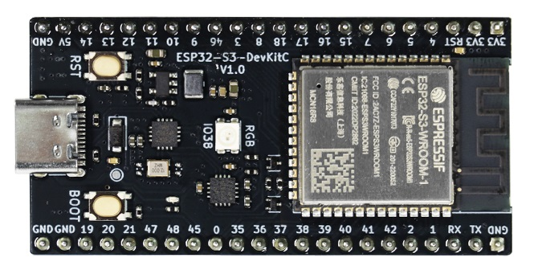
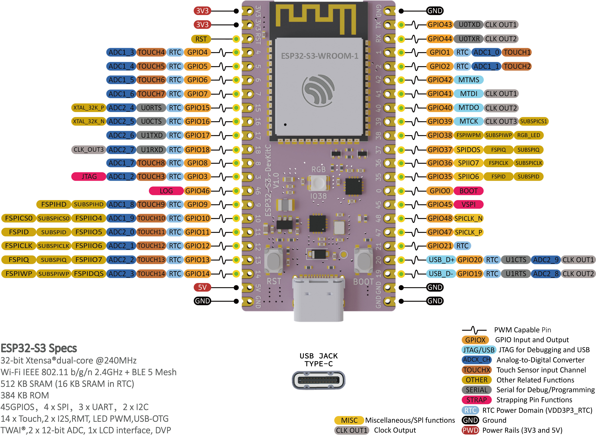
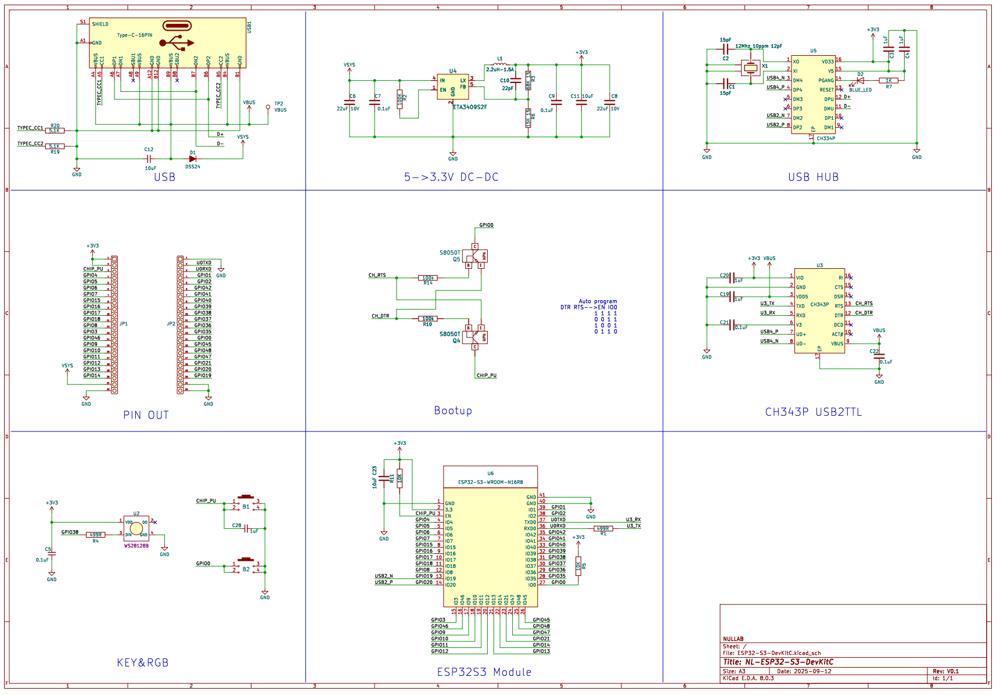
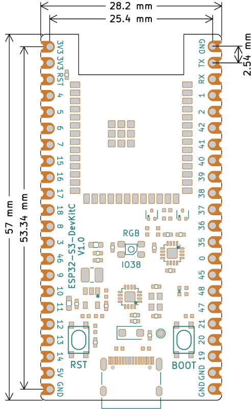

# NL-ESP32-S3-DevKitC

## 概述

​	NL-ESP32-S3-DevKitC开发板是基于乐鑫科技的[ESP32-S3-WROOM-1-N16N8模组](https://documentation.espressif.com/esp32-s3-wroom-1_wroom-1u_datasheet_cn.pdf)开发的引脚功能兼容乐鑫官方[ESP32-S3-DevKitC-1开发板]( [ESP32-S3-DevKitC-1 - ESP32-S3 - — esp-dev-kits latest 文档](https://docs.espressif.com/projects/esp-dev-kits/zh_CN/latest/esp32s3/esp32-s3-devkitc-1/index.html) )。本开发板最大特点是采用一颗USB HUB芯片（CH334P），直连ESP32S3 usb口（19D-，20D+），同时也连接到USB转串口芯片（CH343P）的usb接口上，通过CH343P在连接到ESP32S3 UART0(44RX，43TX)，这样只需要一个TypeC接口即可实现下载和调试同时进行。

### 模组参数

- Xtensa双核32位LX7 CPU，主频可达240MHZ,集成2.4GHz Wi-Fi和BLE5.0

- 384KB ROM，512KB SRAM，16 KB RTC SRAM，16M扩展SPI flash，芯片自带8M PSRAM
- 45 GPIO 口
  4 x SPI
  1 x LCD接口(8位~16位并行RGB,I8080，MOTO6800)支持RGB565,YUV422，YUV420,YUV411之间互相转换
  1 x DVP 8位-16位摄像头接口
  3 x UART，2 x I2C， 2 x I2S
  1 x RMT(TX/RX)，1 x 脉冲计数器
  LED RWM 控制器， 多达8个通道-1X全速USB OTG
  1 x USB Serial/JTAG控制器
  2 x MCPWM
  1 x SDIO主机接口，具有2个卡
  通用 DMA控制器(简称 GDMA)，5个接收通道和 5 个发送通道
  1 x TWAI®控制器，兼容 ISO11898-1(CAN 规范 2.0)
- **模拟接口**:
  2 x 12位 SAR ADC，多达 20个通道
  1 x  温度传感器
- *定时器**:
  4 x 54 位通用定时器，1 x 52 位系统定时器，1看门狗定时器

### 开发板参数

- 采用乐鑫原装 ESP32-S3-WROOM-1-N16N8模组
- 芯片内置384KB ROM，512KB SRAM，自带8M OPI PSRAM，外挂16M SPI FLASH
- Type-C接口，usb usb转串口芯片为沁恒的CH343P
- 输入电压：5V 1A
- 板载复位按键和BOOT按键
- 22pin-2.54mm间距双排针

### 引脚说明

下表显示了哪些管脚最适合用作输入和输出，哪些管脚需要谨慎使用。

| 端口名字 | 输入      | 输出 | 备注信息                              |
| -------- | --------- | ---- | ------------------------------------- |
| 3.3V     |           |      | 3.3V电源输出                          |
| RST      |           |      | 主控芯片复位引脚                      |
| VIN      |           |      | 5V电源输入                            |
| GND      |           |      | 电源地                                |
| 0        | pulled up | 是   | Strapping管脚，低电平进入串口下载模式 |
| 3        |           |      | JTAG信号源                            |
| 45       | 是        | 是   | 0：VDD_SPI为3.3V；1：VDD_SPI为1.8V    |
| 46       | 是        | 是   | ROM日志打印 1：打印 0：不打印         |
| 44（RX） | 是        | 是   | U0RXD，串口下载接收口                 |
| 43（TX） | 是        | 是   | U0RXD，串口下载发送口                 |

- 注意0号引脚外接设备的电平，防止主板进入下载模式而无法正常工作。
- RST是主控芯片的引脚。它是高电平的时候（3.3V）ESP32S3才可以正常工作，如果接地使主控芯片不能启动。这意味着您可以使用连接到按钮的该管脚来重新启动ESP32S3。

###  <a href="zh-cn/esp32/nl-esp32-s3-devkitc/NL-ESP32-S3-DevKitC_sch.pdf" target="_blank">下载原理图</a>

## 产品尺寸图

### <a href="zh-cn/esp32/esp32_devkit_32e/ch340G_esp32_pico.step" target="_blank">产品三维图</a>

## ESP32-S3-DevKitC驱动安装

[点击此处下载CH343P驱动](https://www.wch.cn/downloads/CH343SER_EXE.html)

## ArduinoIDE下载程序

请参考：[ESP32系列上传程序方法](zh-cn/esp32/esp32_software_instructions/esp32_software_instructions.md)

开发板->选择**ESP32S3 Dev Module** 

Flash Size-> **16M**

PSRAM -> **OPI PSRAM**