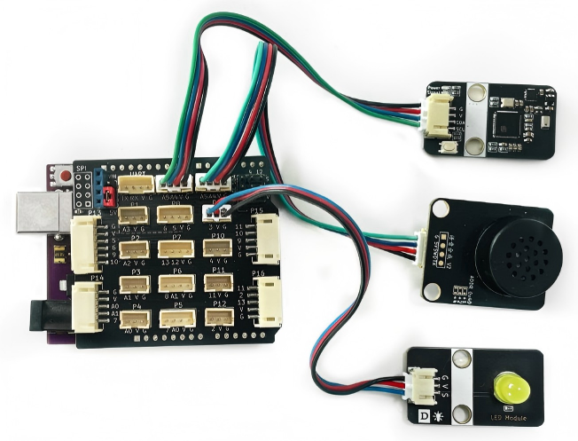
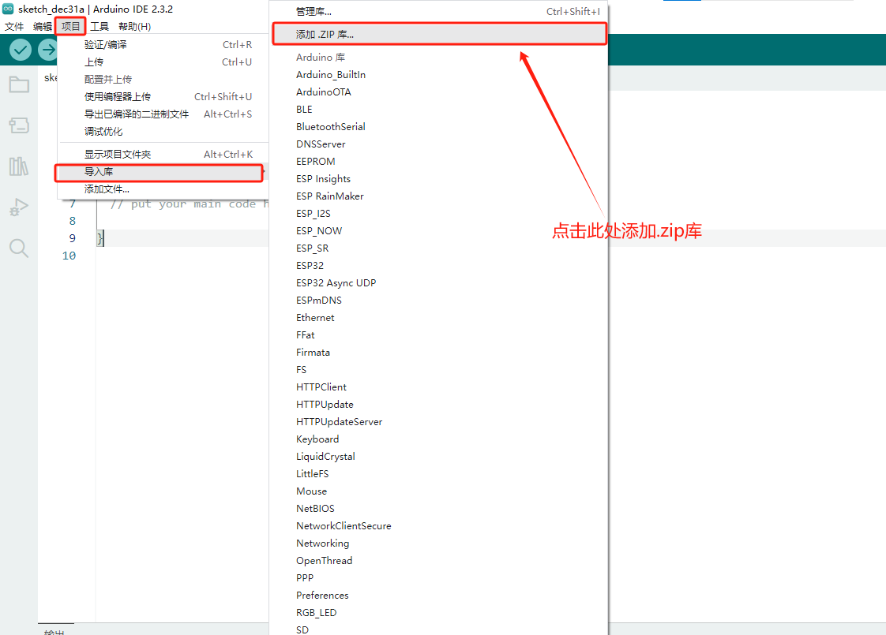

# LD3320语音识别模块和TTS20语音合成模块的综合示例程序(Arduino)

## 概述

  本示例程序是基于 Arduino 平台实现的简易语音交互示例，通过语音指令控制 LED 灯的开关，并结合语音播报进行状态反馈，模拟智能音箱的基础功能场景。

## 模块详情

- LD3320语音识别模块详细说明请参阅：[LD3320语音识别模块文档](zh-cn/ph2.0_sensors/smart_module/speech_recognizer/speech_recognizer.md)

- TTS20语音合成模块详细说明请参阅：[TTS20语音合成模块文档](zh-cn/ph2.0_sensors/smart_module/tts20_module/tts20_module.md)

## 硬件准备

- Arduino uno开发板

- TTS20语音合成模块

- LD3320语音识别模块

- LED灯

## 接线

| 模块        | Arduino开发板  |
| ----------- | ------------- |
| LED灯       | 3             |
| LD3320模块  | I2C(A5,A4)    |
| TTS20模块   | I2C(A5,A4)    |

### 接线图

## 程序下载

点击下方链接下载示例程序，下载后解压用Arduino IDE打开示例文件，主板选择Arduino uno。

<a href="https://gh-proxy.com/https://github.com/emakefun-arduino-library/example_tts20_and_speech_recognizer/archive/refs/tags/v1.0.0.zip" download>点击此处下载示例程序</a>

## 依赖库安装

使用本示例前，需先安装LD3320语音识别模块和TTS20语音合成模块的 Arduino 库。

### 下载库程序

<a href="https://github.com/emakefun-arduino-library/emakefun_speech_recognizer/archive/refs/tags/latest.zip" download>LD3320语音识别模块</a>

<a href="https://gh-proxy.com/https://github.com/emakefun-arduino-library/em_tts20/archive/refs/tags/v1.0.1.zip" download>TTS20语音合成模块</a>

### 安装库到Arduino IDE

1. 打开 Arduino IDE；

2. 依次点击 **项目 → 导入库 → 添加 .ZIP 库…**；

3. 选择下载好的 .zip 库文件，点击“打开”；

4. 等待库文件安装完即可。

## 使用说明

- **唤醒模块**：对着LD3320语音识别模块说"**小易小易**"进行唤醒，唤醒成功后TTS20语音播报模块会播报: "**在呢**"。

- **开灯指令**：唤醒后对着LD3320语音识别模块说: "**请开灯**"，识别成功后，LED灯亮起，TTS20语音合成模块会播报："**已开灯**"，随后LD3320语音识别模块返回待唤醒状态。

- **关灯指令**：唤醒后对着LD3320语音识别模块说: "**请关灯**"，识别成功后，LED灯熄灭，TTS20语音合成模块会播报："**已关灯**"，随后LD3320语音识别模块返回待唤醒状态。

- **超时提示**：唤醒后如果10秒内未识别到新的指令，TTS20语音合成模块则会播报"**有需要再叫我**"，LD3320语音识别模块返回待唤醒状态。
