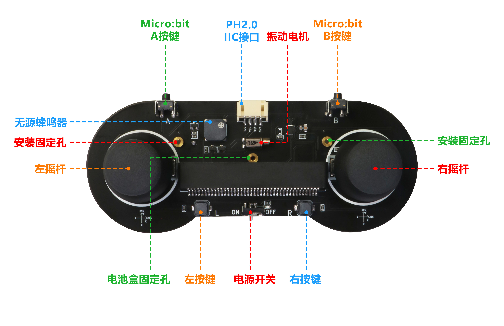
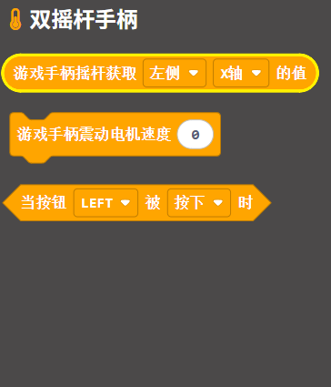
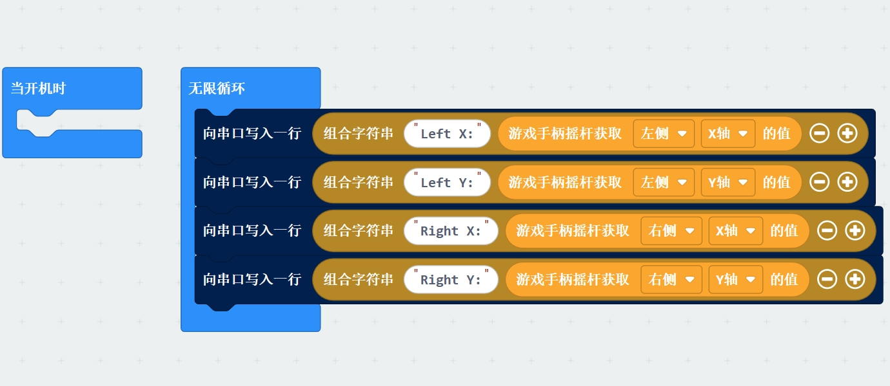
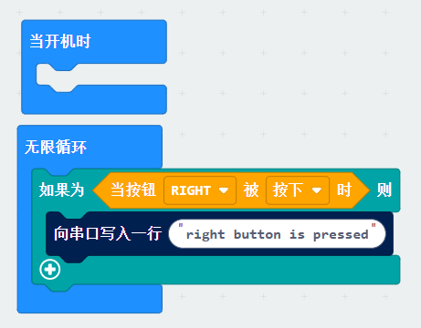
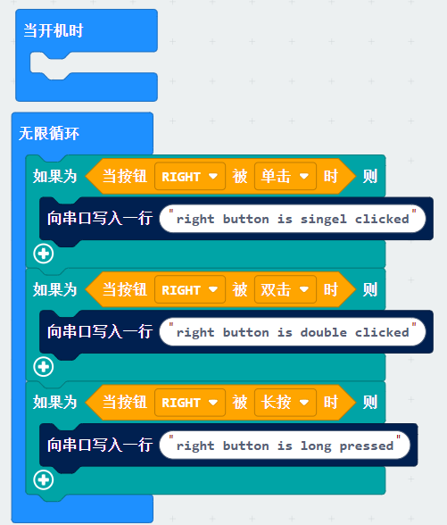
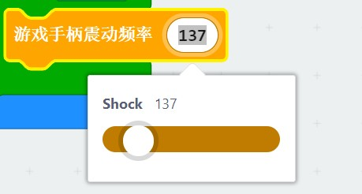
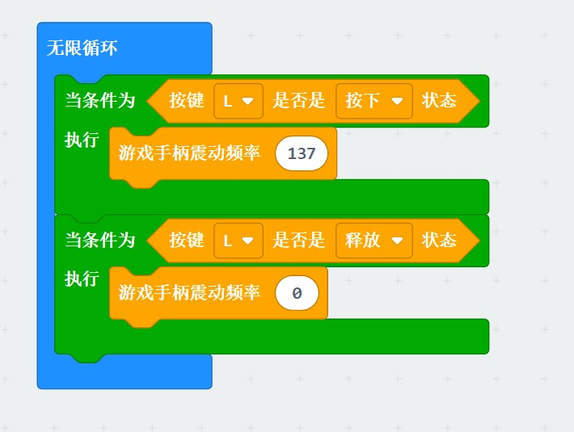
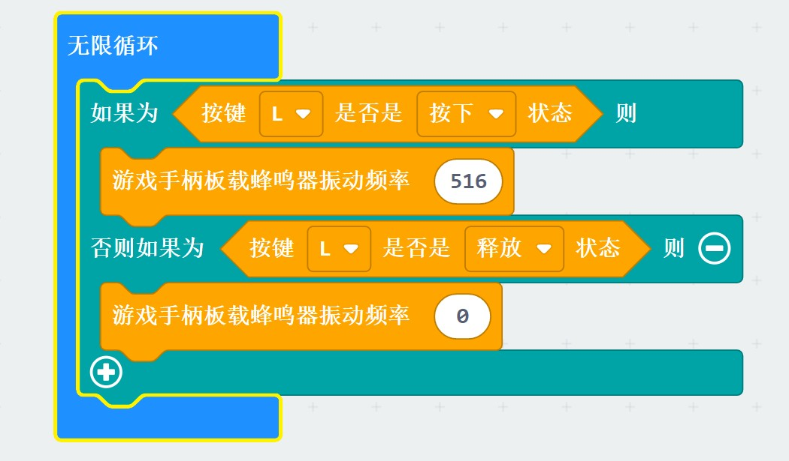
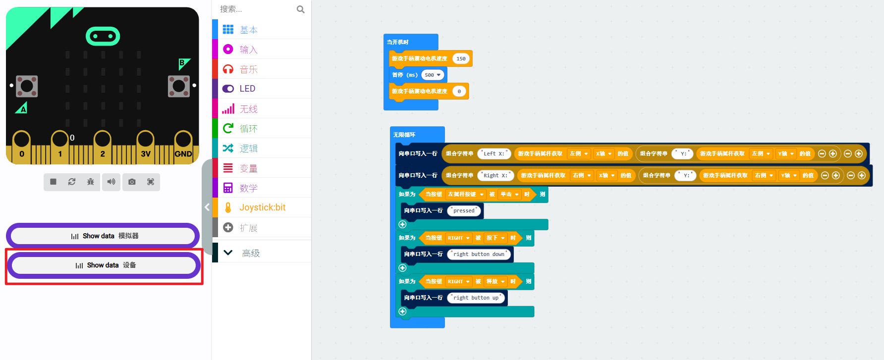

# joystick:bit

joystick:bit是一款针对类似micro:bit的金手指插卡式开发板而开发的可编程手柄，支持micro:bit V1、 V2、iot:bit、掌控板、开源大师兄。



## 特点

- 左右双摇杆，带按下按键；

- 手柄扩展Micro:Bit主板上的A，B按键；

- L，R两个可编程独立按键；

- 板载无源蜂鸣器和震动电机；

- 2节7号电池供电；

- 1个PH2.0-4Pin i2c接口

## 图像化编程块说明

 **Microbit MakeCode扩展链接为**: **<https://github.com/emakefun/pxt-joystickbit>**

- 《游戏手柄摇杆获取 左/右侧 x/y轴 的值》:该模块用于获取手柄左或者右摇杆x轴或者y轴方向的坐标值，其获取的值为数值类型，其值可以通过‘显示数字’模块显示在Micro:Bit板上

- 《游戏手柄震动频率()》 :该模块用于调试游戏手柄上震动电机的震动频率，其值为0时震动电机停止震动。

- 《按键 L/R/左摇杆按键/右摇杆按键 是否是 按下/释放/单击/双击/长按 状态》 :该模块用于判断游戏手柄左右按键和摇杆中心按键是否按下或者释放，是返回ture,否返回false，作用于判断模块（如果...则执行...）

   

### 摇杆图形化块

- 获取游戏手柄摇杆x/y轴值（获取左/右侧x/y轴的值并将其数值通过串口显示出来）

   

### 独立按键编程图形块

- 按键 L/R/左摇杆按键/右摇杆按键 是否是 按下/释放 状态

- 下面模块是对按键状态进行一个判断：当你按了按键R，则显示字符串"right button is pressed！"

   

- 同理，下面两个模块也是对按键的单击双击或者长按为真则显示显示相应信息

   注意如果使用单机、双击、长按的时候，无线循环里面不能有延时，否则有可能主板捕获不到这个事件
   
   

### 震动电机编程图形块

- 游戏手柄震动频率模块可以调试震动电机的震动频率

   

- 配合按键使用: 当你按下L键时，震动电机开始工作，频率为137HZ。当你释放按键L时，震动电机停止工作。

   

### 板载蜂鸣器编程图形块

- 游戏手柄板载蜂鸣器振动频率模块可以调试板载蜂鸣器的振动频率

   

- 配合按键使用: 当你按下L键时，板载蜂鸣器开始工作，频率为516HZ，当你释放按键L时，板载蜂鸣器频率为0停止工作。

  

microbit makecode测试程序https://makecode.microbit.org/_aFpi2fPow8Tk

如果要传看查看结果请直接点击microbit串口监听窗口查看



[点击下载microbit MicroPython扩展库以及示例程序](zh-cn/microbit/joystickbit/joystickbit_microbit_micropython_demo.zip ':ignore')


## 掌控板/物联板IOT:BIT（ESP32主控）MicroPython扩展库

[点击下载掌控板/物联板IOT:BIT（ESP32） MicroPython扩展库以及示例程序](zh-cn/microbit/joystickbit/iobit_joystick_test.zip ':ignore')

### MicroPython API详细说明

#### 1.read_joystick_left_x(self)

这是JoystickController类下的成员函数，用于接收手柄左摇杆x轴的模拟值。

```python
read_joystick_left_x(self)

参数:无
返回值：返回0~255的模拟值

```

#### 2.read_joystick_left_y(self)

这是JoystickController类下的成员函数，用于接收手柄左摇杆y轴的模拟值。

```python
read_joystick_left_y(self)

参数:无
返回值：返回0~255的模拟值

```

#### 3.read_joystick_right_x(self)

这是JoystickController类下的成员函数，用于接收手柄右摇杆x轴的模拟值。

```python
read_joystick_right_x(self)

参数:无
返回值：返回0~255的模拟值

```

#### 4.read_joystick_right_y(self)

这是JoystickController类下的成员函数，用于接收手柄右摇杆y轴的模拟值。

```python
read_joystick_right_y(self)

参数:无
返回值：返回0~255的模拟值

```

#### 5.read_button_status(self, button)

这是JoystickController类下的成员函数，用于接收手柄按钮的按下状态。

```python
read_button_status(self, button)

参数:
button: 按钮类型，取值范围为BUTTON_LEFT_REG、BUTTON_RIGHT_REG、JOYSTICK_BUTTON_RIGHT、JOYSTICK_BUTTON_LEFT，分别表示左侧按键、右侧按键、左摇杆按键、右摇杆按键。
返回值：返回Button_Status类成员变量，表示按钮的按下状态，取值范围为
    JOYSTICK_PRESS_DOWN = 0  //按下
    JOYSTICK_PRESS_UP = 1    //释放
    JOYSTICK_SINGLE_CLICK = 3//单击
    JOYSTICK_DOUBLE_CLICK = 4//双击
    JOYSTICK_LONG_PRESS_HOLD = 6//长按
    JOYSTICK_NONE_PRESS = 8  //无

```
