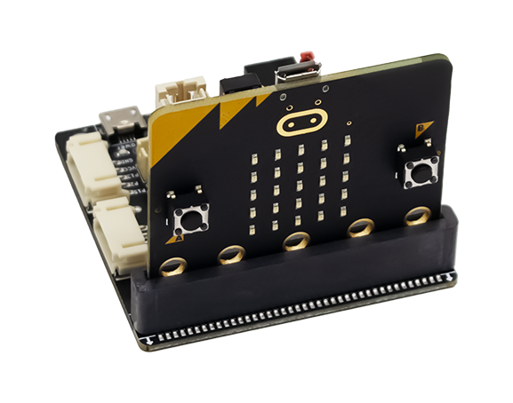
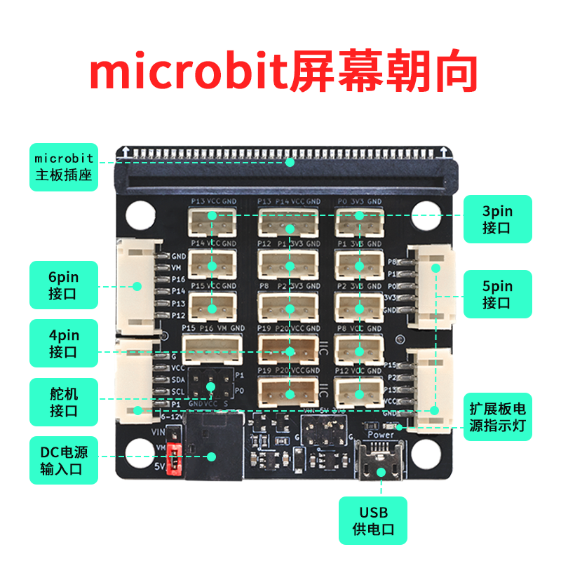

# Sensor:bit 简介

什么是 Sensor:bit ？Sensor:bit 是一套为 Micro:bit 量身打造基于 PH2.0 接口的扩展板，Sensor:bit 扩展功能多样，包含八个 3pin 接口、六个 4pin 接口、三个 5pin 接口、一个 6pin 接口，对Micro:bit 可扩展接口进行了优化设计，使得 Sensor:bit 在 PH2.0 接口情况下可以连接更多的传感器。在电源设计方面，Sensor:bit 设计有两种供电方式：第一种是通过 micro usb 接口供电；另一种是通过DC头供6-12V的电压。Sensor:bit 设计有两种可选电压：5V 和 3V3，可以通过跳线帽选择不同的电压给扩展板接口供电。

## Sensor:bit 参数介绍

- PCB厚度：1.6mm
- 圆孔直径：4.6mm（与乐高孔兼容）
- 产品尺寸：56 / 56 / 12mm（裸板长宽高）
- 净        重：23.1g
- 输入电压：5-12V
- 输出电压：5V / 3.3V
- 插接方式：立插
- 引脚口类型：PH2.0 接口

## Sensor:bit 引脚介绍

- Sensor:bit 有8个3pin 接口、引出的 Micro:bit IO口分别为：P0、P1、P2、P8、P12、P13、P14、P15。其中只有 P0、P1、P2 引脚为模拟口。
- Sensor:bit 设计有6个4pin 接口、引出的 Micro:bit IO口分别为：P1 和 P12、P8 和 P2、P13 和 P14、P15 和 P16、以及两个I2C接口。
- Sensor:bit 有3个5pin 接口、引出的 Micro:bit IO口分别为：P1、SCL和SDA；P2、P13 和 P15；P0、P1 和 P8。
- Sensor:bit 有1个6pin 接口、引出的 Micro:bit IO口为：P12、P13、P14 和 P16。
- 电压选择接口：当跳线帽连接 5V 与 VCC 引脚时、扩展板的引脚(VCC)输出电压为 5V；当跳线帽连接 3V3 与 VCC 引脚时、扩展板的引脚(VCC)输出电压为 3.3V。
- 电压输出/输入接口：Sensor:bit 设计有一个多功能电压引脚，当采用 micro usb 接口供电时、该引脚可以输出 5V 为其它扩展板供电；另一方面、该引脚也可以通过杜邦线连接电源(5V)，为Sensor:bit 扩展板供电。**注意: 不能同时使用该接口与 micro usb 接口供电，以免造成损坏！**

# Sensor:bit 与 PH2.0接口传感器

Sensor:bit 是专为 Micro:bit 与各种传感器连接所设计的，对与 PH2.0 接口的 Sensor:bit 、设计有一套量身定做的 PH2.0接口传感器套件。传感器种类多样，按照其作用类型可分为四大类：输入模块、传感器、执行类、显示器。

要支持如下micropython语法需要下载最新固件到microbit

[Micro:bit V1固件](zh-cn/microbit/sensorbit/firmware_v1.hex ':ignore')

[Micro:bit V2固件](zh-cn/microbit/sensorbit/firmware_v2.hex ':ignore')
