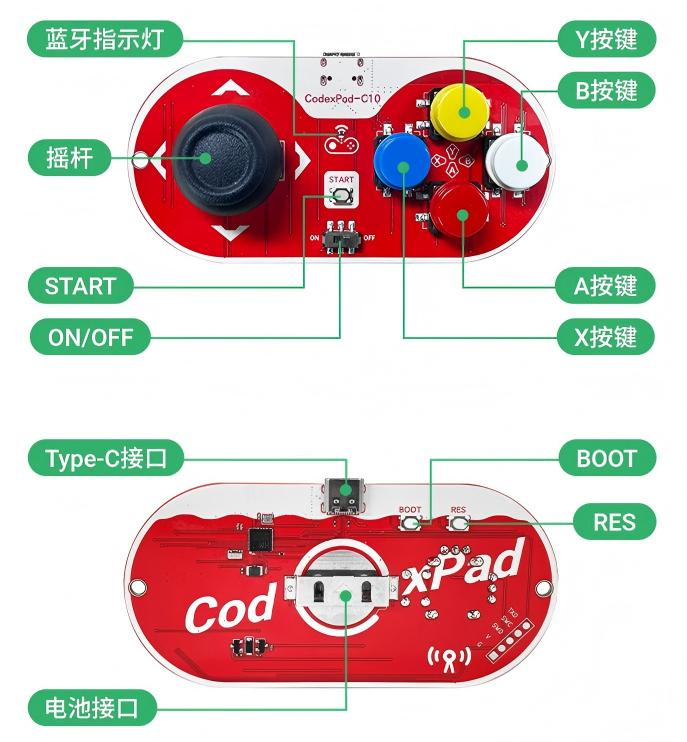
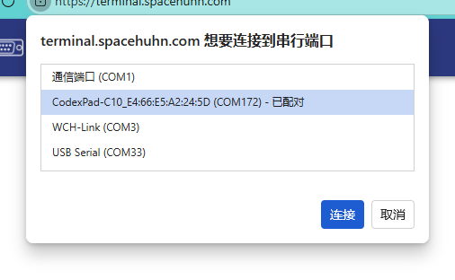
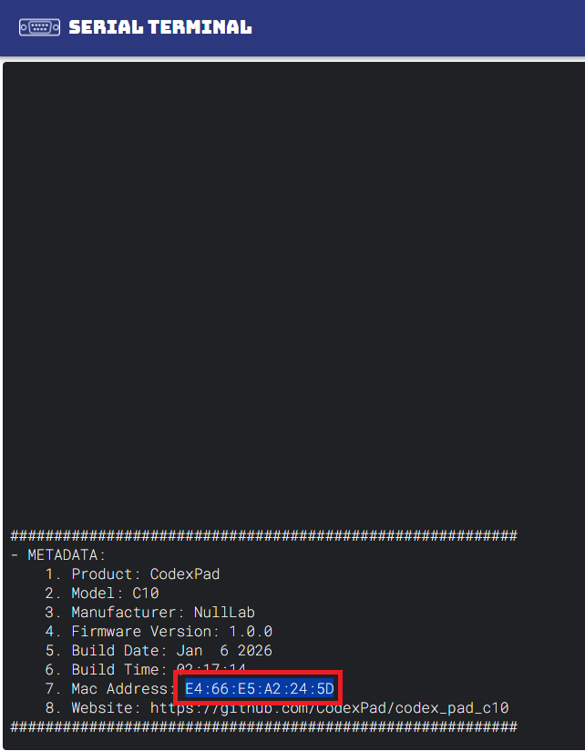
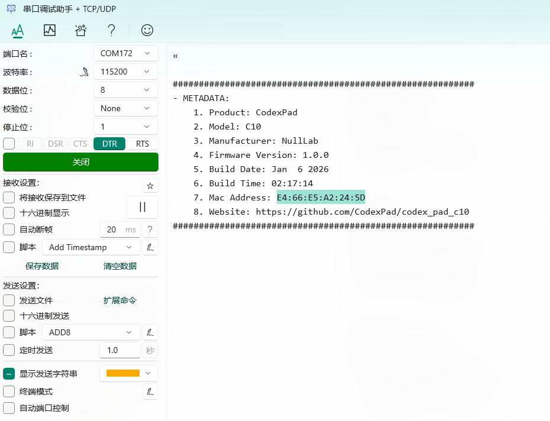
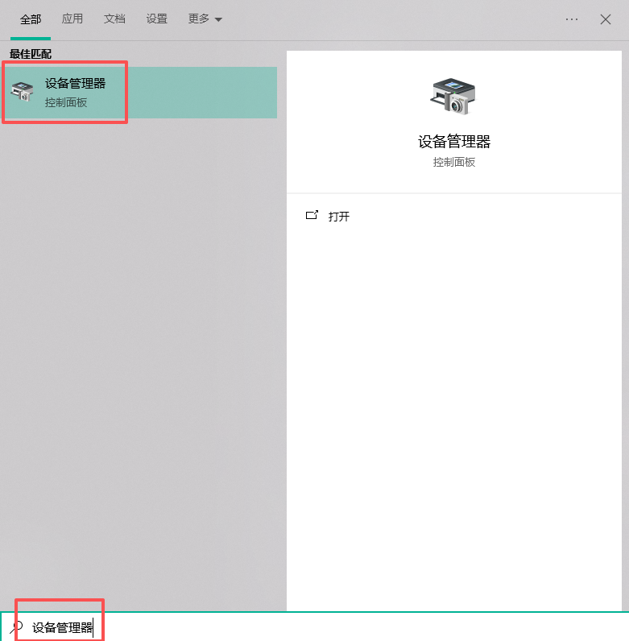
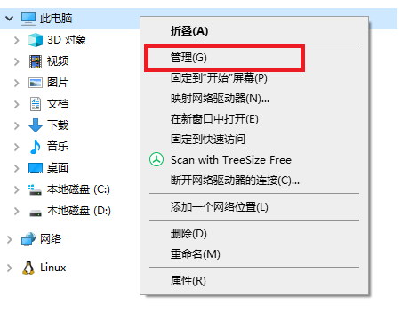

# CodexPad-C10

## 产品图

## 概述

CodexPad-C10是CodexPad系列中的一款专为创客和嵌入式开发者设计的低功耗蓝牙手柄。该系列采用创新的低功耗蓝牙主从一体设计，具备高度的连接灵活性。作为系列产品之一，CodexPad-C10不仅支持作为从机与各类具备BLE主机功能的设备连接，其系列设计也支持作为主机与其他BLE外设交互。

CodexPad系列可广泛适配包括**micro:bit**、**ESP32**/**ESP32-S**/**ESP32-C**系列在内的主流嵌入式开发板，为机器人控制、物联网设备交互及自定义人机界面等项目提供可靠的物理输入解决方案。CodexPad-C10继承了系列的核心优势，提供了简单易用的数据接口，使开发者能够轻松获取按键状态和摇杆模拟量数值。

我们致力于为创客生态提供友好开发体验，不仅提供了丰富的主机端库和示例代码，还支持图形化编程环境，让从初学者到专业开发者都能快速上手，将创意转化为现实。

## 特性

### 核心功能特性

- **低功耗蓝牙主从一体设计**：采用创新的BLE主从一体架构，既可作为从机被其他具备BLE主机功能的设备连接，也可作为主机主动连接其他BLE外设，提供灵活多样的连接方案
- **完整输入支持​**: 提供A/B/X/Y功能键、START菜单键、L3摇杆按压等标准游戏手柄布局
- **高精度摇杆​**: 采用高品质模拟摇杆，提供0-255范围的精确数值输出
- **低功耗优化**：专为电池供电场景设计，续航表现优异

### 硬件特性

- **纽扣电池供电**：使用常见的**CR2032**纽扣电池，更换方便，续航持久，也可以使用USB直接供电（无充电功能）
- **可调发射功率​**: 支持**-16 dBm**到**+6 dBm**间多档的功率调节，适应不同距离需求
- **长距离传输**：在发射功率设置为**0 dBm**且无遮挡无干扰的理想环境下，可提供稳定长达 **40米** 的通信距离
- **抗干扰设计**​：采用先进的跳频技术，有效避免信号串扰
- **蓝牙版本**：Bluetooth Low Energy 5.3

### 开发友好特性

- **多平台SDK与编程支持**：针对不同的开发设备，提供广泛的开发平台支持。
  
  | 设备型号      | 支持的开发平台或编程语言                              |
  | --------- | ----------------------------------------- |
  | ESP32     | Arduino IDE, MicroPython，米思齐（mixly），Mind+ |
  | ESP32-S3  | Arduino IDE, MicroPython，米思齐（mixly），Mind+ |
  | ESP32-C3  | Arduino IDE, MicroPython，米思齐（mixly），Mind+ |
  | micro:bit | MakeCode                                  |

- **即插即用示例**​：丰富的示例代码覆盖从基础连接到高级应用的各种场景

- **详细文档支持**​：提供完整的中英文技术文档和API参考

## 规格参数

- PCB厚度：1.6mm

- 产品尺寸：48*100mm

- 电池接口电压：3.6V，**注意：电压不能大于3.6V**

- 电池类型：推荐使用CR2032纽扣电池

- 震动反馈：无

- 蓝牙连接距离：最大约30米（0 dBm，理想环境）

- 蓝牙标准：Bluetooth Low Energy 5.3（BLE）

## 机械尺寸图

<a href="zh-cn/peripheral/codexpad/codexpad_c10/codexpad_c10_3d.zip" download>点击下载3D文件</a>

---

## 按键示意图

---

## 🔧快速开始

### 开机

#### 安装电池

1. 将手柄电源开关拨动至`OFF​`端关闭电源，切断电路，防止安装过程中发生短路或静电损坏器件

2. 小心剥离手柄背部外壳，露出背部电路板和电池扣插件

3. 将手柄翻转至**背部朝上**

4. 将CR2032纽扣电池**正极（"+"标识面）朝上**，平行于电池扣中间间隙，平滑推入，确保牢固卡住、不会脱落

#### 安装外壳

- 电池安装完毕后，立即将外壳装回并固定好，这样**避免手直接触碰背部电路，防止因静电或短路导致器件损坏**

#### 拨动电源开关

- 将手柄电源开关拨动至`ON`端打开电源，手柄会自动开机。

#### 指示灯确认

- 开机后根据指示灯状态确认手柄工作状态：
  
  - ✅ **慢闪**（约1秒亮/灭）：正常状态。手柄正在广播，等待主机连接
  
  - 🔵 **常亮**：手柄已被主机成功连接
  
  - ⚠️ **快闪**（约100毫秒亮/灭）：低电量警告。电池电量已不足，无法正常工作，请更换电池

---

### 获取手柄的MAC地址

MAC地址用于在蓝牙网络中唯一识别您的手柄，如同设备的“身份证号”，是建立连接所必需的信息。

它由12位十六进制字符组成，以冒号分隔，格式为`XX:XX:XX:XX:XX:XX`（其中`X`为 0-9 或 A-F），例如：`E4:66:E5:A2:24:5D`。在后续连接主机时，您将需要用到它。

> 💡 **重要提示：每台手柄均需单独获取**
> 
> 由于此类手柄的MAC地址都是全球唯一的，因此每台新手柄在使用前，都需要按照此章节的步骤重新获取并记录其专属的MAC地址。请勿误以为获取一次即可通用于所有手柄。

请确保手柄已**开机**，并使用USB-Type C数据线将其与电脑连接，然后使用以下方式获取MAC地址并妥善保存。

#### 工作原理

当您使用USB数据线将手柄连接到电脑时，手柄会**虚拟成一个标准的串口设备（COM端口）**。获取MAC地址的本质，就是通过任意串口工具与这个虚拟串口进行通信。

**通信参数与流程：**

- **通用性**：任何串口工具（网页版、Windows、macOS、Linux）在正确配置后均可使用
- **关键配置**：波特率可任意设置，但务必使能DTR信号
- **自动应答**：连接成功后，手柄自动上报包含MAC地址的元数据信息

理解此原理后，您可以根据自身喜好和操作系统，选择下方任意一种工具进行操作。

#### 获取方式1：使用网页串口工具获取

1. 确保手柄已**开机**并已通过USB连接到电脑

2. 打开浏览器访问：<https://terminal.spacehuhn.com/>

3. 点击屏幕中间的**CONNECT**图标

4. 在弹出的设备列表中，选择以`CodexPad-C10`开头的设备，然后点击**连接**
    

5. 连接成功后，内容框会打印设备信息。在其中找到标识为 `7. Mac Address:`的一行，将其后的MAC地址复制并妥善保存，例如：`E4:66:E5:A2:24:5D`
    

6. 断开手柄与电脑的连接

---

#### 获取方式2：通过Windows电脑的串口调试助手获取

此方法使用通用的串口调试工具与手柄通信，获取MAC地址信息。

1. 安装串口调试助手
   
   - 访问串口调试助手下载页面：<https://apps.microsoft.com/detail/9nblggh43hdm?launch=true&hl=zh-cn&gl=cn>
   
   - 自行下载安装适用于Windows的最新版本

2. 启动串口调试助手
   
   - 安装完成后在桌面或开始菜单找到并启动程序

3. 配置串口连接
   
   - 选择正确的COM端口
     
     - 确保手柄已**开机**并已通过USB连接到电脑
     
     - 在软件界面的“**端口名**”下拉菜单中，选择对应的COM端口（例如`COM172`）
     
     - **如何确认哪个是手柄**：如果无法确定哪个端口对应手柄，您可以**拔掉手柄的USB线**，观察列表中哪个端口消失，**重新插上手柄**，观察哪个新出现的端口，该端口即对应您的手柄
   
   - 配置串口参数
     
     - **波特率**：可设置为任意值（如9600、115200等）
     
     - **数据位**：8
     
     - **停止位**：1
     
     - **校验位**：None (无)
     
     - **接收显示**：确保“十六进制显示”选项未勾选，以便查看文本格式的元数据
   
   - 启用DTR信号
     
     - 在软件界面中找到“**DTR**”选项，并点击启用它，选项会变为绿色
     
     

4. 连接并获取MAC地址
   
   - 完成上述配置后，点击“**打开**”按钮建立连接
       
   
   - 连接成功后，手柄会自动发送一次设备元数据，并显示在软件右侧的“**接收区**”
   
   - 在接收区查看显示的数据，在其中找到标识为 `7. Mac Address:`的一行，将其后的MAC地址（例如：`E4:66:E5:A2:24:5D`）复制并妥善保存，这便是手柄的MAC地址
       

5. 断开手柄与电脑的连接

---

#### 获取方式3：通过Windows电脑的设备管理器获取

1. 启动“**设备管理器**”
   
   - **启动方式1**：启动 “**开始**”菜单，输入 “**设备管理器**”。 然后，从搜索结果中选择“**设备管理器**”点击启动
       
   
   - **启动方式2**：通过“**文件资源管理器**”启动
     
     - 在文件资源管理器中，右键单击“**此电脑**”，选择“**管理**”
         
     
     - 然后从生成的对话框中列出的系统工具中选择 “**设备管理器**”
         

2. 展开端口列表
   
   - 在设备管理器的设备列表中，找到并点击“**端口（COM和LPT）**”类别左侧的 “**>**” 符号，将其展开
        

3. 识别您的手柄设备
   
   - 在展开的列表中，您会看到一个或多个名为“**USB 串行设备 (COMxx)**”的条目，其中xx代表数字
   
   - **如何确认哪个是手柄**：如果列表中有多个此类设备，您可以**拔掉手柄的USB线**，观察列表中哪个“USB 串行设备”条目消失；**重新插上手柄**，观察哪个新出现的条目，该条目即对应您的手柄。请记下其COM口号（例如：COM172）

4. 打开设备属性
   
   - 右键点击您所识别出的“**USB 串行设备 (COMxx)**”，在弹出的菜单中选择“**属性**”
       

5. 查看设备详细信息
   
   - 在弹出的属性窗口中，点击顶部的“**详细信息**”选项卡
   
   - 在“**属性(P)**”下方的下拉菜单中，选择“**设备实例路径**”
       

6. 记录MAC地址
   
   - 此时，“**值(V)**”下方的文本框中将显示一串信息
   
   - 在这串信息中，找到“**CODEXPAD-C10_**”字段，其后面紧跟的由冒号分隔的12位字符（例如：`E4:66:E5:A2:24:5D`）即为您手柄的MAC地址
       
   
   - 请准确抄录这串地址并妥善保管，用于后续连接

7. 断开手柄与电脑的连接

---

## 🔋 电源管理

为确保产品续航并避免不必要的电量损耗，当您长时间不使用手柄时，**请务必将手柄的电源开关拨动至 OFF位置**切断电源。在电源开启 (ON) 状态下，即使没有进行任何按键操作，手柄为保持可被连接状态，其低功耗蓝牙 (BLE) 模块仍会以一定间隔进行广播，这个过程会产生持续电流消耗。主动关机是最大限度延长纽扣电池使用寿命的最有效方式。

## ⚡ USB Type-C 接口说明

本手柄的 USB Type-C 接口主要用于 ① 为手柄电路供电​ 和 ② 虚拟串口通信（如用于获取 MAC 地址）。需要特别注意的是，此接口不具备电池充电功能。当手柄通过 USB 线缆供电运行时，若突然拔下线缆，系统会瞬间切换至纽扣电池供电。如果纽扣电池电量已处于较低水平，其电压在负载突然加大的瞬间可能无法及时响应，导致电压骤降而引发系统复位重启。此现象属于电源切换过程中的正常特性，并非设备故障。建议在需稳定使用的场景下，确保使用电量充足的电池或保持 USB 供电连接。

## 🛡️ 安装与静电防护

为防止静电放电 (ESD) 对精密电子元件造成不可逆的损伤，**在使用手柄前，必须确保其外部外壳已完全安装并紧固**。手柄背部的电路板直接暴露在外时，人体或环境产生的静电可能通过直接接触或近距离感应，瞬间击穿脆弱的集成电路，这种损伤通常是永久性的。完整的外壳构成了重要的物理屏障，能有效避免手部直接接触电路，是保证产品可靠性和使用寿命的关键步骤。

---

## 手柄TX Power（发射功率）设置

### 发射功率概述

发射功率（TX Power）是指手柄蓝牙射频信号的输出强度，其单位为 **dBm（分贝毫瓦）**。这是一个用于表示功率绝对值的对数单位。

- **数值大小的意义**：在dBm的标度下，**数值越大，代表发射功率越强**。例如，`+3 dBm` 的功率就比 `0 dBm` 强，而 `0 dBm` 又比 `-5 dBm` 强。每增加大约 `3 dBm`，实际功率约翻一倍。
- **正负号的意义**：`0 dBm` 代表1毫瓦（mW）的功率。**正数（如 +3 dBm）表示功率大于1毫瓦，负数（如 -12 dBm）表示功率小于1毫瓦。**
- **作用与权衡**：**增大发射功率可有效提升通信距离和信号抗干扰能力，但同时也会显著增加功耗，缩短电池续航时间。** 用户应根据实际使用场景（如通信距离、环境障碍物、对续航的要求）在信号强度和功耗之间进行权衡，选择一个合适的固定值。

### 设置方法与注意事项

- **默认值**：手柄在每次与主机建立蓝牙连接后，其发射功率**默认会自动重置为 0 dBm**。
- **设置方式**：必须通过主机端代码调用专用API（相关库中已提供）将目标功率值发送给手柄，设置会**立即生效**。
- **重要提示**：为避免无线连接出现波动，建议在单次连接中**仅设置一次**，避免频繁更改。请在设备初始化阶段根据应用场景选定一个合适的功率档位。

### 支持档位

手柄支持通过主机编程设置以下12个档位的发射功率（**从弱到强**排列）：

| 发射功率档位  |
| ------- |
| -16 dBm |
| -12 dBm |
| -8 dBm  |
| -5 dBm  |
| -3 dBm  |
| 0 dBm   |
| +1 dBm  |
| +2 dBm  |
| +3 dBm  |
| +4 dBm  |
| +5 dBm  |
| +6 dBm  |

您可以在主机示例代码中找到相应的API进行设置。

💡 建议：根据距离需求选择合适档位，避免频繁更改。

---

## 重要协议说明

CodexPad系列手柄采用**标准的低功耗蓝牙协议**进行通信，这与常见的**BLE HID**协议有本质区别。

- **协议类型**：本产品使用专为嵌入式开发优化的自定义标准BLE协议，而非即插即用的BLE HID协议。
- **连接与使用**：这意味着您的电脑或手机操作系统（如Windows、macOS、Android、iOS）在扫描并成功连接本手柄后，**不会将其识别为标准的游戏控制器或输入设备**，因此无法直接在任何游戏或应用中使用。
- **正确使用方式**：本产品的设计初衷是作为**一个可编程的输入模块**，必须通过您自己编写的主机端代码来连接手柄、读取其数据，并实现您所需要的控制逻辑。
  - **主要支持模式**：我们为**嵌入式开发板（如ESP32、micro:bit等）** 提供了完善的库和示例代码，这是推荐且官方技术支持的主要方向。
  - **进阶使用模式**：技术开发者也可以在**电脑（如使用Python、Node.js等）或手机（如使用Android Studio、Swift等）** 上编写主机端代码来连接并控制手柄。此为实现特定项目的进阶用法，**我司不提供此模式下的官方技术支持、库或示例**。关于其底层BLE GATT通信特征，我们后续将根据市场需求评估是否提供详细说明文档。

> **💡 请务必知悉**：本产品是为**可编程嵌入式项目**设计的开发工具。若您需要连接电脑或手机即插即用，本产品无法满足需求。若您是有能力的开发者，希望在PC或手机端集成本手柄，需要您自行研究其BLE通信协议。

---

## ⌨ 主机端库和示例程序

### ESP32 Arduino库和示例程序

<a href="https://gh-proxy.com/https://github.com/CodexPad/codex_pad_arduino_lib/archive/refs/tags/v1.0.3.zip" download>点击此处下载Arduino示例程序</a>

#### 支持的MCU型号

| 支持的MCU型号 |
| -------- |
| ESP32    |
| ESP32-S2 |
| ESP32-S3 |
| ESP32-C3 |
| ESP32-C5 |
| ESP32-C6 |
| ESP32-H2 |
| ESP32-P4 |

#### Arduino 库使用文档

<a href="https://codexpad.github.io/codex_pad_arduino_lib/html/zh-CN/annotated.html" target="_blank">点击此处查看API说明文档</a>

#### Arduino 库示例程序

<a href="https://codexpad.github.io/codex_pad_arduino_lib/html/zh-CN/basic_polling_8ino-example.html" target="_blank">基本轮询</a>

<a href="https://codexpad.github.io/codex_pad_arduino_lib/html/zh-CN/inputs_detection_8ino-example.html" target="_blank">输入状态检测</a>

### ESP32 MicroPython库和示例程序

<a href="https://gh-proxy.com/https://github.com/CodexPad/codex_pad_mpy_lib/archive/refs/tags/v1.0.1.zip" download>点击下载ESP32 MicroPython示例程序</a>

#### 支持的MCU型号

| 支持的MCU型号 |
| -------- |
| ESP32    |
| ESP32-S3 |
| ESP32-C3 |

### Mind+库和示例程序

Mind+ CodexPad蓝牙手柄用户库链接：https://gitee.com/emakefun_midplus_lib/codexpad-c10

[点击查看Mind+导入用户库方法](https://mindplus.dfrobot.com.cn/extensions-user-libraries)

[点击下载CodexPad蓝牙手柄Mind+示例程序](https://gitee.com/emakefun_midplus_lib/codexpad-c10/releases/download/V0.0.1/codexpad_c10%E6%B5%8B%E8%AF%95%E7%A4%BA%E4%BE%8B.zip)

### Mixly库和示例程序

[点击下载CodexPad蓝牙手柄Mixly库](https://gitee.com/emakefun_mixly_lib/codexpad-c10/releases/download/V0.0.1/codexpad-c10_Mixly%E5%BA%93.zip)

[点击下载CodexPad蓝牙手柄Mixly示例程序](https://gitee.com/emakefun_mixly_lib/codexpad-c10/releases/download/V0.0.1/codexpad-c10%E8%93%9D%E7%89%99%E6%89%8B%E6%9F%84Mixly%E7%A4%BA%E4%BE%8B.zip)

### Micro:bit MakeCode图形化扩展

**Microbit MakeCode扩展链接为**: **<https://github.com/CodexPad/codex_pad_makecode_extension>**

---

## ❓ 常见问题（FAQ）

### Q1：手柄无法开机怎么办？

**答：请按以下步骤排查**：

1. **检查电池安装**：
   
   - 确认纽扣电池正极（"+"面）朝上。
   - 确保电池已卡紧，没有松动。

2. **电池电量不足**：
   
   - 尝试更换一颗全新的纽扣电池。

3. **检查电源开关**：
   
   - 将开关完全拨至 ON 位置，确认到位。

4. **尝试USB供电**：
   
   - 通过Type-C 接口供电验证是否可以正常开机。

5. **硬件故障**：
   
   - 如果以上方法都不行，可能是硬件故障
   - 请联系技术支持，提供您尝试过的步骤和现象描述。

### Q2：蓝牙连接不稳定、容易断开？

**答：可能原因及解决方法：**

- **距离过远/障碍物多**：尽量在无遮挡、无强干扰的环境中使用，理想通信距离建议不超过20米。
- **发射功率设置过低**：如果连接距离较远，可尝试通过主机代码将发射功率调高（如设为 +3 dBm 或更高）。
- **电池电量不足**：电量不足也会影响信号稳定性，请确保电池电量充足。
- **环境干扰**：远离路由器、微波炉、大型金属物体等可能干扰信号的设备。
- **多设备干扰**：避免周围有过多蓝牙/WiFi设备同时工作。

### Q3：为什么手机/电脑不能直接识别为手柄？

**答：CodexPad-C10**是一款为嵌入式开发设计的可编程BLE设备，采用专为嵌入式开发优化的自定义标准BLE协议，而非即插即用的BLE HID协议。因此它不能被系统直接识别为即插即用的手柄。您需要使用我们提供的主机端库，在ESP32、micro:bit等开发板上编写程序来读取和控制手柄。

### Q4：手柄多久进入休眠？如何唤醒？

**答**：**CodexPad-C10手柄暂不支持休眠功能**。

- **省电建议**：长时间不使用时，请将手柄电源开关拨动至`OFF`端以关闭电源，延长使用寿命。
- **重新使用**：再次使用时将手柄电源开关拨动至`ON`端即可开机。

### Q5：手柄可以充电吗？

**答：CodexPad-C10手柄不可以充电**。

- **供电方式**：
  - **纽扣电池供电**：使用CR2032纽扣电池（推荐）。
  - **USB Type-C 接口直接供电**：通过Type-C接口供电，但**不会给电池充电**。
- **重要提示**：
  - USB供电时如果电池电量过低，拔掉USB线可能导致设备重启。
  - 建议USB Type-C 接口供电时使用电量充足的电池，或保持USB连接。

### Q6：如何获取手柄的MAC地址？获取不到MAC地址怎么办？

**答：获取方法**：请参考本文档中 [📍 获取手柄MAC地址](#获取手柄的MAC地址) 章节。

**如果无法获取，请按以下步骤排查：**

1. **检查手柄状态**：
   
   - 确认手柄已开机（指示灯慢闪）。
   - 如果指示灯不亮，检查电池和开关。

2. **检查USB连接**：
   
   - 使用优质USB数据线（支持数据传输）。
   - 尝试更换USB端口或电脑。

3. **检查电脑识别**：
   
   - 打开设备管理器（Windows）。
   - 查看"端口(COM和LPT)"下是否有新手柄设备。
   - 如果看不到，可能是驱动问题或数据线问题。

4. **检查工具配置**：
   
   - 使用网页工具时，确保浏览器支持Web Serial API（Chrome/Edge 89+）。
   - 使用串口工具时，确保参数配置正确以及启用了DTR信号。

5. **硬件故障**：
   
   - 如果以上方法都不行，可能是硬件故障
   - 请联系技术支持，提供您尝试过的步骤和现象描述。
