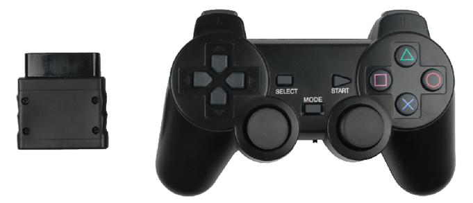
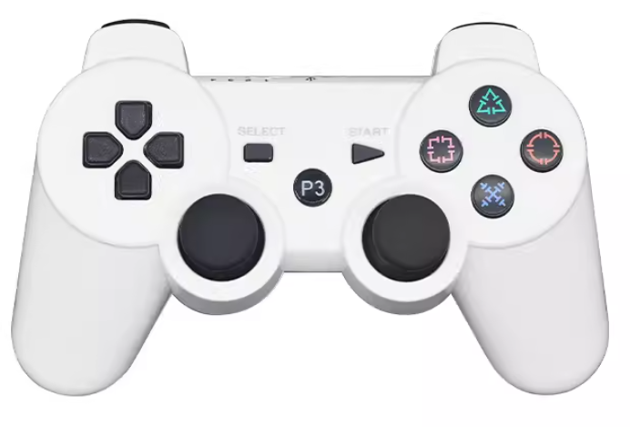
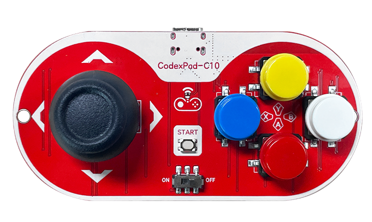
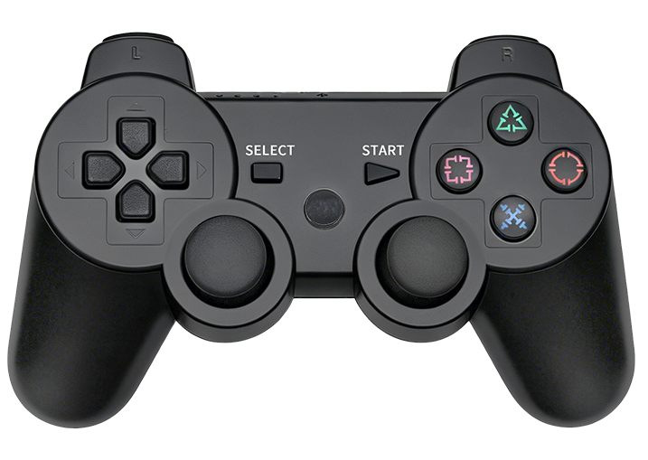

# 常见无线遥控器对比

在创客行业，最常见的无线遥控器有PS2、PS3。但是它们原本设计开发目标都是作为pc端无线游戏手柄使用，后来被爱好者破解后编写使用库，用来支持Arduino硬件。但是由于并不是为创客行业专用，存在一些问题。我司为解决痛点问题，开发了CodexPad系类手柄，它们之间的区别如下：

| 名   字  | PS2                                                          | PS3                                                          | CodexPad-C10                                                 | CodexPad-S10                                                 |
| -------- | ------------------------------------------------------------ | ------------------------------------------------------------ | ------------------------------------------------------------ | ------------------------------------------------------------ |
| 图片     |                                |              |                   |                   |
| 支持主控 | Arduino Uno主板（需外接PS2接收器底座）                       | ESP32系类                                                    | 1、Arduino生态：ble-uno/ble-nano 2、esp32系类、ESP32-S系列、ESP32-C系类 3、microbit V2.0 4、掌控版、物联板、行空板 5、树莓派pico-w | 1、Arduino生态：ble-uno/ble-nano 2、esp32系类、ESP32-S系列、ESP32-C系类 3、microbit V2.0 4、掌控版、物联板、行空板 5、树莓派pico-w |
| 软件生态 | Arduino C/C++ mixly mind+                            | Arduino C/C++ mixly mind+                             | Arduino C/C++ micropython makecode mixly mind+ blockcode | Arduino C/C++ micropython makecode mixly mind+ blockcode |
| 无线技术 | 2.4G                                                         | 经典蓝牙                                                     | BLE蓝牙5.3                                                   | BLE蓝牙5.3                                                   |
| 距离     | 8m                                                           | 10m                                                          | 空旷距离80m （实验室测试环境）                            | 空旷距离150m （实验室测试环境）                           |
| 优点     | 1、带接收器 2、价格低廉 3、可更换电池              | 1、支持经典蓝牙 2、ESP32上库支持完善 3、价格便宜 4、可充电 | 1、低功耗蓝牙通信距离远 2、点对点连接、不干扰、不串频 3、支持硬软件生态丰富 4、长时间使用不断连 5、可使用接收器NL-16 | 1、低功耗蓝牙通信距离远 2、点对点连接、不干扰、不串频 3、支持硬软件生态丰富 4、长时间使用不断连 5、可使用接收器NL-16 |
| 缺点     | 1、接收器过大、接线麻烦 2、遥控距离短 3、容易串频、掉线 4、整体使用容易损坏 5、功耗大、不可以充电 | 1、遥控距离短 2、容易掉线 3、指示灯无意义 4、经典蓝牙功耗大 | 1、单摇杆、按键数量少 2、不可充电                       | 价格偏高                                                     |
| 供电情况 | 2节七号电池，带开关可断电关机                                | 400mA可充电锂电池，待机2周                                   | 纽扣电池，带开关可断电关机                                   | 400mA可充电锂电池，可以使用大概1月                           |
| 适合场景 | arduino uno主板，近距离、同时只有单机使用                    | esp32主板、双摇杆多按键遥控场景、竞赛场景，短距遥控、        | 按键需求不多、简单遥控场景、距离远遥控                       | 双摇杆多按键遥控场景、竞赛场景、远距离遥控                   |
