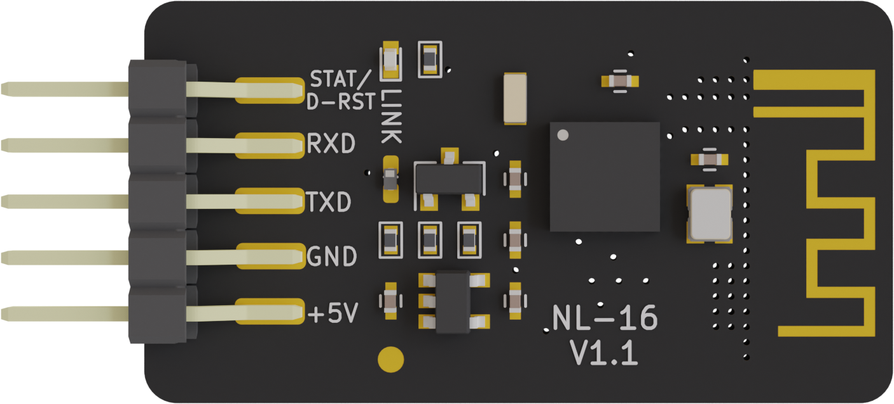

# NL-16使用说明

本文档为BLE4.2蓝牙模块NL-16AT指令说明文档

**修改历史**

------

**日期**                       **版本**                        **发布说明**

------

2021.10.15                V1.0                                 添加详细引脚描述

------

2025.10.15                V1.1                                 芯片修改为CH571F说明

------

2026.4.15                 V1.2                              固件支持codexpad手柄，增加AT+ECHO指令

------

[产品介绍](#产品简介) 
[模块参数](#模块参数) 
[引脚说明](#引脚说明) 
[NL-16测试](#NL-16测试) 
[AT指令集](#AT指令一览表) 
[AT指令集详细说明](#AT指令集详细说明) 
[Arduino无线下载](#AT指令集详细说明) 
[常见问题](#常见问题) 

## 产品简介

NL-16透传模块是基于蓝牙 4.2 协议标准，工作频段为 2.4GHZ 范围，调制方式为 GFSK，最大发射功率为 0db，最大发射距离 60 米，采用沁恒微CH571F芯片设计，支持用户通过 AT 命令修改设备名、服务 UUID、发射功率、配对密码等指令，方便快捷使用灵活。 
NL-16 蓝牙模块可以实现模块与手机或模块与模块数据传输，默认是UART 通信方式，通过简单的AT指令配置即可快速使用 BLE 蓝牙进行产品应用。

## 模块参数

- 型号：NL-16
- BLE芯片: RISC-V架构ch571F芯片（高度兼容TI CC2540芯片）
- 工作频道: 2.4G
- 0dBm 发送功率时电流6mA  
- 接收灵敏度-96dBm，可编程+5dBm 发送功率
- 传输距离：空旷情况下，在0dB发送功率通讯距离约170m，在3dBm发送功率时约240m
- 支持串口，蓝牙两种种方式，AT指令配置，支持主从模式切换、
- 主机模式下支持蓝牙自动连接从机
- 支持蓝牙无线下载Arduino程序
- MTU为256，单次数据发送量最大为256Byte

## 引脚说明

| 引脚 | 功能       | 说明                                                |
| ---- | ---------- | --------------------------------------------------- |
| 1    | STAT/D-RST | STAT和复位单片机引脚 默认为复位Arduino主控功能 |
| 2    | RXD        | 蓝牙模组串口接收引脚RXD                             |
| 3    | RXD        | 蓝牙模组串口发送引脚TXD                             |
| 4    | GND        | 电源地                                              |
| 5    | +5V        | 电源输入                                            |

## NL-16测试

### NL-16和android手机测试

<a href="/zh-cn/peripheral/BleToolsTest.apk" download>点击下载BleToolsTest.apk</a>

### NL-16和IOS/MAC设备测试

ios手机和mac电脑我们测试方法是一样的，应用商店下载lightblue这个应用

### NL-16和PC设备

windows电脑我们用网页版本来测试

<a href="zh-cn/peripheral/nl-16/BleSerialTools.html" target="_blank">PC端BLE测试网页</a>

## AT指令一览表

NL-16透传模块指令是通过串口发送，波特率支持9600、19200、38400、57600、115200。ble-uno串口默认波特率为115200bps。  
AT指令还可以通过APP的为0xFFE2的characteristics来控制。  
（注：发AT指令时必须回车换行， AT指令只能在模块未连接状态下才能生效，一旦蓝牙模块与设备连接上，蓝牙模块即进入数据透传模式。AT指令区分大小写，均以回车换行字符结尾：\\r\\n）

| 指令             | 描述                                                         | 主(Master)/从(Slave) | 默认         |
| ---------------- | ------------------------------------------------------------ | -------------------- | ------------ |
| AT               | 测试                                                         | M/S                  |              |
| AT+ALL           | 打印所有得配置信息                                           | M/S                  |              |
| AT+ECHO          | 打开关闭AT信息显示                                           | M/S                  | 0            |
| AT+RESET         | 复位蓝牙模块                                                 | M/S                  |              |
| AT+TARGE_RESET   | 复位Arduino(Atmega328PB芯片)                                 | M/S                  |              |
| AT+VER           | 查询模块固件版本                                             | M/S                  |              |
| AT+BAUD          | 设置模组串口波特兰                                           | M/S                  | 115200       |
| AT+NAME          | 设置蓝牙广播名字（NL-16_6位mac地址）                         | S                    | NL-16_xxxxxx |
| AT+MAC           | 设置查看模组蓝牙12位mac地址                                  | M/S                  | 随机         |
| AT+AUTH          | 设置蓝牙连接是否需要鉴权                                     | S                    | 0            |
| AT+PASS          | 设置模组蓝牙连接密码                                         | S                    | 000000       |
| AT+ROLE          | 配置主从模式                                                 | M/S                  | 1            |
| AT+SCAN          | 扫描周边的蓝牙设备                                           | M                    |              |
| AT+CONN          | 连接扫描结果对应下标的蓝牙                                   | M                    |              |
| AT+CON           | 连接对应Mac地址得蓝牙                                        | M                    |              |
| AT+AUTOCON       | 自动连接最近的从机蓝牙，重启生效                             | M                    | 0            |
| AT+DISCON        | 断开当前的连接                                               | M                    |              |
| AT+SRVUUID       | 设置/获取蓝牙服务特征码SRVUUID                               | M/S                  | 0xFFE0       |
| AT+CHARUUID      | 设置/获取蓝牙字符特征码CHARUUID                              | M/S                  | 0xFFE1       |
| AT+MINI_INTERVAL | 设置BLE芯片最小通信间隔                                      | M/S                  | 6            |
| AT+MAX_INTERVAL  | 设置BLE芯片最大通信间隔                                      | M/S                  | 10           |
| AT+TXPOWER       | 设置蓝牙发射功率                                             | M/S                  | 4            |
| AT+SETTING       | 系统设置                                                     | M/S                  |              |
| AT+SET_STAT_RST  | 设置模块1号引脚功能  0：复位Arduino功能 1：蓝牙状态指示引脚，连接成功为低电平，断开连接为高电平 | M/S                  | 0            |

## AT指令集详细说明

1、测试指令

| 指令 | 响应 | 参数 |
| ---- | ---- | ---- |
| AT   | OK   | 无   |

2、打印NL-16的所有配置信息

| 指令   | 响应                 | 参数 |
| ------ | -------------------- | ---- |
| AT+ALL | 详细配置信息 OK | 无   |

3、打开或者关闭AT显示

| 指令    | 响应                       | 参数                                           |
| ------- | -------------------------- | ---------------------------------------------- |
| AT+ECHO | AT+ECHO=< Result > OK | 1：打开AT显示 0：关闭AT显示 默认关闭 |

4、软件复位蓝牙芯片指令

| 指令     | 响应 | 参数 |
| -------- | ---- | ---- |
| AT+RESET | 无   | 无   |

5、复位Arduino主控指令

| 指令           | 响应 | 参数 |
| -------------- | ---- | ---- |
| AT+TARGE_RESET | OK   | 无   |

6、查询NL-16固件版本

| 指令   | 响应                                                   | 参数 |
| ------ | ------------------------------------------------------ | ---- |
| AT+VER | +VERSION=v1.0 +DATE=Apr 16 2023 +TIME=  OK | 无   |

7、配置串口波特率

| 指令             | 响应                    | 参数                                                    |
| ---------------- | ----------------------- | ------------------------------------------------------- |
| AT+BAUD=< Param> | +BAUD=<  baud > OK | 0:9600  1:19200  2:38400  3:57600  4:115200 |

8、配置蓝牙名字指令

| 指令              | 响应                    | 参数                           |
| ----------------- | ----------------------- | ------------------------------ |
| AT+NAME=< Param > | +NAME=< param > OK | 蓝牙名字，默认为NL-16_xxxxxxxx |

9、查询或者设置蓝牙的Mac地址

| 指令            | 响应                    | 参数 |
| --------------- | ----------------------- | ---- |
| AT+MAC=< Param> | +MAC=< Result > OK | 无   |

10、设置蓝牙连接是否需要密码

| 指令             | 响应                     | 参数               |
| ---------------- | ------------------------ | ------------------ |
| AT+AUTH=< Param> | +AUTH=< Result > OK | 0:不要 1:需要 |

11、查询或者设置蓝牙的连接密码

| 指令             | 响应                     | 参数          |
| ---------------- | ------------------------ | ------------- |
| AT+PASS=< Param> | +PASS=< Result > OK | 6位阿拉伯数字 |

12、查询设置蓝牙主从模式

| 指令              | 响应                    | 参数               |
| ----------------- | ----------------------- | ------------------ |
| AT+ROLE=< Param > | +ROLE=< Param > OK | 0:主机   1:从机 |

13、蓝牙主机模式下扫描附近从机

| 指令    | 响应                                                         | 参数 |
| ------- | ------------------------------------------------------------ | ---- |
| AT+SCAN | +SCAN   OK mac[1]:xxxx  mac[2]:xxxx   ……   | 无   |

14、通过扫描返回下标连接从机蓝牙

| 指令                | 响应              | 参数                 |
| ------------------- | ----------------- | -------------------- |
| AT+CONN=<  Param  > | OK+CONN=< Param > | 扫描从机蓝牙下标数字 |

15、通过Mac地址连接从机蓝牙

| 指令             | 响应             | 参数         |
| ---------------- | ---------------- | ------------ |
| AT+CON=< Param > | OK+CON=< Param > | 从机蓝牙地址 |

+SCAN 
OK 
mac[1] 3e:bb:9e:e4:e9:9a0: 
mac[2] 8c:5a:f8:ef:5c:f8 
mac[3] 6b:9c:b3:c4:4b:0c 
mac[4] 17:cc:ef:66:40:b1 
mac[5] fd:e2:4e:af:ea:da 
mac[6] 67:3a:b1:45:c2:e8 
mac[7] d0:44:7a:9e:e4:e4 
OK 
AT+CONN=1代表连接扫描得到的第二个蓝牙设备 
AT+CON=d0:44:7a:9e:e4:e4直接连接Mac地址为d0:44:7a:9e:e4:e4的设备 

16、开启蓝牙自动连接模式    开启后，蓝牙模块将自动连接上次成功连接过的设备

| 指令                   | 响应                         | 参数                              |
| ---------------------- | ---------------------------- | --------------------------------- |
| AT+AUTOCON=<  Param  > | +AUTOCON=<  Param  > OK | 0:关闭自动连接  1:开机自动连接 |

17、断开当前连接蓝牙设备

| 指令      | 响应            | 参数 |
| --------- | --------------- | ---- |
| AT+DISCON | +DISCON OK | 无   |

18、设置蓝牙的连接是否需要密码

| 指令                | 响应                    | 参数                            |
| ------------------- | ----------------------- | ------------------------------- |
| AT+AUTH=<  Param  > | +AUTH=< Param > OK | 0:连接无密码  1:需要密码连接 |

19、设置蓝牙的连接是密码

| 指令              | 响应                    | 参数 |
| ----------------- | ----------------------- | ---- |
| AT+PASS=< Param > | +PASS=< Param > OK |      |

20、设置蓝牙的USB和蓝牙数据传输模式

| 指令                | 响应                      | 参数                                                         |
| ------------------- | ------------------------- | ------------------------------------------------------------ |
| AT+BLEUSB=< Param > | +BLEUSB=< Param > OK | 0:关闭 1:USB串口数据传给BLE 2:BLE数据传给USB串口 3:USB串口数据和BLE透传 |

21、设置蓝牙的发射功率

| 指令                  | 响应                          | 参数                                                         |
| --------------------- | ----------------------------- | ------------------------------------------------------------ |
| AT+TX_POWER=< Param > | + TX_POWER=< Param >  OK | 0: -20DB 1: -14DB 2: -8DB 3: -4DB 4: 0DB 5: 1DB 6: 2DB 7: 3DB 8: 4DB 9: 5DB |

22、设置BLE芯片最小通信间隔，

| 指令                       | 响应                               | 参数                                                |
| -------------------------- | ---------------------------------- | --------------------------------------------------- |
| AT+MINI_INTERVAL=< Param > | + MINI_INTERVAL=< Param >  OK | PC和Android，建议设为为6   iOS设备，建议设置为20 |

23、设置BLE芯片最大通信间隔，以毫秒为单位

| 指令                      | 响应                              | 参数                                                 |
| ------------------------- | --------------------------------- | ---------------------------------------------------- |
| AT+MAX_INTERVAL=< Param > | + MAX_INTERVAL=< Param >  OK | PC和Android，建议设为为10   iOS设备，建议设置为40 |

24、获取BLE服务特征码UUID

| 指令        | 响应                     | 参数 |
| ----------- | ------------------------ | ---- |
| AT+SERVUUID | +SERVUUID=0xffe0 OK |      |

25、获取BLE字符特征码UUID

| 指令        | 响应                     | 参数 |
| ----------- | ------------------------ | ---- |
| AT+CHARUUID | +CHARUUID=0xffe0 OK |      |

26、系统设置

| 指令                 | 响应                       | 参数                                                        |
| -------------------- | -------------------------- | ----------------------------------------------------------- |
| AT+SETTING=< Param > | +SETTING=< Param > OK | DEFAULT恢复出厂设置   PARI_DEFAULT清除配对信息，密码信息 |

27、模块1号引脚功能设置

| 指令                 | 响应                       | 参数                                                        |
| -------------------- | -------------------------- | ----------------------------------------------------------- |
| AT+SETTING=< Param > | +SETTING=< Param > OK | DEFAULT恢复出厂设置   PARI_DEFAULT清除配对信息，密码信息 |

## 无线Arduino程序下载

NL-16模块可以给Arduino Uno（nano）主板蓝牙下载程序，接线图如下：

**蓝牙下载技术参考**

[安卓源码](https://github.com/nulllaborg/arduino_ble_flash_demo)

<a href="zh-cn/peripheral/nl-16/BleSerialTools.html" download>下载PC端BLE测试网页</a>

**第三方支持蓝牙下载平台**

[BlockCode](https://make.blockcode.fun/)

[蜗牛编程](/zh-cn/software/Mobile_programming/Mobile_programming)

[绘玩编程PlayCode](https://playcode.huiwancode.com/application/download.html)

## 常见问题

**问：NL-16和HC-05蓝牙模组有何区别?**

NL-16是低功耗蓝牙4.2模组，HR-05是经典蓝牙模块

**问：NL-16和其他蓝牙模组相比有何优势?**

1、完善的AT指令支持，功能齐全可以更灵活应用

2、除了串口AT支持，还支持蓝牙配置

3、NL-16支持Arduino Uno主板无线蓝牙下载程序

**问：为什么我的手机连不上NL-16，即使可以连上，但也不能通信？**

答：请检查您的手机是否支持蓝牙4.0。另外，请使用APP内的Scan按钮扫描连接NL-16，连接不需要密码。不支持手机蓝牙设置界面、其他BLE APP连接。

**问：NL-16支持多联吗？我想用一个主机连接很多从机，请问最多能连几个？**

答：NL-16不支持多联，但是可以通过不断地切换绑定从机，实现多联的思想。

**问：为什么NL-16系列的蓝牙4.2产品无法连接蓝牙2.0的设备？**

答：由于我们的NL-16系列为了实现极低的功耗，采用了单模蓝牙低功耗（Bluetooth Smart），硬件和软件上都做了优化，只能支持BLE，不支持连接蓝牙2.0设备。
