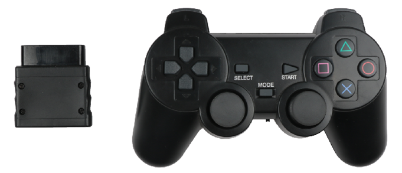
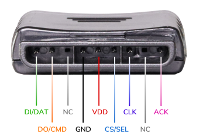
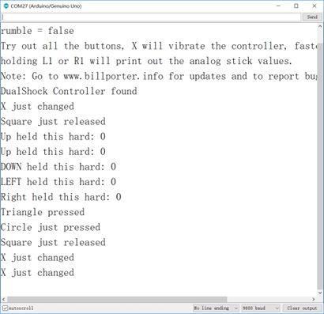
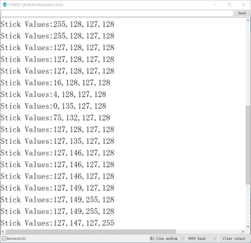

## PS2手柄介绍

​	PS2手柄原本是索尼公司专门为游戏机的生产的一款遥控手柄，索尼的系列游戏主机在全球很是畅销。不知什么时候开始，便有人打起PS2手柄的主意，破解了通讯协议，使得手柄可以接在其他器件上做遥控使用，比如遥控我们熟悉的四轮车与机器人。突出的特点是现在这款手柄性价比极高。按键丰富，方便扩展到其它应用中。
​	PS2手柄由手柄和接收器两个部分组成，手柄需要两节7号干电池供电，接收器的电源电压范围为3~5V，不能接反，不能超电压，过压和反接，都会使接收器烧坏。手柄上有个电源开关，ON开/OFF关，将手柄开关打到ON上，在未搜索到接收器的状况下，手柄上的灯会不停的闪，在一定时间内，还未搜索到接收器，手柄将进入待机模式，手柄上的灯将灭掉，这时，按下“START”键，唤醒手柄。

在接收头的一端，一共有9个接口，每个接口功能如下表所示：

| 1      | 2      | 3    | 4    | 5    | 6      | 7    | 8    | 9    |
| ------ | ------ | ---- | ---- | ---- | ------ | ---- | ---- | ---- |
| DI/DAT | DO/CMD | NC   | GND  | VDD  | CS/SEL | CLK  | NC   | ACK  |

注：**批次不同，接收器的外观会有所区别，一个上有电源灯红灯，一个上没有电源灯，但使用方法是一样的，引脚定义是一样的**。

- DI/DAT：信号流向，从手柄到主机，此信号是一个8bit的串行数据，同步传送于时钟的下降沿。信号的读取在时钟由高到低的变化过程中完成。

- DO/CMD：信号流向，从主机到手柄，此信号和DI相对，信号是一个8bit的串行数据，同步传送于时钟的下降沿。

- NC：空端口

- GND：电源地

- VDD：接收器工作电源，电源范围3~5V

- CS/SEL：用于提供手柄触发信号。在通讯期间，处于低电平

- CLK：时钟信号，由主机发出，用于保持数据同步

- NC：空端口

- ACK：从手柄到主机的应答信号。此信号在每个8bits数据发送的最后一个周期变低并且CS一直保持低电平，如果CS信号不变低，约60微秒PS主机会试另一个外设。在编程时未使用ACK端口。

	接收器连接Arduino Uno主板，在未配对的状况在，绿灯闪。手柄打开，接收器供电，手柄和接收器会自动配对，这时灯常亮，手柄配对成功。按键“MODE”(手柄批次不同，上面的标识有可能是"ANALOG"，但不会影响使用)，可以选择“红灯模式”、“绿灯模式”。
	
	PS2技术详细原理请查看<a href="zh-cn/peripheral/ps2/ps手柄原理.pdf" target="_blank">PS2手柄原理</a>

### PS2手柄测试实验步骤

本测试使的是[**MotorDriverBoard V5驱动板**](zh-cn/arduino_products/uno/motor_driver_board/MotorDriverBoard.md)，可以方便直接接PS2座子

| PS2    | Arduino  UNO |
| ------ | ------------ |
| VDD    | VCC 3~5V     |
| GND    | GND          |
| CLK    | 13           |
| D0/CMD | 11           |
| CS/SEL | 10           |
| DAT    | 12           |

<a href="zh-cn/peripheral/ps2/ArduinoUno_PS2X_Test.zip" download>点击下载Arduino Uno PS2按键测试程序</a>

**测试结果：**

串口设置波特率为9600，按PS2上面的按键，从串口可以看到按键被按下

 

按住L1和R1按键，可以读取到左右摇杆按键

 

如果超过3分钟，没有按遥控器，PS2会进入待机状态，PS2接收器上的RX接收灯会闪烁，按一下遥控器，会唤醒遥控器。

### Mixly自带PS2库

<a href="zh-cn/peripheral/ps2/ps2_mixly_test.mix" download>点击下载Mixly PS2按键测试程序</a>

### FAQ

A：手柄和接收器不能正常配对！多数问题是，接收器的接线不正确，或程序有问题？

Q：接收器只接电源（电源线一定要连接正确），不接任何数据线和时钟线，一般情况下手柄是能够配对成功。配对成功后灯常亮，说明手柄是好的。这时再检查接线是否正确，程序移植是否有问题。

A：为什么PS2容易断开连接？

Q：我们需要保证电源供电问题，尤其是3.3V需要非常稳定，否则PS2就会断联
