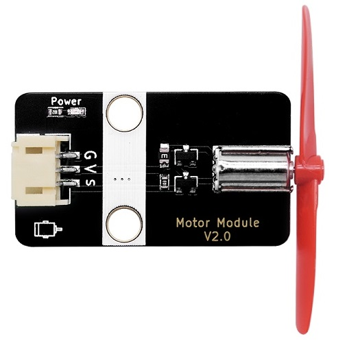
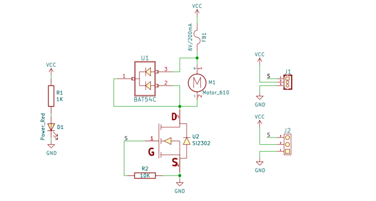
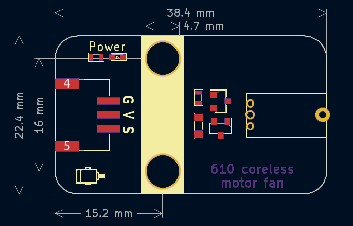

# 空心杯610电机风扇规格书




## 概述

​        本模块采用高转速空心杯610电机，由MOS管直接驱动。通过一个PWM控制信号调节电机的转速，但是不能控制电机的方向。高速空心杯电机带动桨叶可以产生风力，可以吹灭20cm距离远的蜡烛，非常方便在DIY，科学实验，小作品上使用。由于桨叶是塑料片，旋转时请勿用手触碰。

## 原理图



<a href="zh-cn/ph2.0_sensors/actuators/610_coreless_motor_fan/610_coreless_motor_fan_sch.pdf" target="_blank">点击此处查看原理图</a>

## 模块参数

* 供电电压：3~5V
* 额定电流：20mA，堵转电流 <60mA
* 空载转速：45000RPM
* 连接方式：3Pin PH2.0接口
* 模块尺寸：38.4*22.4mm
* 安装方式：M4螺钉兼容乐高插孔

| 引脚名称 | 描述                |
| -------- | ------------------- |
| V        | 3~5V电源输入        |
| G        | GND地线             |
| S        | 电机PWM控制信号引脚 |

## 机械尺寸



<a href="zh-cn/ph2.0_sensors/actuators/610_coreless_motor_fan/610_coreless_motor_fan_3d.zip" target="_blank">点击下载2D和3D文件</a>

## Arduino IDE示例程序

```c
void setup() {
  pinMode(5, OUTPUT);  // 设置电机5端口为输出模式
}

void loop() {
  analogWrite(5, 255);  // 设置电机速度为255
  delay(2000);          // 2s之后电机调速
  analogWrite(5, 100);  // 设置电机速度为100
  delay(2000);          // 2s之后电机停
  analogWrite(5, 0);    // 设置电机速度为0
  delay(2000);
}
```

## microbit示例程序

<a href="https://makecode.microbit.org/_bR98taPuz0rM" target="_blank">动手试一试</a>

 通过小电机风扇模块接Microbit的P1引脚，程序上传之后，可以看到小风扇先全速转两秒，然后中速转两秒，最后停下两秒之后在全速转两秒如此循环。
