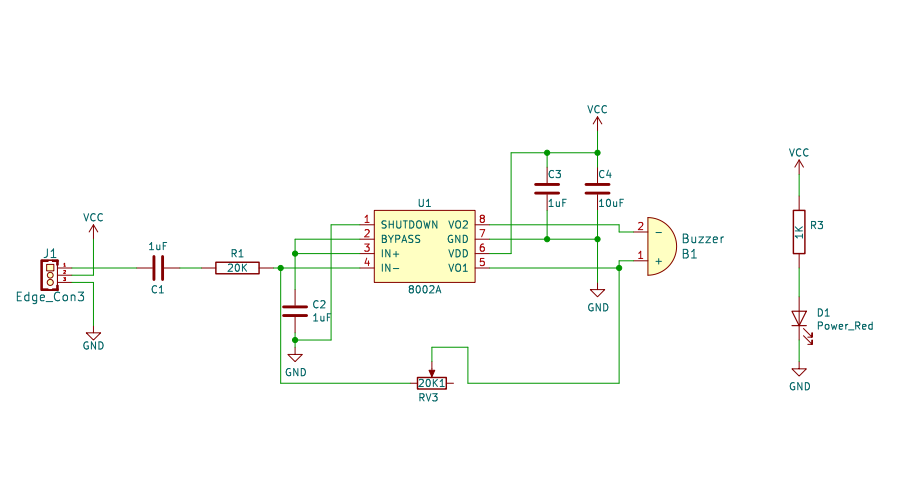
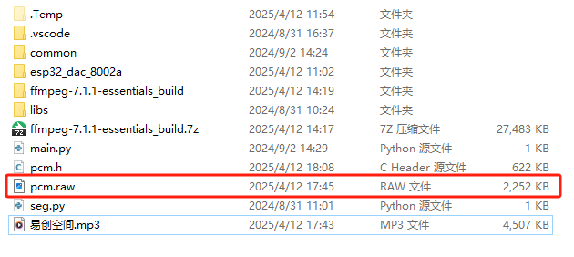
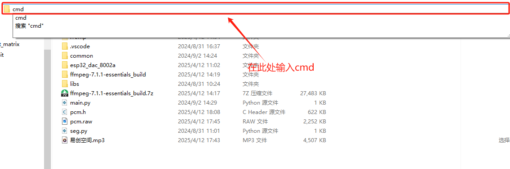
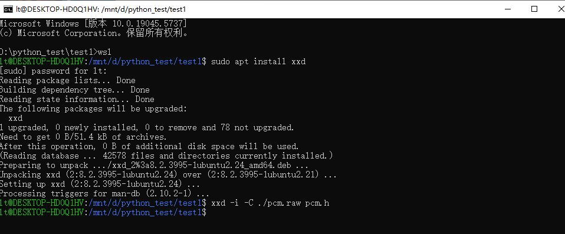
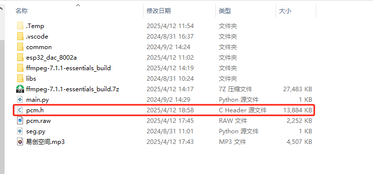

# 8002A音频放大器模块

## 实物图

## 概述

8002A音频放大器模块是一款高性能单声道D类功放模组，采用宽电压供电（2.5-5.5V），最大输出功率达3W（THD<10%）。该模块内置自适应滤波技术和过流保护电路，总谐波失真≤0.3%，信噪比≥90dB，适用于蓝牙音箱、智能家居等便携设备。

### 原理图



[点击此处查看原理图](zh-cn/ph2.0_sensors/actuators/8002a_amp_speaker/8002A_AMP_Speaker.pdf ':ignore')

## 通过ESP32播放自定义音频文件

### 快速上手

#### 1.下载ffmpeg

[下载方法可参考此链接](https://blog.csdn.net/m0_47449768/article/details/130102406)

按照上述安装好ffmpeg后，将示例音频文件[易创空间](zh-cn/ph2.0_sensors/actuators/8002a_amp_speaker/易创空间.zip ':ignore')解码出PCM格式的音频文件。

通过win+R打开cmd，输入ffmpeg命令，将示例音频文件转换为PCM格式：

`ffmpeg -i d:\data\音频\易创空间.mp3 -c:a pcm_u8 -ar 16000 -ac 1 -f u8 -y pcm.raw`

将`d:\data\音频\易创空间.mp3`修改成原音频文件所在路径即可。

转换完成后，原始音频文件将被解码为PCM格式的音频文件`pcm.raw`。



#### 2.安装windows linux子系统

[安装方法可参考此链接](https://blog.csdn.net/x777777x/article/details/141092913)

安装好上述子系统后，在pcm.raw所在目录打开终端，输入以下命令：

```linux
wsl
sudo apt install xxd
xxd -i -C ./pcm.raw pcm.h
```





通过这些指令，将PCM格式的音频文件转换为C语言数组，并保存为`pcm.h`文件。



#### 3.通过ESP32播放音频文件

##### 接线

按照下图所示接线

TIDO

##### 代码实现

1.先下载[ESP32示例程序](zh-cn/ph2.0_sensors/actuators/8002a_amp_speaker/esp32_dac_8002a.zip ':ignore')，将其烧录到ESP32开发板上。可以听到播放的易创空间音频。

2.若想要播放其他音频文件，则需要修改播放程序，将示例文件中的'pcm.h'文件替换为自己的音频文件，并按如下格式修改，注意音频文件尽可能小，以便减少RAM占用。

在自定义的`pcm.h`文件中的头部添加和修改如下代码：

```c++
#pragma once

#include <cstdint>

constexpr uint8_t kPcmData[]  /*数组名修改成该变量名*/ 

```

也可以参考示例代码的`pcm.h`文件格式进行修改。

3.再将示例程序烧录到ESP32开发板上，可以听到播放的自定义音频。

## 相关资料

[ESP32 DAC 官方资料](https://docs.espressif.com/projects/esp-idf/zh_CN/stable/esp32/api-reference/peripherals/dac.html#dac)

## 注意事项

- DAC只支持8位数据
- 不能和I2S同时使用
