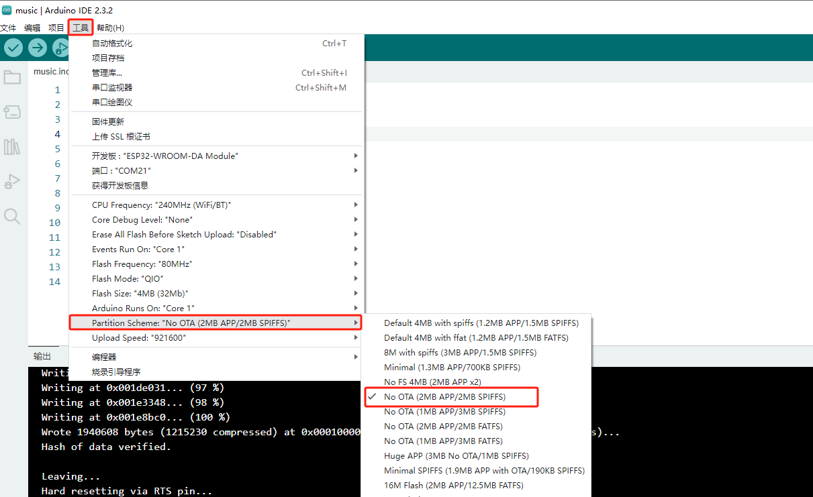

# 8002A音频放大器模块

## 实物图


## 概述

8002A音频放大器模块是一款高性能单声道D类功放模组，采用宽电压供电（2.5-5.5V），最大输出功率达3W（THD<10%）。该模块内置自适应滤波技术和过流保护电路，总谐波失真≤0.3%，信噪比≥90dB，适用于蓝牙音箱、智能家居等便携设备。

### 原理图


<a href="zh-cn/ph2.0_sensors/actuators/8002a_amp_speaker/8002A_AMP_Speaker.pdf" target="_blank">点击此处查看原理图</a>

## 通过ESP32播放自定义音频文件

### 快速上手

#### 1.下载ffmpeg

[下载方法可参考此链接](https://blog.csdn.net/m0_47449768/article/details/130102406)

按照上述安装好ffmpeg后，将示例音频文件<a href="zh-cn/ph2.0_sensors/actuators/8002a_amp_speaker/8002a_amp_speaker.zip" download>易创空间</a>解码出PCM格式的音频文件。

通过win+R打开cmd，输入ffmpeg命令，将示例音频文件转换为PCM格式：

`ffmpeg -i d:\data\音频\易创空间.mp3 -c:a pcm_u8 -ar 16000 -ac 1 -f u8 -y pcm.raw`

将`d:\data\音频\易创空间.mp3`修改成原音频文件所在路径即可。

转换完成后，原始音频文件将被解码为PCM格式的音频文件`pcm.raw`。


#### 2.安装windows linux子系统

[安装方法可参考此链接](https://blog.csdn.net/x777777x/article/details/141092913)

安装好上述子系统后，在pcm.raw所在目录打开终端，输入以下命令：

```linux
wsl
sudo apt install xxd
xxd -i -C ./pcm.raw pcm.h
```


通过这些指令，将PCM格式的音频文件转换为C语言数组，并保存为`pcm.h`文件。


#### 3.通过ESP32播放音频文件

##### 接线

按照下图所示接线，将音频放大器模块插入ESP32的GPIO25引脚即可。


##### 代码实现

1、先下载<a href="zh-cn/ph2.0_sensors/actuators/8002a_amp_speaker/8002a_amp_speaker.zip" download>ESP32示例程序</a>，用ArduinoIDE打开esp32_dac_8002a.ino文件，上传到ESP32开发板上。可以听到播放的易创空间音频。

2、若想要播放其他音频文件，则需要修改播放程序，将示例文件中的'pcm.h'文件替换为自己的音频文件，并按如下格式修改，注意音频文件尽可能小，以便减少RAM占用。

在自定义的`pcm.h`文件中的头部添加和修改如下代码：

```c++
#pragma once

#include <cstdint>

constexpr uint8_t kPcmData[] /*数组名修改成该变量名*/

```

也可以参考示例代码的`pcm.h`文件格式进行修改。

3、再将示例程序烧录到ESP32开发板上，可以听到播放的自定义音频。

## 相关资料

[ESP32 DAC 官方资料](https://docs.espressif.com/projects/esp-idf/zh_CN/stable/esp32/api-reference/peripherals/dac.html#dac)

## 注意事项

- DAC只支持 8 位数模转换器，数字值 0 ~ 255 转换成模拟电压 0 ~ Vref ；
- ESP32只有两个通道DAC，分布为 GPIO25（通道 1）和 GPIO26（通道 2） ；
- 不能和I2S同时使用。

## 蓝牙音响实验

<a href="zh-cn/ph2.0_sensors/actuators/8002a_amp_speaker/ESP32-A2DP.zip" download>点击出下载示例代码以及zip库文件</a>

在本次实验中，我们在Arduino IDE中运行。

在编写程序之前，先选择相应主板型号。


在上传此程序之前，需要先导入相关库文件，步骤如下：


更新库文件后，重启IDE，再打开示例程序，正常上传。

再按如下选择内存选项以免编译时报内存溢出错误。



打开示例程序ESP32-A2DP\examples\bt_music_receiver_to_internal_dac.ino

```
#include "AudioTools.h"
#include "BluetoothA2DPSink.h"

AnalogAudioStream out;

//库文件，DAC默认接口25号端口；
BluetoothA2DPSink a2dp_sink(out);

void setup() {
//在此修改蓝牙设备名称
  a2dp_sink.start("EmakeFun DAC");  
  LOGI("analog left output pin: %d", 25);
  LOGI("analog right output pin: %d", 26);
}

void loop() {
}
```


### 实验结果

上传示例程序后，打开手机蓝牙设置（电脑蓝牙设置），搜索周围蓝牙设备，例如本实验中设备名称为“Emakefun DAC”，点击连接配对，配对成功后，即可外放音频，达到蓝牙音响的效果。

|  |  |  |
| ---------------------- | ---------------------- | ---------------------- |
|                        |                        |                        |
