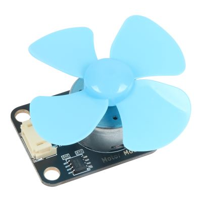
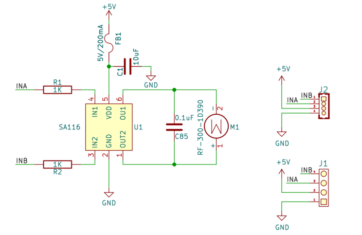
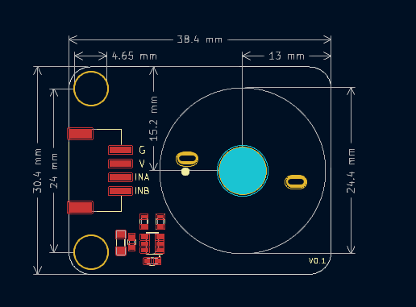

# R300C电机风扇模块



## 概述

​	电机风扇模块是一款基于R300C电机的一款低电压，低电流可控制正反转的模。搭配2mm轴的螺旋浆，可轻松吹灭20cm处的打火机火焰，可用于救火机器人、手工DIY、益智玩具、模型的制作。

## 原理图



## 模块参数

* 供电电压：3~6V直流电压
* 启动电流：250mA
* 额定电流：60mA
* 连接方式：4pin-PH2.0接口
* 模块尺寸：38.4*30.4mm
* 安装方式：M4螺钉兼容乐高插孔

### 电机参数

- 工作环境

  - 额定电压：3.0V DC
  - 使用温度：-10℃~+60℃
  - 相对湿度：  30％～90％ 
  
- 空载转速：2700士10% RPM

- 空载电流：<15mA

- 额定力矩： 4.0g.cm  

- 额定转速：1800士10% RPM

- 额定电流：60mA

- 起动电压：<1.0V

- 堵转力矩：  ≥10g.cm  

- 堵转电流：  ≤450mA  

- 绝缘电阻：  1.0MΩ  

- 机械特性:

  - 轴向间隙：0.05~0.3mm

  - 轴伸长度：7.8±0.3mm
  - 轴直径：2mm
  - 机械噪音：<=50分贝

## 机械尺寸




<a href="zh-cn/ph2.0_sensors/actuators/R300C/R300C_3d.zip" download>下载R300C风扇模块3D文件</a>

## Arduino Uno示例程序

​	风扇驱动原理很简单，INA给高电平，INB给低电平风扇朝一个方向旋转，INB给高电平，INA给低电平，风扇朝反方向旋转。如需要调整旋转速度，那么分别给INA，INB两个引脚给PWM差，就能控制电机旋转速度。

```c
#define INB 6
#define INA 5

void setup() {
  pinMode(INB, OUTPUT);
  pinMode(INA, OUTPUT);
}

void loop() {
  analogWrite(INA, 255);  // 设置电机INA端口为PWM 255
  analogWrite(INB, 0);    // 设置电机INB端口为低电平
  delay(2000);            // 2s之后电机反转
  analogWrite(INA, 0);    // 设置电机INA端口为低电平
  analogWrite(INB, 255);  // 设置电机INB端口为PWM 255
  delay(2000);            // 电机反转2s然后正转
}
```
