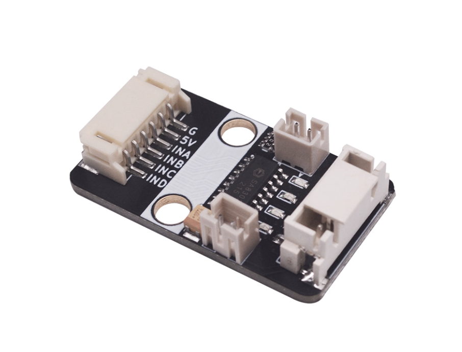
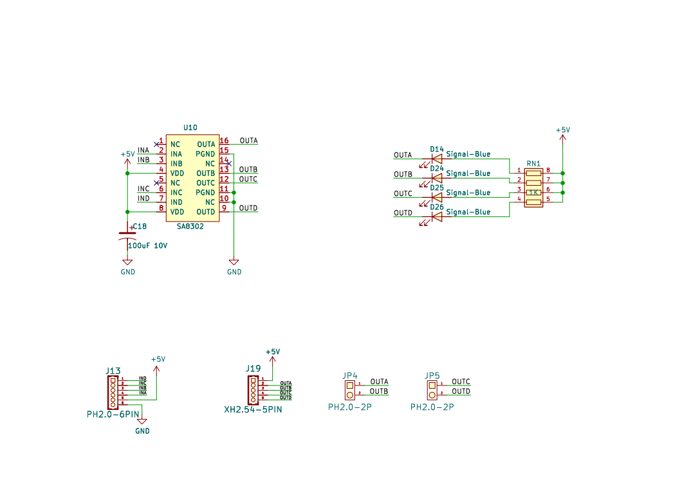
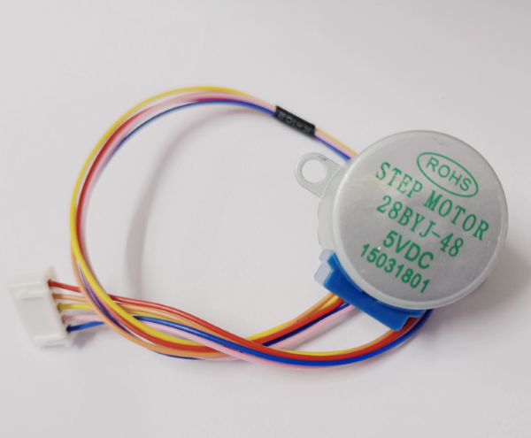
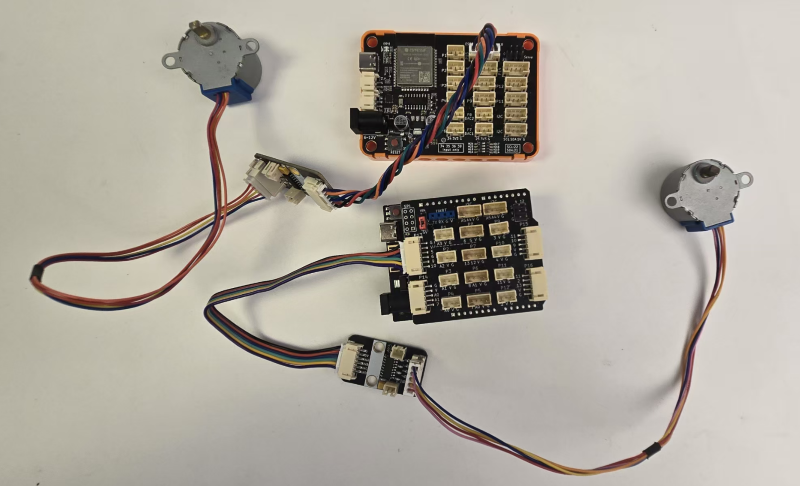

# SA8302步进电机驱动模块

## 实物图



## 概述

​	SA8302模块是一款功能兼容替代ULN2003的步进电机驱动模块，工作电压2-7V，双通道工作电流为1A。此器件相对ULN2003的功能区别在于，除了可以驱动一个步进电机之外还可以驱动两路无刷直流电机。由功率PMOS和NMOS组成，集成了电机正转/反转/停止/刹车四个功能。同时芯片集成了过温保护和欠压闭锁等保护功能，导通电阻和待机电流等性能远优于ULN2003芯片。

## 原理图



<a href="zh-cn/ph2.0_sensors/actuators/SA8302/SA8302_sch.pdf" target="_blank">原理图点击此处下载查看</a>

## 模块参数

- 电压： 典型5V（2-7V）；
- 接口： 2路PH2.0直流无刷电机，1个XH2.54 5pin接口默认连接28BYJ-48步进电机；
- 驱动电流： 双通道电流持续输出1A，峰值3A；
- 导通电阻：400mΩ（HS+LS)；
- 电流：待机电流0.1uA，工作电流120uA；
- 尺寸： 38.4 * 22.4 mm

接线方式：INA，INB，INC，IND为步进电机四相信号输入。

### 模块尺寸参数


## SA8302驱动无刷直流马达Arduino示例

```c++
#define INA 5  
#define INB 6  // 定义电机A.B端口
#define INA 9  
#define INB 10  // 定义电机C.D端口

void setup() {
    pinMode(INA, OUTPUT);  // 设置电机端口为输出模式
    pinMode(INB, OUTPUT);
    pinMode(INC, OUTPUT);  
    pinMode(IND, OUTPUT);  
}

void loop() {
    analogWrite(INA, 255);  // 设置A端口为高电平
    analogWrite(INB, 0);    // 设置B端口为低电平
    analogWrite(INC, 255);  // 设置C端口为高电平
    analogWrite(IND, 0);    // 设置D端口为低电平
    delay(2000);            // 2s之后电机反转
    analogWrite(INA, 0);    // 设置A端口为低电平
    analogWrite(INB, 255);  // 设置B端口为高电平
    analogWrite(INC, 0);    // 设置C端口为低电平
    analogWrite(IND, 255);  // 设置D端口为高电平
    delay(2000);            // 电机反转2s然后正转
}
```

**注意事项**

- SA8302模块接口接在arduino上用5V供电时，只能驱动小型马达，微型水泵，TT马达，N20电机，积木马达等，不能驱动启动电流大于500mA的马达。
- ArduinoUno主板USB接口供电时注意只有500mA，为了系统稳定性，请使用DC头供电，或者5V独立供电。

## SA8302驱动28BYJ-48步进电机



 **28BYJ-48**步进电机的型号含义： 

```
28：步进电机的有效最大外径是28毫米
B：表示是步进电机
Y：表示是永磁式
J：表示是减速型（减速比1:64）
48：可以四拍、八拍运行 
```

**参数**

```
直径：28mm
电压：5V
步角：5.625 x 1/64
减速比：1:64
驱动类型：1-2相位
类型：四相五线
定位转矩 >300g.cm
```

根据规格书，步距角为5.625°，那么360°/5.625°=64。所以STEPS就是64。

```cpp
Stepper stepper(STEPS,pin1,pin2,pin3,pin4); //输入参数步数，引脚
```

STEPS: 步进电机旋转一周的步数（整数型）
pin1, pin2，pin3, pin4: 连接电机的引脚编号

```text
stepper.setSpeed(SPEED); //设定步进电机速度为SPEED rpm
```

设定转速，单位为rpm，比如setSpeed(200)。但这里的转速是**不带减速比的**，实际转速就是200/64 = 3.125 rpm。

如果我们想让步进电机旋转一圈需要给的steps = (360/5.625)*64 = 4096 

### 引脚连接图



| SA8302模块 | Arduino Uno引脚 | ESP32主板 |
| ---------- | --------------- | --------- |
| G          | GND电源地       | GND电源地 |
| V          | 电源5V          | 电源5V    |
| INA        | 5               | 17        |
| INB        | 6               | 16        |
| INC        | 9               | 15        |
| IND        | 10              | 14        |

## Arduino IDE示例程序

<a href="zh-cn/ph2.0_sensors/actuators/SA8302/SA8302_for_arduino.zip" download>点击下载Arduino IDE示例程序</a>

## MicroPython示例程序

<a href="zh-cn/ph2.0_sensors/actuators/SA8302/28BYJ38_Stepper_esp32_micropython.zip" download>点击下载ESP32 MicroPython示例程序</a>

<a href="zh-cn/ph2.0_sensors/actuators/SA8302/28BYJ38_Stepper_microbit_micropython.zip" download>点击下载micro:bit MicroPython示例程序</a>

## micro:bit MakeCode 示例程序

请等待更新...

[点击查看用户库链接](https://github.com/emakefun-makecode-extensions/emakefun_28byj48_stepper) 