# DM11两路电机驱动模块

## 模块实物图

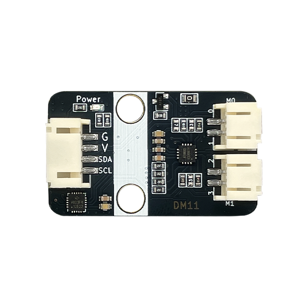

## 概述

DM11是一款I2C转4路PWM控制两路电机的驱动模块。

该模块由单片机CH32V003为主控，通过I2C协议接收上位机指令输出4路PWM波，驱动电机驱动芯片AT8833。进而驱动两路电机。适用于单片机IO口引脚不够，而需要驱动多路电机转动的场景。本模块的最高驱动为5V，单路最大驱动电流为350mA，只能用于驱动小型马达，微型水泵，TT马达，N20电机，积木马达等。

### 原理图

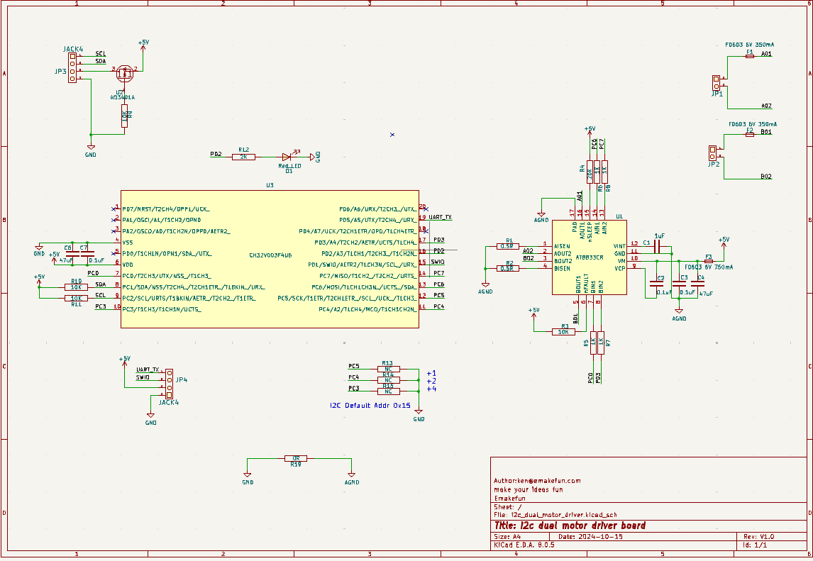

<a href="zh-cn/ph2.0_sensors/actuators/dm11/i2c_dual_motor_driver.pdf" target="_blank">原理图点击此处下载查看</a>

## 模块参数

- 工作电压：3.6~5V
- 接 口：IIC接口和2.0间距接口
- 通信方式：IIC通信，地址0x15，背面焊盘可配置地址
- 尺 寸：22.4*38.4mm，兼容乐高积木和M4螺丝固定孔

| Arduino Uno | DM11             |
| ----------- | ---------------- |
| VCC         | VCC （3.6~5V电源输入） |
| GND         | GND （电源地）        |
| A5          | SCL              |
| A4          | SDA              |

### 尺寸图

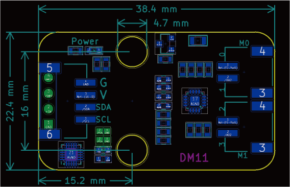

### 3D图纸
<a href="zh-cn/ph2.0_sensors/actuators/dm11/Drawing/DM11.step" download>点击下载STEP文件</a>

<a href="zh-cn/ph2.0_sensors/actuators/dm11/Drawing/DM11.wrl" download>点击下载WRL文件</a>

<a href="zh-cn/ph2.0_sensors/actuators/dm11/Drawing/DM11.dxf" download>点击下载DXF文件</a>

## 模块测试

即将DM11模块插入I2C接口即可。（如下图所示）

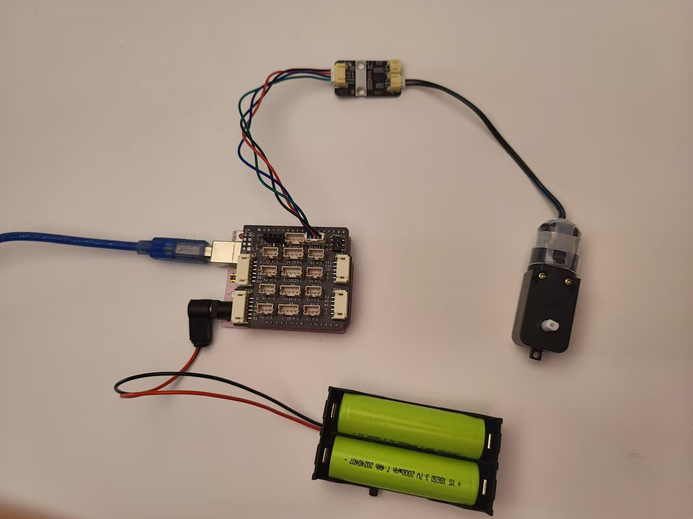

### 驱动电机Arduino示例文件以及常用函数说明

[点击查看直流电机驱动模块库和示例程序](https://emakefun-arduino-library.github.io/em_dm11/html/zh-CN/index.html)

点击上述链接此处即可下载库文件和示例程序。
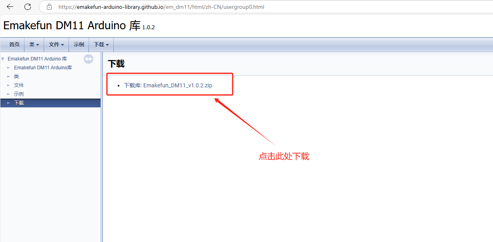

#### 示例文件说明( [点击查看示例文件说明](https://emakefun-arduino-library.github.io/em_dm11/html/zh-CN/motor_forward_backward_8ino-example.html) )

详情可查看上述链接的如下位置：

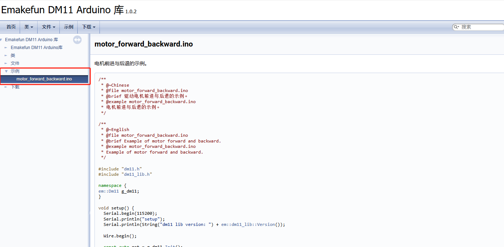

#### 常用函数说明( [点击查看常用函数说明](https://emakefun-arduino-library.github.io/em_dm11/html/zh-CN/classem_1_1_dm11.html#a612627d1e1525ebbf46ec575aab220c4) )

更多函数可以参考上方链接的如下位置：

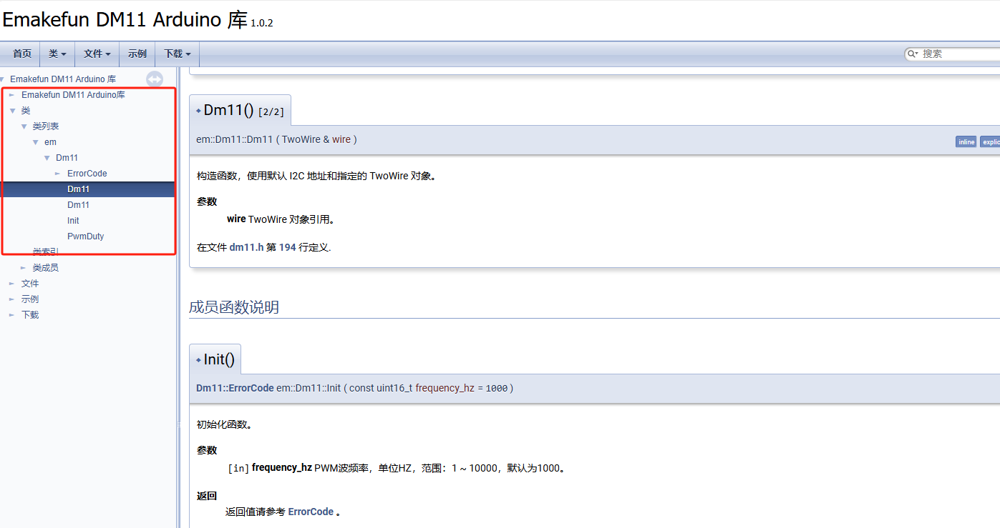

### 调试

打开Arduino IDE，点击项目->导入库->添加.ZIP库，选择下载好的库文件，点击打开，然后点击确定。

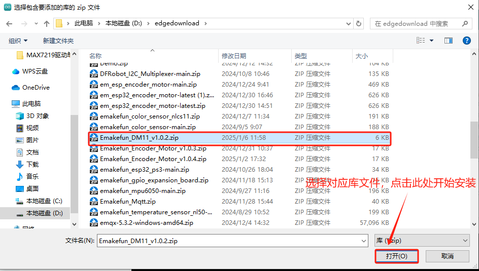

等待库文件安装完即可。

选择主板型号，比如我的是Arduino Uno，然后点击确定。

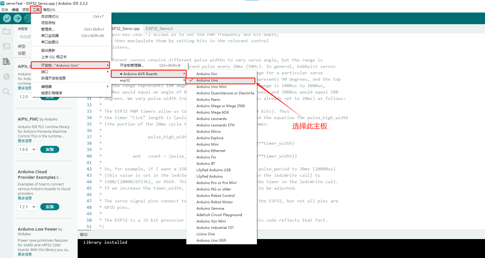

#### 打开示例程序

打开Arduino IDE，点击文件->示例->Emakefun DM11->motor_forward_backward，然后点击打开。

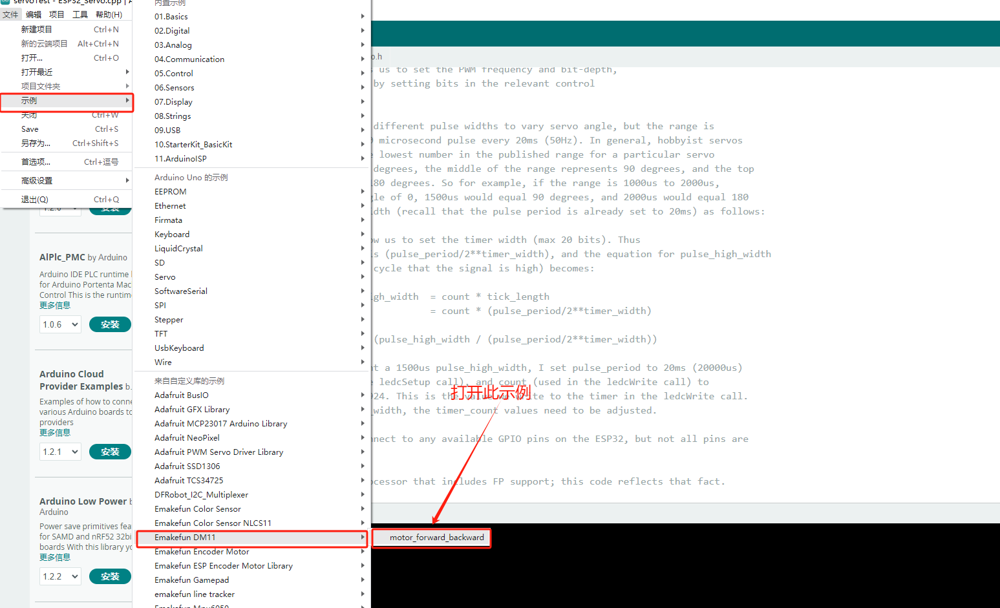

选择COM口，然后点击上传。

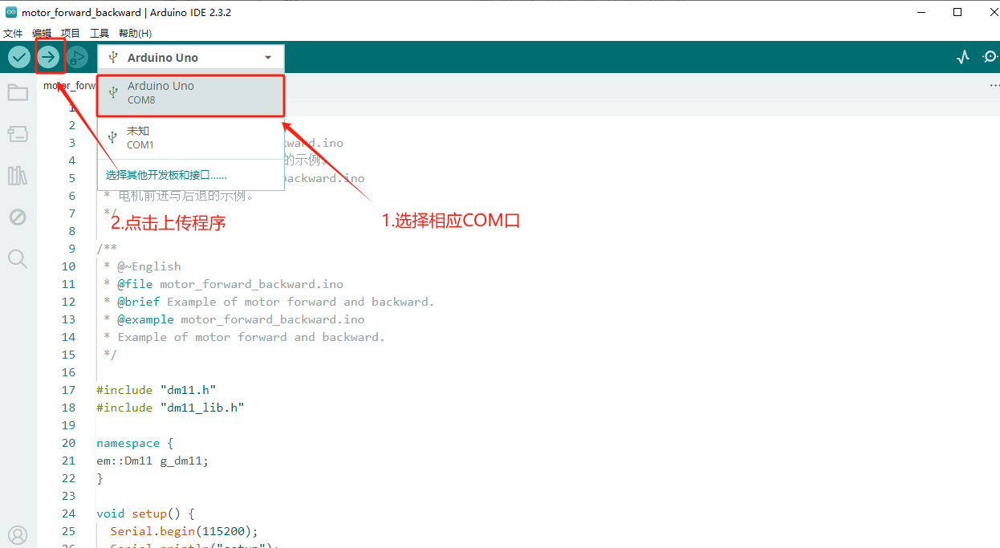

打开电源开关。发现电机在不停的正反转即调试成功。

若出现上传失败，请检查电机驱动模块是否连接正确。

## MicroPython示例程序

<a href="zh-cn/ph2.0_sensors/actuators/dm11/dm11_esp32_micropython.zip" download>点击下载ESP32 MicroPython示例程序</a>

<a href="zh-cn/ph2.0_sensors/actuators/dm11/dm11_microbit_micropython.zip" download>点击下载micro:bit MicroPython示例程序</a>

## micro:bit MakeCode 示例程序

[MakeCode示例程序点击此处查看](https://makecode.microbit.org/S25589-93071-08419-24570 )

[点击查看用户库链接](https://github.com/emakefun-makecode-extensions/emakefun_dm11)

## Mind+示例程序

<a href="zh-cn/ph2.0_sensors/actuators/dm11/emakefun-dm11-thirdex-V0.0.1.mpext" download>点击下载Mind+库</a>

## Mixly示例程序

DM11库在Emakefun官方库执行器里面，[点击跳转详情查看](/zh-cn/software/mixly/mixly.zh-CN.md)
