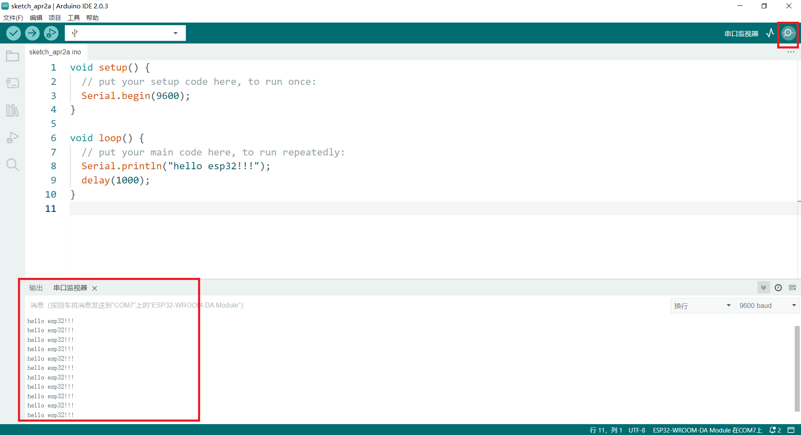

# ESP32 Software Instructions

The purpose of this document is to introduce how to use the esp32 motherboard on Arduino IDE 2.0, Mixly, Mind+ and other platforms.

## 1. Download the program from the Arduino IDE

Please go to [the Arduino website](https://www.arduino.cc/en/Main/Software) to download the latest IDE 2.0 version

1. Open Ardunio IDE 2.0;
2. Install the ESP32 library;

1) Click on the Arduino IDE menu bar: [File] --> [Preferences]

*Copy the [URL of https://dl.espressif.com/dl/package_esp32_index.json](https://dl.espressif.com/dl/package_esp32_index.json) to the add-on manager address*

2) Click [Tools] in the menu bar> [Board] -> [Boards Manager] to search for ESP32, and then install it, as shown below:

After the installation is complete, open the IDE and select the motherboard first, as shown in the figure below

Click the upload button to write the program and wait for the program to be uploaded successfully.

Click on the serial port tool to see the printing of the serial port.

## 2. Use of Mixly (Take Mixly 2.0 as an example)

[Mixly2.0 Basic Tutorial](/en/software/mixly/mixly.zh-CN.md) Please check the previous introduction directly, here only explains how to choose ESP32 motherboard in mixly

1. Board selection

   If it's Arduino, choose as:

If it's MicroPython, choose as:

2. Motherboard selection

3. Import the case

4. Download

## 3. Mind+

[You can check the previous introduction for the basic use of Mind+,](/en/software/mind_plus/mindplus.zh-CN.md) here is only an introduction, how to install ESP32 motherboard, and how to choose in Mind+

\1. Install and open the software, select the mode and language, and select the motherboard from the extension

\2. Click to select the FireBeetle ESP32-E motherboard, as shown below

## 4. MicroPython

For MicroPython syntax Chinese documentation, refer to [Getting Started with MicroPython on ESP32—MicroPython Chinese 1.17 documentation](http://micropython.com.cn/en/latet/esp32/tutorial/intro.html)

Please download the firmware from [micropytho.org official website](https://micropython.org/download/ESP32_GENERIC/)

[Thonny](/en/software/thonny/thonny.zh-CN.md) is recommended for programming tools
