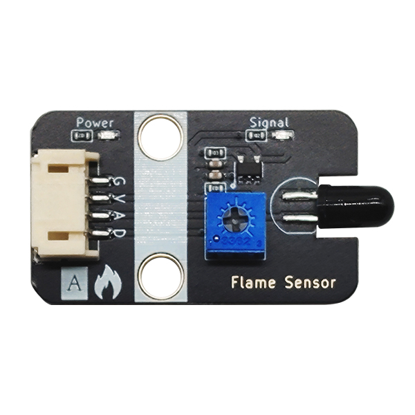
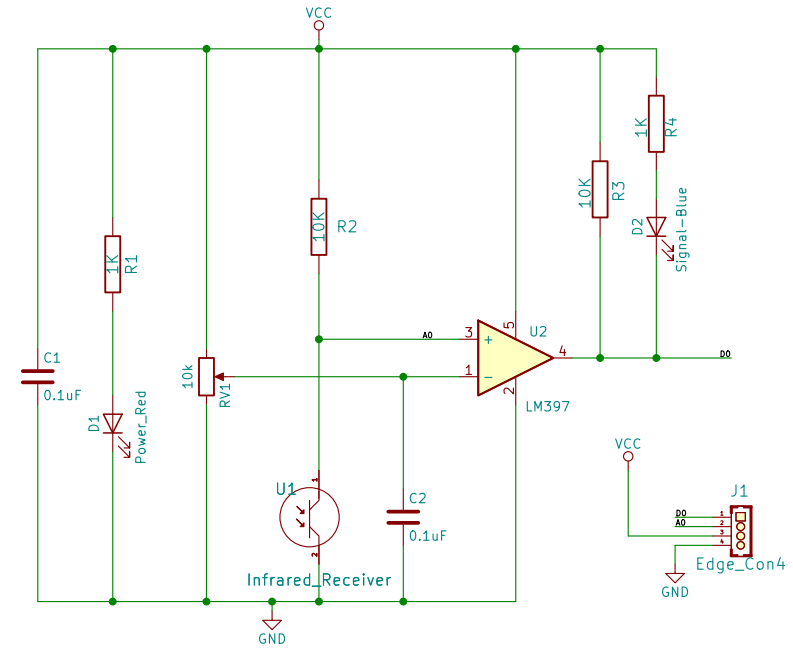
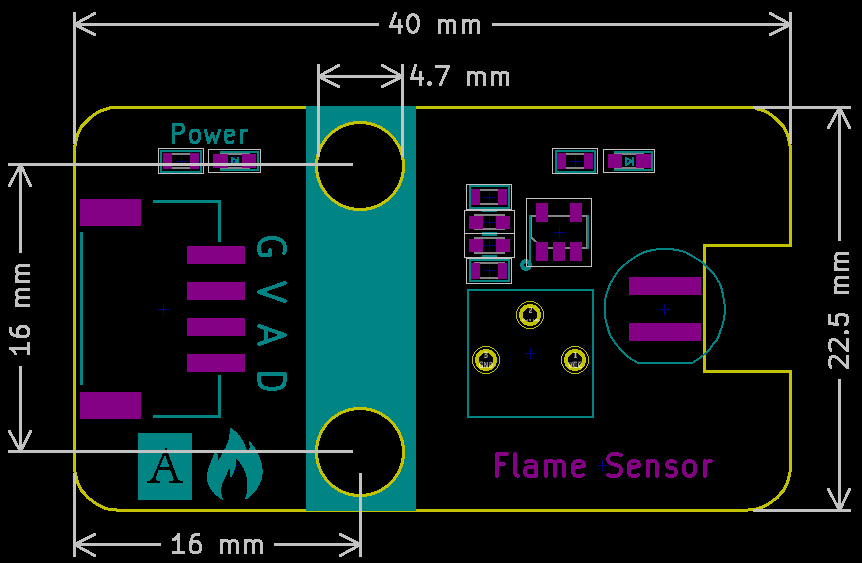

# Flame Sensor

## Physical picture



## Overview

In public places, such as hotels, buildings and other places, fire alarms are equipped. How do they sense fires? As we all know, when a fire breaks out, there will be particularly strong infrared rays. This device can detect fires through infrared rays. The flame sensor is a sensor that the robot uses to search for fire sources. Of course, the flame sensor can also be used to detect the brightness of light, but this sensor is particularly sensitive to flames. The flame sensor uses the characteristics of infrared rays being very sensitive to flames, uses a special infrared receiving tube to detect flames, and then converts the brightness of the flame into a high and low level signal, which is input into the central processing unit. The central processing unit makes corresponding program processing according to the changes in the signal.

## Schematic

<a href="en/ph2.0_sensors/sensors/flame_sensor/flame_sensor_schematic.pdf" target="_blank">View Schematic</a>



## Module parameters

| Pin Name | describe            |
| -------- | ------------------- |
| G        | GND                 |
| In       | VCC                 |
| A        | Analog signal pins  |
| D        | Digital signal pins |

- Supply voltage: 3V3/5V
- Connection method: 4PIN anti-reverse connection DuPont line
- Module size: 40 x 22.5 mm
- Installation method: M4 screw compatible with Lego socket

## Mechanical Dimensions



## Arduino Example Program

<a href="en/ph2.0_sensors/sensors/flame_sensor/flame_sensor.rar" downloaad>Download the sample program</a>

```c
#define FLAMEL_DIGITAL_PIN 7  // Define the digital pin of the flame sensor
#define FLAMEL_ANALOG_PIN A0  // Define the analog pin of the flame sensor

int flamel_analog_value = 0;   // Define digital variables, read the flame analog value
int flamel_digital_value = 0;  // Define digital variables, read the flame digital value

void setup() {
  Serial.begin(9600);                // Set the serial port baud rate
  pinMode(FLAMEL_DIGITAL_PIN, INPUT);  // Set the flame sensor digital pin as input
  pinMode(FLAMEL_ANALOG_PIN, INPUT);   // Set the flame sensor analog pin as input
}
void loop() {
  flamel_analog_value = analogRead(FLAMEL_ANALOG_PIN);     // Read the flame sensor analog value
  flamel_digital_value = digitalRead(FLAMEL_DIGITAL_PIN);  // Read the flame sensor digital value
  Serial.print("FlamelAnalog Data: ");
  Serial.print(flamel_analog_value);  // Print the flame sensor analog value
  Serial.print("FlamelDigital Data: ");
  Serial.println(flamel_digital_value);  // Print the flame sensor digital value
  delay(200);
}
```

## MicroPython Example Program

### Esp32 MicroPython Example Program

```python
from machine import ADC, Pin
import time

analog_pin = 15 # Define the flame sensor analog interface pin
digital_pin = 14 # Define the flame sensor digital interface pin

p1 = ADC(analog_pin)
p2 = Pin(digital_pin, Pin.IN)

while True:
    analog_value = p1.read_u16(2) # Read the flame sensor analog value222
    print("Analog Data:", analog_value) # Print the flame sensor analog value
    print("Digital Data:", p2.value()) # Print the flame sensor digital value
    time.sleep_ms(200)
```

### Micro:bit MicroPython Example Program

```python
from microbit import *

analog_pin = pin1 # Define the flame sensor analog interface pin
digital_pin = pin0 # Define the flame sensor digital interface pin

while True:
    analog_value = analog_pin.read_analog() # Read the flame sensor analog value
    print("Analog Data:", analog_value) # Print the flame sensor analog value
    print("Digital Data:", digital_pin.read_digital()) # Print the flame sensor digital value
    sleep(0.2)
```

## MakeCode Example Programs

[Try it yourself](https://makecode.microbit.org/_FoqM4TLuUdzW)
