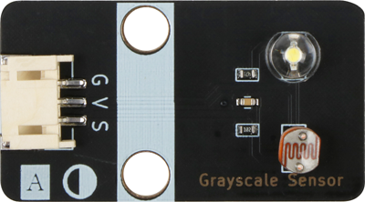
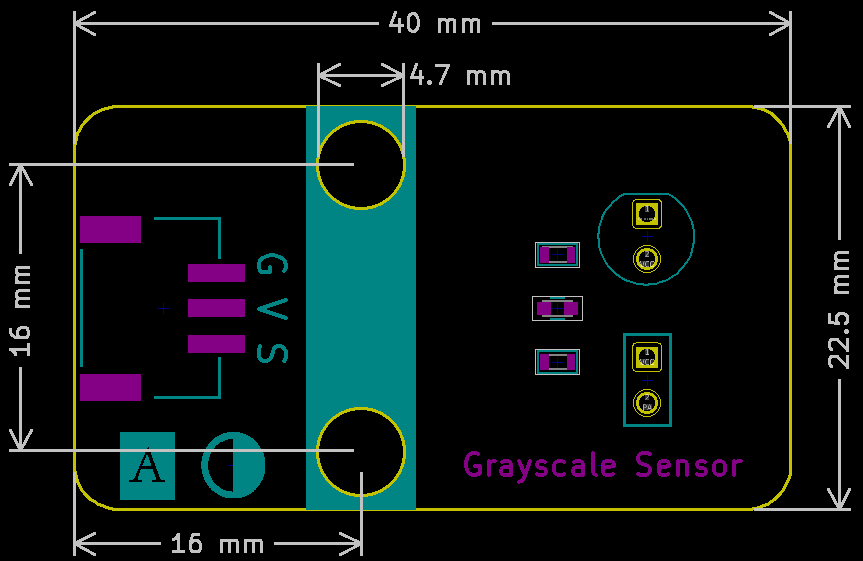

# Grayscale Sensor

## Physical picture



## Overview

Grayscale sensor is an analog sensor, which has a light-emitting diode and a photoresistor installed on the same surface. Grayscale sensor uses the principle that different colors of detection surfaces reflect light to different degrees, and the photoresistor has different resistance values to the light returned by different detection surfaces to detect the depth of color. Within the effective detection distance, the light-emitting diode emits white light, which shines on the detection surface. The detection surface reflects part of the light, and the photoresistor detects the intensity of this light and converts it into a recognizable signal. It outputs a continuous analog signal. It can be used as a line patrol sensor for a line patrol car or as a field grayscale recognition for a football robot.

## Schematic

<a href="en/ph2.0_sensors/sensors/grayscale_sensor/grayscale_sensor_schematic.pdf" target="_blank">View Schematic</a>


## Module parameters

| Pin Name | describe           |
| -------- | ------------------ |
| G        | GND                |
| In       | VCC                |
| S        | Analog signal pins |

- Power supply voltage: 3v3/5V
- Connection method: 4PIN anti-reverse connection DuPont line
- Module size: 40 x 22.5 mm
- Installation method: M4 screw compatible with Lego socket

## Mechanical Dimensions



## Arduino Example Program

<a href="en/ph2.0_sensors/sensors/grayscale_sensor/grayscale_sensor.zip" download>Download the sample program</a>

```c
void setup() {
  Serial.begin(9600);  // Set the serial port baud rate to 9600
  pinMode(A3, INPUT);  // Set A3 as an input pin
}

void loop() {
  Serial.println(analogRead(A3));  // Print the data obtained by A3 pin
  delay(200);                      // Delay 200ms
}
```

## MicroPython Example Program

### Esp32 MicroPython Example Program

```python
from machine import ADC, Pin
import time

analog_pin = 2 # Define grayscale sensor analog interface pin

p = ADC(analog_pin)

while True:
    analog_value = p.read_u16() # Read grayscale sensor analog value
    print(analog_value) # Print grayscale sensor analog value
    time.sleep_ms(200)
```

### Micro:bit MicroPython Example Program

```python
from microbit import *

while True:
    p = pin1.read_analog() # Read grayscale sensor analog value
    print( p) # Print grayscale sensor analog value
    sleep(200)
```

## MakeCode Example Programs

[Try it yourself](https://makecode.microbit.org/_fakY8cFmMMch)
