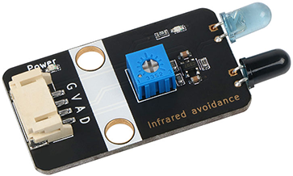

# Infrared Obstacle Avoidance Sensor

## Physical picture



## Overview

The infrared obstacle avoidance sensor is a sensor device that is widely used in robot obstacle avoidance, obstacle avoidance vehicles, assembly line counting and many other occasions. The sensor module has a strong adaptability to ambient light. It has a bunch of infrared transmitting and receiving tubes. The transmitting tube emits infrared rays of a certain frequency. When the detection direction encounters an obstacle (reflective surface), the infrared rays are reflected back and received by the receiving tube. After being processed by the comparator circuit, the blue indicator light will light up, and the signal output interface will output a digital signal (a low-level signal). The detection distance can be adjusted by the potentiometer knob. The effective distance range is 2 to 30cm, and the working voltage is 3.3V-5V. The detection distance of the sensor can be adjusted by the potentiometer, and it has the characteristics of low interference, easy assembly, and easy use.

## Schematic

<a href="en/ph2.0_sensors/sensors/infrared_obstacle_avoidance_module/InfraredObstacleAvoidance_schematic.pdf" target="_blank">View Schematic</a> 

## Module parameters

| Pin Name | describe            |
| -------- | ------------------- |
| G        | GND                 |
| In       | VCC                 |
| A        | Analog signal pins  |
| D        | Digital signal pins |

- Power supply voltage: 3v3/5V
- Connection method: 4PIN anti-reverse connection DuPont line
- Module size: 40 x 22.5 mm
- Installation method: M4 screw compatible with Lego socket

## Mechanical Dimensions


## Arduino Example Program

<a href="en/ph2.0_sensors/sensors/infrared_obstacle_avoidance_module/InfraredObstacleAvoidanceModule.zip" download>Download the sample program</a>

```c++
#define DIGITAL_PIN 7  // Define the digital pin of the infrared obstacle avoidance module
#define ANALOG_PIN A0  // Define the analog pin of the infrared obstacle avoidance module

int analog_value = 0;  // Define digital variables, read the analog value of the infrared obstacle avoidance module
int digital_value = 0;  // Define digital variables, read the digital value of the infrared obstacle avoidance module

void setup() {
  Serial.begin(9600);          // Set the serial port baud rate
  pinMode(DIGITAL_PIN, INPUT);  // Set the digital pin of the infrared obstacle avoidance module as input
  pinMode(ANALOG_PIN, INPUT);   // Set the analog pin of the infrared obstacle avoidance module as input
}
void loop() {
  analog_value = analogRead(ANALOG_PIN);     // Read the analog value of the infrared obstacle avoidance module
  digital_value = digitalRead(DIGITAL_PIN);  // Read the digital value of the infrared obstacle avoidance module
  Serial.print("InfraredObstacleAvoidanceModuleAnalog Data:");
  Serial.print(analog_value);  // Print infrared obstacle avoidance module analog value
  Serial.print("InfraredObstacleAvoidanceModuleDigital Data:");
  Serial.println(digital_value);  // Print infrared obstacle avoidance module digital value
  delay(200);
}
```

## MicroPython Example Program

### <a href="en/ph2.0_sensors/sensors/infrared_obstacle_avoidance_module/infrared_obstacle_avoidance_module?id=esp32-micropython示例程序" download>Esp32 MicroPython Example Program</a>

```python
from machine import ADC, Pin
import time

analog_pin = 15 # Define infrared obstacle avoidance module analog interface pin
digital_pin = 14 # Define infrared obstacle avoidance module digital interface pin

p1 = ADC(analog_pin)
p2 = Pin(digital_pin, Pin.IN)

while True:
    analog_value = p1.read_u16() # Read infrared obstacle avoidance module analog value
    print("InfraredObstacleAvoidanceModuleAnalog Data:", analog_value) # Print infrared obstacle avoidance module analog value
    print("InfraredObstacleAvoidanceModuleDigital Data:", p2.value()) # Print infrared obstacle avoidance module digital value
    time.sleep_ms(200)
```

### Micro:bit MicroPython Example Program

```python
from microbit import *

analog_pin = pin1 # Define the infrared obstacle avoidance module analog interface pin
digital_pin = pin0 # Define the infrared obstacle avoidance module digital interface pin

while True:
    analog_value = analog_pin.read_analog() # Read the infrared obstacle avoidance module analog value
    print("Analog Data:", analog_value) # Print the infrared obstacle avoidance module analog value
    print("Digital Data:", digital_pin.read_digital()) # Print the infrared obstacle avoidance module digital value
    sleep(0.2)
```

## MakeCode Example Programs

[Try it yourself](https://makecode.microbit.org/_9zWVg7hvCJHy)
