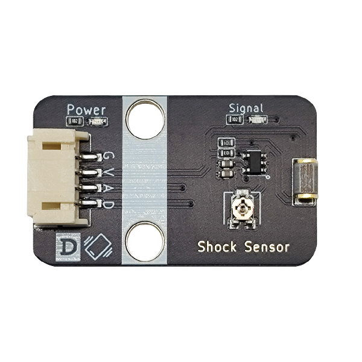
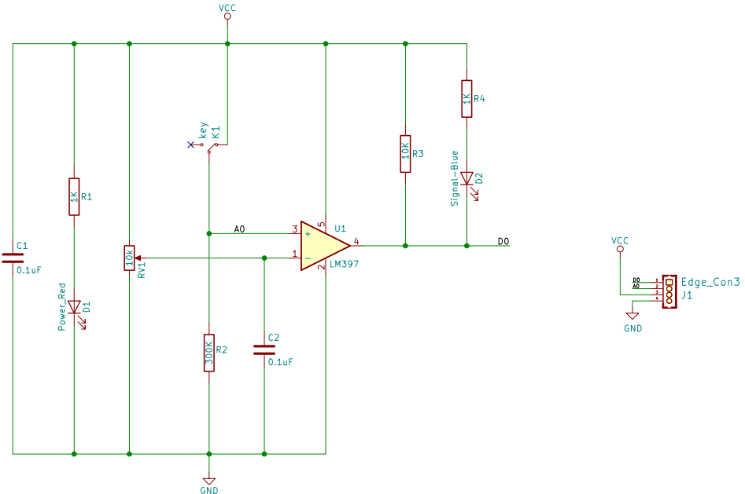
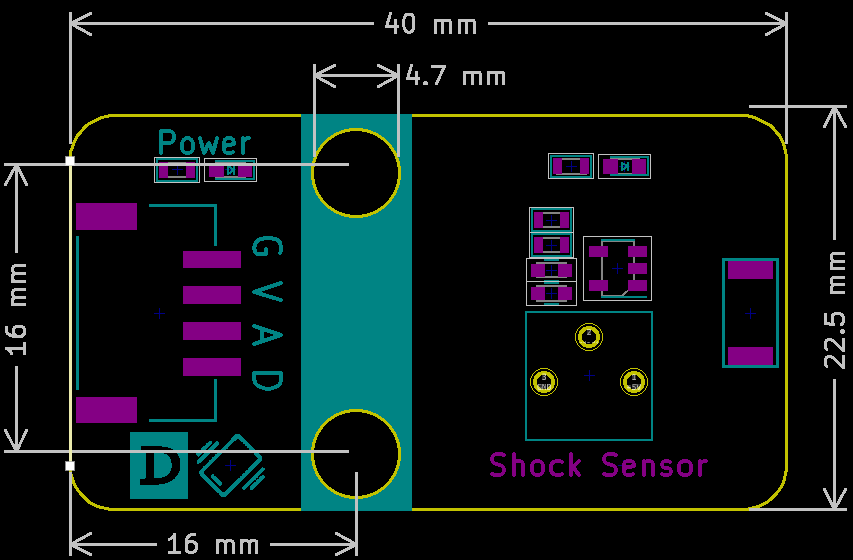

# Shock Sensor

## Physical picture



## Overview

The shock sensor module is essentially a switch, which contains a metal sheet and a spring. When the product is not vibrating, the vibration switch is in the off state, and the output end outputs a high level. When the product is vibrating, the vibration switch is instantly turned on due to the spring and the metal sheet, and the output end outputs a low level. The output end can be directly connected to the microcontroller, and the high and low levels can be detected by the microcontroller to detect whether the environment is vibrating, thereby serving as an alarm.

## Schematic

<a href="en/ph2.0_sensors/sensors/shock_sensor/shock_sensor_schematic.pdf" target="_blank">View Schematic</a> 

## Module parameters

| Pin Name | describe           |
| -------- | ------------------ |
| G        | GND                |
| In       | VCC                |
| A        | Analog signal pins |
| D        | Digital signal pin |

- Power supply voltage: 3v3/5V
- Connection method: 4PIN anti-reverse connection DuPont line
- Module size: 40 x 22.5 mm
- Installation method: M4 screw compatible with Lego socket

## Mechanical Dimensions



## Arduino Example Program

<a href="en/ph2.0_sensors/sensors/shock_sensor/shock_sensor.rar" download>Download the sample program</a>

```c++
#define SHOCK_ANALOG_PIN A0  // Define shock sensor analog pin
#define SHOCK_DIGITAL_PIN 7  // Define shock sensor digital pin

void setup() {
  Serial.begin(9600);               // Initialize serial communication
  pinMode(SHOCK_ANALOG_PIN, INPUT);   // Set shock sensor analog pin as input
  pinMode(SHOCK_DIGITAL_PIN, INPUT);  // Set shock sensor digital pin as input
}

void loop() {
  Serial.println("Shock Analog Data: ");
  Serial.println(analogRead(SHOCK_ANALOG_PIN));    // Print shock sensor analog data
  Serial.println("Shock Digital Data: ");
  Serial.println(digitalRead(SHOCK_DIGITAL_PIN));  // Print shock sensor digital data
  delay(1000);                                   // Delay 1 second
}
```

## MicroPython Example Program

### Esp32 MicroPython Example Program

```python
from machine import ADC, Pin
import time

analog_pin = 15 # Define the analog interface pin of the vibration sensor
digital_pin = 14 # Define the digital interface pin of the vibration sensor

p1 = ADC(analog_pin)
p2 = Pin(digital_pin, Pin.IN)

while True:
    analog_value = p1.read_u16() # Read the analog value of the vibration sensor
    print("Analog Data:", analog_value) # Print the analog value of the vibration sensor
    print("Digital Data:", p2.value()) # Print the digital value of the vibration sensor
    time.sleep_ms(200)
```

### Micro:bit MicroPython Example Program

```python
from microbit import *

analog_pin = pin1 # Define the analog interface pin of the vibration sensor
digital_pin = pin0 # Define the digital interface pin of the vibration sensor

while True:
    analog_value = analog_pin.read_analog() # Read the analog value of the vibration sensor
    print("Analog Data:", analog_value) # Print the analog value of the vibration sensor
    print("Digital Data:", digital_pin.read_digital()) # Print the digital value of the vibration sensor
    sleep(0.2)
```

## MakeCode Example Programs

[Try it yourself](https://makecode.microbit.org/_0Jy1249E9U4K)
