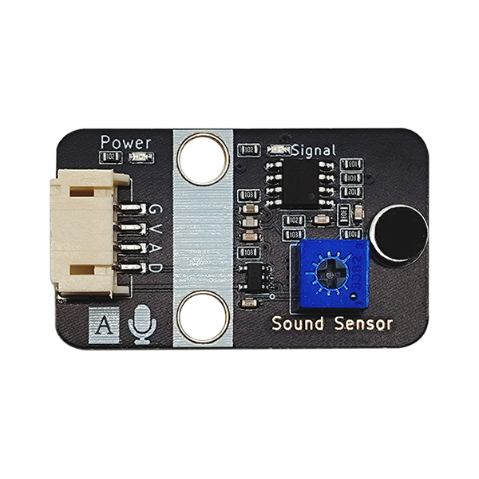
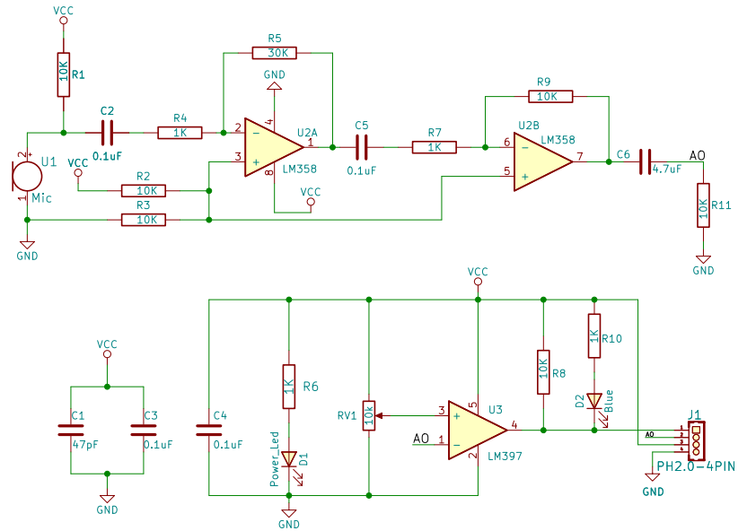
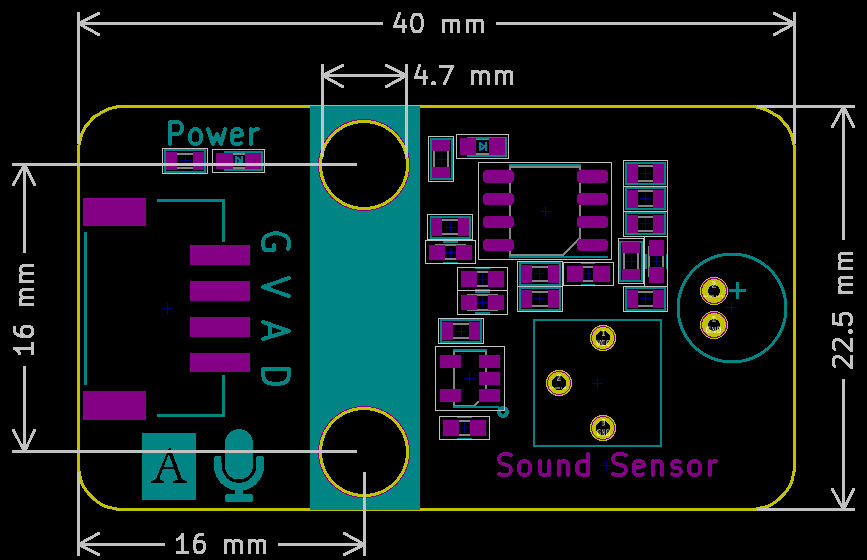

# Sound Sensor

## Physical picture



## Overview

The function of the sound sensor module is equivalent to a microphone. It is used to receive sound waves and display the vibration image of the sound, but it cannot measure the intensity of the noise. The sensor has a built-in capacitive electret microphone that is sensitive to sound. The sound wave causes the electret film in the microphone to vibrate, resulting in a change in capacitance, which generates a small voltage corresponding to the change. This voltage is then converted into a 0-5V voltage, which is received by the data acquisition device after A/D conversion and transmitted to the main control chip.

## Schematic

<a href="en/ph2.0_sensors/sensors/sound_sensor/sound_sensor_schematic.pdf" target="_blank">View Schematic</a> 

## Module parameters

| Pin Name | describe            |
| -------- | ------------------- |
| G        | GND                 |
| In       | VCC                 |
| A        | Analog signal pins  |
| D        | Digital signal pins |

- Supply voltage: 5V
- Connection method: 3PIN anti-reverse connection DuPont line
- Module size: 40 x 22.5 mm
- Installation method: M4 screw compatible with Lego socket

## Mechanical Dimensions



## Arduino Example Program

<a href="en/ph2.0_sensors/sensors/sound_sensor/sound_sensor.zip" download>Download the sample program</a>

```c++
#define ANALOG_PIN 15   // Define the analog interface pin of the sound sensor
#define DIGITAL_PIN 14  // Define the digital interface pin of the sound sensor

int analog_value = 0;
byte digital_value = 0;

void setup() {
  Serial.begin(9600);          // Set the serial port baud rate
  pinMode(ANALOG_PIN, INPUT);   // Set the analog interface pin of the sound sensor to input
  pinMode(DIGITAL_PIN, INPUT);  // Set the digital interface pin of the sound sensor to input
}

void loop() {
  analog_value = analogRead(ANALOG_PIN);     // Read the analog value of the sound sensor
  digital_value = digitalRead(DIGITAL_PIN);  // Read the digital value of the sound sensor
  Serial.print("Analog Data:");
  Serial.println(analog_value);  // Print the analog value of the sound sensor
  Serial.print("Digital Data:");
  Serial.println(digital_value);  // Print the digital value of the sound sensor
  delay(200);
}
```

The sensor threshold can be adjusted by adjusting the resistance value on the sound sensor.

## MicroPython Example Program

### Esp32 MicroPython Example Program

```python
from machine import ADC, Pin
import time

analog_pin = 15 # Define the analog interface pin of the sound sensor
digital_pin = 14 # Define the digital interface pin of the sound sensor

p1 = ADC(analog_pin)
p2 = Pin(digital_pin, Pin.IN) # create input pin on GPIO2

while True:
    analog_value = p1.read_u16() # Read the analog value of the sound sensor
    print("Analog Data:", analog_value) # Print the analog value of the sound sensor
    print("Digital Data:", p2.value()) # Print the digital value of the sound sensor
    time.sleep_ms(200)
```

### Micro:bit MicroPython Example Program

```python
from microbit import *

while True:
    p1 = pin1.read_analog() # Read the analog value of the sound sensor
    p2 = pin2.read_digital() # Read the digital value of the sound sensor
    print("Analog Data:", p1) # Print the analog value of the sound sensor
    print("Digital Data:", p2) # Print the digital value of the sound sensor
    sleep(1000)
```

## MakeCode Example Programs

[Try it yourself](https://makecode.microbit.org/_FaF5Xx1C2Tvb)
