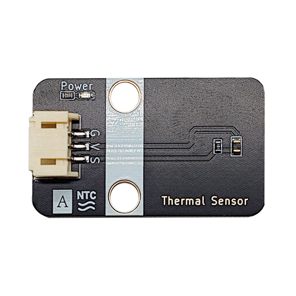
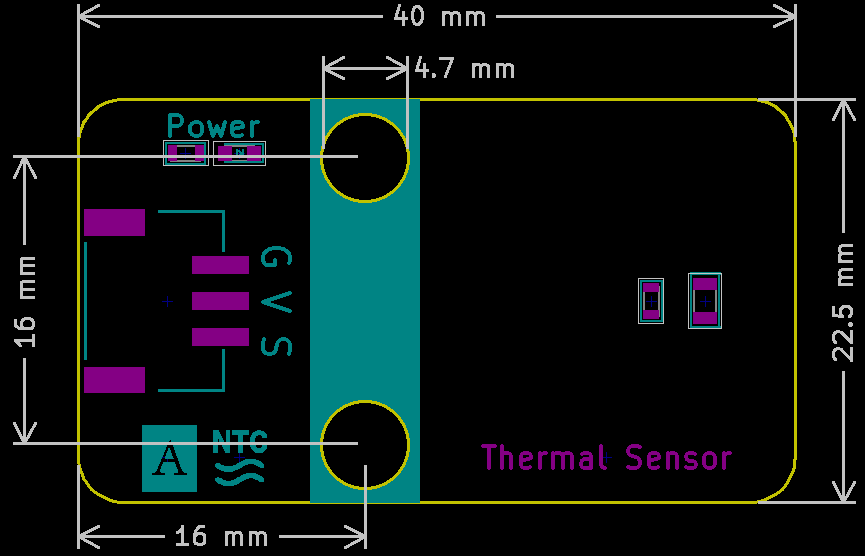

# Thermal Sensor

## Physical picture



## Overview

Thermistors are a type of sensitive components, which are divided into positive temperature coefficient thermistors (PTC) and negative temperature coefficient thermistors (NTC) according to their temperature coefficients. The typical characteristic of thermistors is that they are sensitive to temperature and show different resistance values at different temperatures. The positive temperature coefficient thermistor (PTC) has a greater resistance value when the temperature is higher, while the negative temperature coefficient thermistor (NTC) has a lower resistance value when the temperature is higher. They are both semiconductor devices.

## Schematic

<a href="en/ph2.0_sensors/sensors/thermal_sensor/thermal_sensor_schematic.pdf" target="_blank">View Schematic</a> 

## Module parameters

| Pin Name | describe                                                     |
| -------- | ------------------------------------------------------------ |
| G        | GND                                                          |
| V        | VCC                                                          |
| S        | The higher the temperature, the larger the analog value read |

- Power supply voltage: 3v3/5V
- Connection method: 3PIN anti-reverse connection DuPont line
- Module size: 40 x 22.5 mm
- Installation method: M4 screw compatible with Lego socket

## Mechanical Dimensions



## Arduino Example Program

<a href="en/ph2.0_sensors/sensors/thermal_sensor/thermal_sensor.zip" download>Download the sample program</a>

```c++
#define THERMALE_PIN A3  // Define the thermal sensor module pin

int thermal_value = 0;  // Define variables, read thermal values

void setup() {
  Serial.begin(9600);           // Set the serial port baud rate
  pinMode(THERMALE_PIN, INPUT);  // Set the thermal sensor module pin as input
}
void loop() {
  thermal_value = analogRead(THERMALE_PIN);  // Read the thermal value and assign it to ThermalValue
  Serial.print("Thermal Data: ");
  Serial.println(thermal_value);  // Print the thermal value
  delay(200);
}
```

## MicroPython Example Program

### Esp32 MicroPython Example Program

```python
from machine import ADC, Pin
import time

analog_pin = 15 # Define thermistor analog interface pin

p1 = ADC(analog_pin)

while True:
    analog_value = p1.read_u16() # Read thermistor analog value
    print(analog_value) # Print thermistor analog value
    time.sleep_ms(200)
```

### Micro:bit MicroPython Example Program

```python
from microbit import *

analog_pin = pin1 # Define thermistor analog interface pin

while True:
    analog_value = analog_pin.read_analog() # Read thermistor analog value
    print("Analog Data:", analog_value) # Print thermistor analog value
    sleep(0.2)
```

## MakeCode Example Programs

[Try it yourself](https://makecode.microbit.org/_LTdekc9H3b9u)
