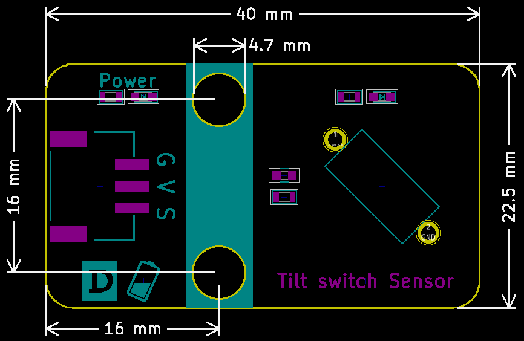

# Tilt Switch Sensor

## Physical picture


## Overview

The tilt switch module is also called a bead switch, steel ball switch, and is actually a vibration switch. It has different names, but the working principle remains the same. The ball controls the connection or disconnection of the circuit by contacting or not contacting the metal plate. Simply put, it is like turning a light on or off, if the switch touches the metal plate inside, the light will be on, and when the switch is off, the light will go out. Contact with the metal terminal or changing the path of light with a small bead in the switch will be able to produce a conduction effect.

## Schematic

<a href="en/ph2.0_sensors/sensors/tilt_switch_sensor/tilt_switch_sensor_schematic.pdf" target="_blank">View Schematic</a> 

## Module parameters

| Pin Name | describe            |
| -------- | ------------------- |
| G        | GND                 |
| V        | VCC                 |
| A        | Analog signal pins  |
| D        | Digital signal pins |

- Power supply voltage: 3v3/5V
- Connection method: 4PIN anti-reverse connection DuPont line
- Module size: 40 x 22.5 mm
- Installation method: M4 screw compatible with Lego socket

## Mechanical Dimensions



## Arduino Example Program

<a href="en/ph2.0_sensors/sensors/tilt_switch_sensor/tilt_switch_sensor.zip" download>Download the sample program</a>

```c++
#define DIGITAL_PIN 7  // Define the digital pin of the tilt sensor
#define ANALOG_PIN A0  // Define the analog pin of the tilt sensor

int analog_value = 0;  // Define a digital variable to read the analog value of the tilt sensor
int digital_value = 0;  // Define a digital variable to read the digital value of the tilt sensor

void setup() {
  Serial.begin(9600);          // Set the serial port baud rate
  pinMode(DIGITAL_PIN, INPUT);  // Set the digital pin of the tilt sensor as input
  pinMode(ANALOG_PIN, INPUT);   // Set the analog pin of the tilt sensor as input
}
void loop() {
  analog_value = analogRead(ANALOG_PIN);     // Read the analog value of the tilt sensor
  digital_value = digitalRead(DIGITAL_PIN);  // Read the digital value of the tilt sensor
  Serial.print("Analog Data: ");
  Serial.print(analog_value);  // Print the analog value of the tilt sensor
  Serial.print("Digital Data: ");
  Serial.println(digital_value);  // Print the digital value of the tilt sensor
  delay(200);
}
```

## MicroPython Example Program

### Esp32 MicroPython Example Program

```python
from machine import ADC, Pin
import time

analog_pin = 15 # Define analog pin
digital_pin = 14 # Define digital pin

p1 = ADC(analog_pin)
p2 = Pin(digital_pin, Pin.IN)

while True:
    analog_value = p1.read_u16()
    print("Analog Data:", analog_value) # Print analog value
    print("Digital Data:", p2.value()) # Print digital value
    time.sleep_ms(200)
```

### Micro:bit MicroPython Example Program

```python
from microbit import *

while True:
    p1 = pin1.read_analog()
    p2 = pin2.read_digital()
    print("Analog Data:", p1) # Print analog data
    print("Digital Data:", p2) # Print digital data
    sleep(1000)
```

## MakeCode Example Programs

[Try it yourself](https://makecode.microbit.org/_5Roamecfp27z)
