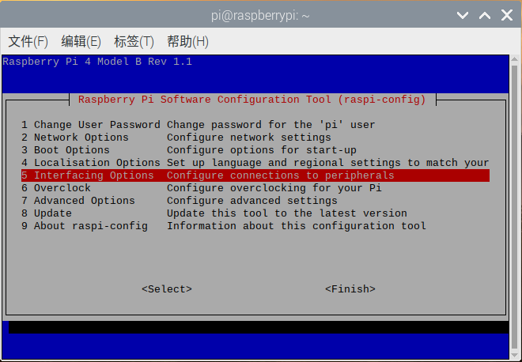
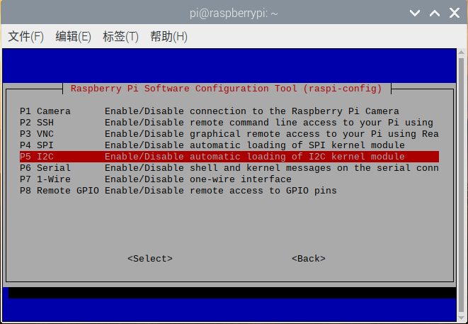
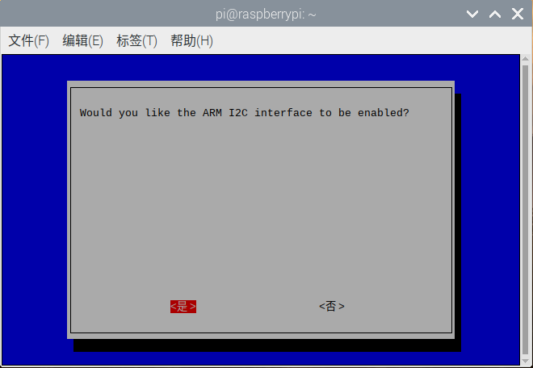
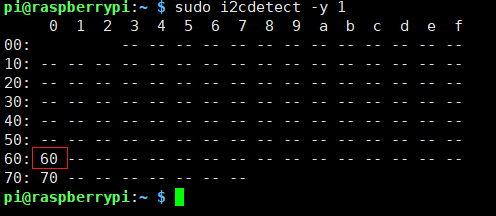
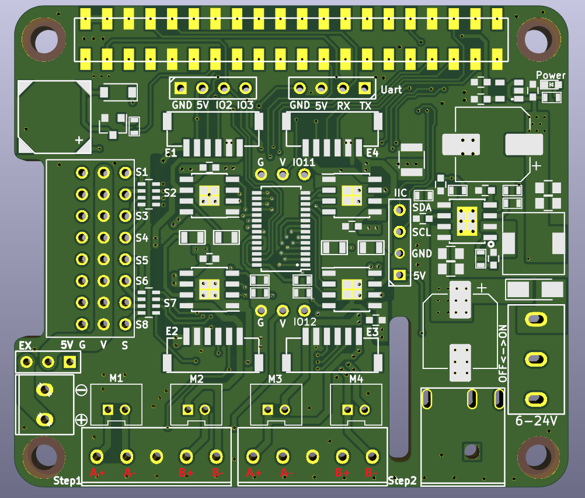

# Raspberry Pi Driver Board

RaspberryPi Multi-function Motor Driver Expansion Board is a full-featured robot motor driver expansion board produced by [Shenzhen Yichuang Space Technology Co., Ltd. It has been upgraded to](http://www.emakefun.com/)**V4.0** ( [**see the old version of V3.0**](https://github.com/emakefun/RaspberryPi-MotorDriverBoard/tree/V3.0) ). This motor driver board is suitable for Raspberry Pi Zero/Zero W/Zero WH/A+/B+/2B/3B/3B+/4B. It can support multiple motors/stepper motors/servos/encoder motors (Stepper/Motor/Servo/Encoder) at the same time, leaving the camera and DIP display cable interface free, and can be stacked with multiple boards to expand more control interfaces, especially suitable for players to DIY robots, smart cars, mechanical arms, smart pan-tilts and other applications.


## Schematic

Since our driver board uses I2C to control the PCA9685 chip to output 16-channel PWM, all driving DC motors or servos, there is no so-called correspondence between the Raspberry Pi IO port and the controlled motor.

For details, please see <a href="raspberrypi/raspberrypi_motordriver_board/schematic/RaspBerryDriverBoardV4.0.pdf" target="_blank">the Raspberry Pi driver board circuit diagram</a>

You can also check the silkscreen markings on the front and back of the driver board.

## Features

- 5.5 ~ 2.1mmDC plug, power supply voltage 6 ~ 25V, built-in DC-DC voltage regulator circuit, power supply for Raspberry Pi more than 3A (recommended to use 7.4V aircraft battery)
- The IIC address of the driver board is 0x60, and the address can be configured by 6 resistors on the back, address A0~A5
- 12-bit resolution, adjustable PWM frequency up to 1.6KHz, configurable push-pull or open-drain output
- Supports driving 8 servos at the same time, 3Pin (black, red, blue, GVS) standard interface wiring, convenient for connecting servos, servo power supply can be switched to external independent power supply through jumper cap
- Supports 4-way 6~24V DC motors, PH2.0 interface or 3.5mm terminal, single motor output up to 3A
- Supports driving 2-way 4-wire stepper motors simultaneously
- Onboard passive buzzer
- The mainboard reserves 2 IIC expansion interfaces and 1 serial port interface

## Install the I2C library and enable

Before using the driver board, you must first install the I2C library and enable it.

Open the Raspberry Pi terminal and enter `sudo raspi-config`the command, then follow the steps in the following sequence.








The above is to enable I2C on the Raspberry Pi. Next, we install the Raspberry I2C library and enter it in the terminal `sudo apt-get install i2c-tools`. After the input is completed, you can see that the I2C library is being downloaded. After the installation is complete, you can enter in the terminal `sudo i2cdetect -l`to check whether it is installed correctly. If a message similar to the following appears, it means that the installation is normal.


Enter the command in the terminal `sudo i2cdetect -y 1`to scan all I2C devices connected to the I2C bus and print out the I2C bus address of the device. The I2C address of our expansion board is 0x60, as shown in the figure below.

In addition, i2cdetect detected that there is still an address of 0x70, which is a universal address that can issue instructions to all slaves.



Restart the Raspberry Pi to make the new settings take effect:

```
sudo reboot
```

## Function Introduction

### Driving servo

#### C++ code

```C++
#include "Emakefun_MotorShield.h"

int main() {
  Emakefun_MotorShield pwm = Emakefun_MotorShield();
  pwm.begin(50);

  // demo这里只操作舵机1, 其他舵机操作相同
  Emakefun_Servo *my_servo_1 = pwm.getServo(1);

  // 速度值是 1 ~ 10 的正整数, 数值越大速度越快
  int speed = 9;
  while (true) {
    // demo这里只操作舵机1, 其他舵机操作相同
    my_servo_1->writeServo(0, speed);
    delay(2000);
    my_servo_1->writeServo(90, speed);
    delay(2000);
    my_servo_1->writeServo(180, speed);
    delay(2000);
  }
}
```

#### Python code

```Python
#!/usr/bin/python

from Emakefun_MotorHAT import Emakefun_MotorHAT, Emakefun_Servo
import time

mh = Emakefun_MotorHAT(addr=0x60)
my_servo = mh.getServo(1)

# 速度值是 1 ~ 10 的正整数, 数值越大速度越快
speed = 9
while (True):
    # demo这里只操作舵机1, 其他舵机操作相同
    my_servo.writeServoWithSpeed(0, speed)
    time.sleep(1)

    my_servo.writeServoWithSpeed(90, speed)
    time.sleep(1)

    my_servo.writeServoWithSpeed(180, speed)
    time.sleep(1)
```

### Driving DC motor

#### C++ code

```C++
#include "Emakefun_MotorShield.h"

int main() {
  Emakefun_MotorShield pwm = Emakefun_MotorShield();
  pwm.begin(50);
  Emakefun_DCMotor *dc_motor_1 = pwm.getMotor(1);
  Emakefun_DCMotor *dc_motor_2 = pwm.getMotor(2);
  Emakefun_DCMotor *dc_motor_3 = pwm.getMotor(3);
  Emakefun_DCMotor *dc_motor_4 = pwm.getMotor(4);

  dc_motor_1->setSpeed(255);
  dc_motor_2->setSpeed(255);
  dc_motor_3->setSpeed(255);
  dc_motor_4->setSpeed(255);

  while (1) {
    dc_motor_1->run(FORWARD);
    dc_motor_2->run(FORWARD);
    dc_motor_3->run(FORWARD);
    dc_motor_4->run(FORWARD);
    delay(1000);
    dc_motor_1->run(BACKWARD);
    dc_motor_2->run(BACKWARD);
    dc_motor_3->run(BACKWARD);
    dc_motor_4->run(BACKWARD);
    delay(1000);
  }
}
```

#### Python code

```Python
#!/usr/bin/python
from Emakefun_MotorHAT import Emakefun_MotorHAT, Emakefun_DCMotor, Emakefun_Servo

import time
import atexit

# create a default object, no changes to I2C address or frequency
mh = Emakefun_MotorHAT(addr=0x60)

# recommended for auto-disabling motors on shutdown!
def turnOffMotors():
    mh.getMotor(1).run(Emakefun_MotorHAT.RELEASE)
    mh.getMotor(2).run(Emakefun_MotorHAT.RELEASE)
    mh.getMotor(3).run(Emakefun_MotorHAT.RELEASE)
    mh.getMotor(4).run(Emakefun_MotorHAT.RELEASE)

atexit.register(turnOffMotors)

################################# DC motor test!
my_motor = mh.getMotor(4)

# set the speed to start, from 0 (off) to 255 (max speed)
my_motor.setSpeed(150)
my_motor.run(Emakefun_MotorHAT.FORWARD)
# turn on motor
my_motor.run(Emakefun_MotorHAT.RELEASE)


while (True):
    print ("Forward! ")

    print ("\tSpeed up...")
    for i in range(255):
        my_motor.setSpeed(i)
        my_motor.run(Emakefun_MotorHAT.FORWARD)
        time.sleep(0.01)

    print ("\tSlow down...")
    for i in reversed(range(255)):
        my_motor.setSpeed(i)
        my_motor.run(Emakefun_MotorHAT.FORWARD)
        time.sleep(0.01)

    print ("Backward! ")

    print ("\tSpeed up...")
    for i in range(255):
        my_motor.setSpeed(i)
        my_motor.run(Emakefun_MotorHAT.BACKWARD)
        time.sleep(0.01)

    print ("\tSlow down...")
    for i in reversed(range(255)):
        my_motor.setSpeed(i)
        my_motor.run(Emakefun_MotorHAT.BACKWARD)
        time.sleep(0.01)

    print ("Release")
        my_motor.run(Emakefun_MotorHAT.RELEASE)
        time.sleep(1.0)
```

### Driving stepper motor

This driver board only supports 42 stepper motors. The wiring method is as follows:



To drive the stepper motor smoothly without lag, the Raspberry Pi I2C speed must be set to 400K. The specific steps are as follows:

- Open a terminal and edit the configuration file (root privileges required) **/boot/config.txt**

- Find the following line:

  ```
  #dtparam=i2c_arm=onClick Copymistakecopy
  ```

- Uncomment it and change it to:

  ```
  dtparam=i2c_arm=on,i2c_arm_baudrate=400000Click Copymistakecopy
  ```

- Save the file and reboot the Raspberry Pi

#### C++ code

```c++
#include "Emakefun_MotorShield.h"

int main() {
  Emakefun_MotorShield pwm = Emakefun_MotorShield();
  pwm.begin(50);
  Emakefun_StepperMotor *stepper_motor_1 = pwm.getStepper(200, 1);

  while (1) {
    stepper_motor_1->setSpeed(30);
    stepper_motor_1->step(100, BACKWARD, SINGLE);
  }
}
```

#### Python code

```python
#!/usr/bin/python
#import Raspi_MotorHAT, Raspi_DCMotor, Raspi_Stepper 
from Emakefun_MotorHAT import Emakefun_MotorHAT, Emakefun_DCMotor, Emakefun_StepperMotor

import time
import atexit

# create a default object, no changes to I2C address or frequency
mh = Emakefun_MotorHAT(0x60)

# recommended for auto-disabling motors on shutdown!
def turnOffMotors():
    mh.getMotor(1).run(Emakefun_MotorHAT.RELEASE)
    mh.getMotor(2).run(Emakefun_MotorHAT.RELEASE)
    mh.getMotor(3).run(Emakefun_MotorHAT.RELEASE)
    mh.getMotor(4).run(Emakefun_MotorHAT.RELEASE)

atexit.register(turnOffMotors)

my_stepper = mh.getStepper(200, 1)   # 200 steps/rev, motor port #1
my_stepper.setSpeed(30)    # 30 RPM

while (True):
    print("Single coil steps")
    my_stepper.step(100, Emakefun_MotorHAT.FORWARD,  Emakefun_MotorHAT.SINGLE)
    my_stepper.step(100, Emakefun_MotorHAT.BACKWARD, Emakefun_MotorHAT.SINGLE)

    print("Double coil steps")
    my_stepper.step(100, Emakefun_MotorHAT.FORWARD,  Emakefun_MotorHAT.DOUBLE)
    my_stepper.step(100, Emakefun_MotorHAT.BACKWARD, Emakefun_MotorHAT.DOUBLE)

    print("Interleaved coil steps")
    my_stepper.step(100, Emakefun_MotorHAT.FORWARD,  Emakefun_MotorHAT.INTERLEAVE)
    my_stepper.step(100, Emakefun_MotorHAT.BACKWARD, Emakefun_MotorHAT.INTERLEAVE)

    print("Microsteps")
    my_stepper.step(100, Emakefun_MotorHAT.FORWARD,  Emakefun_MotorHAT.MICROSTEP)
    my_stepper.step(100, Emakefun_MotorHAT.BACKWARD, Emakefun_MotorHAT.MICROSTEP)
```

## C# code

A C# demo is provided. You can study it if you are interested. No technical support is provided.

<a href="raspberrypi/raspberrypi_motordriver_board/Demo.zip" download>Click to download the above code</a>

### Precautions

1. After connecting the driver board, check the Raspberry Pi IIC to see if the driver board address is detected. [Link](https://blog.csdn.net/qq_15807167/article/details/53435831)

2. When executing the code, you need to download the code from Github to your local computer for execution. The above are just some examples. [Github link](https://github.com/emakefun/RaspberryPi-MotorDriverBoard2)

3. If the Raspberry Pi is powered by ordinary lithium batteries, the Raspberry Pi may restart. It is recommended to use 7.4V model aircraft batteries.

4. This driver board can be used to drive 42 stepper motors with low precision. When driving high-precision stepper motors, a dedicated stepper motor driver is required.

5. The driver board can be connected to the encoder motor, and the code is being updated...
