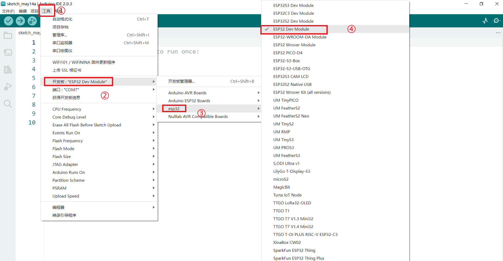
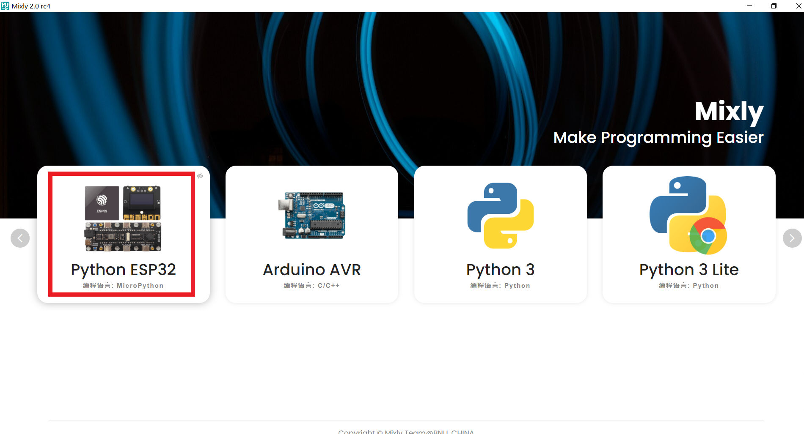
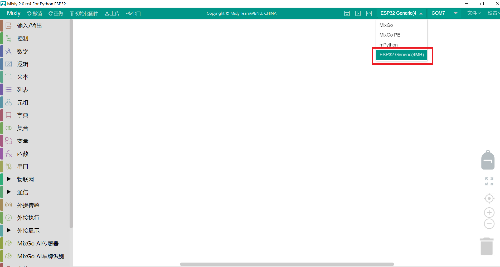
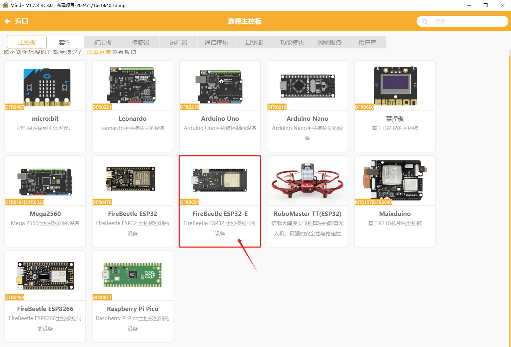

# ESP32软件使用说明

此文档旨在介绍esp32主板在Arduino IDE2.0、Mixly、Mind+等平台的使用方法。

## 一丶通过Arduino IDE下载程序

请前往 [Arduino官网](https://www.arduino.cc/en/Main/Software) 下载最新IDE2.0版本

1. 打开Ardunio IDE2.0;
2. 安装ESP32库；

1)  点击Arduino IDE菜单栏：【文件】-->【首选项】

*将<https://dl.espressif.com/dl/package_esp32_index.json> 这个网址复制到附加管理器地址*

2. 菜单栏点击 【工具】->【开发板】->【开发板管理器】搜索esp32，然后安装，如下图：

   

**注：**

下载第一个工具的时候可能会出现错误的情况，这是因为国内访问github网站慢导致的，直接重新多次点击下载就可以了，下载的比较慢，不要着急。

下载第二个工具的时候可能会出现下载错误，不要慌，再试几次如果不行的话，使用手机（不使用流量也可以）开个热点，电脑连手机的热点就可以下载了。虽然下载的较慢，但是步骤极为简单。

安装完成后，打开IDE，先选择主板，如下图

将写好程序点击上传按钮，等待程序上传成功，如下图。

点击串口工具就可以看到串口的打印。如下图

**注意：**如果您程序无误，选择的主板也正确但是依然报错，请检查你电脑用户名字是否包含中文，如果包含中文请修改用户变量 “TEMP” “TMP”字段即可。修改方法请自行网上查资料。

## 二丶Mixly使用(以Mixly2.0为例)

[Mixly2.0基础使用教程](/zh-cn/software/mixly/mixly.zh-CN.md) 请直接查看前面的介绍，这里只说明ESP32主板在mixly里面如何选择

1. 板卡选择

   若是Arduino则选择

MicroPython则选择

2. 主板选择

3. 导入案例

4. 下载

## 三丶Mind+

[Mind+基础使用可以查看前面的介绍](/zh-cn/software/mind_plus/mindplus.zh-CN.md)这里只介绍，如何安装ESP32主板在Mind+里面如何选择

1、安装打开软件选择模式和语言，从扩展中进去选择主板

2、点击选择FireBeetle ESP32-E主板，如下图

## 四丶MicroPython

MicroPython语法中文文档请参考[在 ESP32 上开始使用 MicroPython —MicroPython中文 1.17 文档](http://micropython.com.cn/en/latet/esp32/tutorial/intro.html)

固件请到[micropytho.org官网下载](https://micropython.org/download/ESP32_GENERIC/)

编程工具推荐[Thonny](/zh-cn/software/thonny/thonny.zh-CN.md)