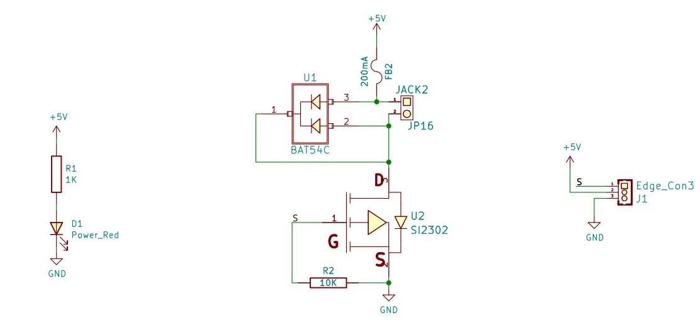

# 空心杯610电机风扇规格书

## 模块图


## 概述

​        直流电动机是将直流电能转换为机械能的电动机。因其良好的调速性能而在电力拖动中得到广泛应用。直流电动机按励磁方式分为永磁、他励和自励3类，其中自励又分为并励、串励和复励3种。 当直流电源通过电刷向电枢绕组供电时，电枢表面的N极下导体可以流过相同方向的电流，根据左手定则导体将受到逆时针方向的力矩作用；电枢表面S极下部分导体也流过相同方向的电流，同样根据左手定则导体也将受到逆时针方向的力矩作用。这样，整个电枢绕组即转子将按逆时针旋转，输入的直流电能就转换成转子轴上输出的机械能。由定子和转子组成，定子：基座，主磁极，换向极，电刷装置等；转子（电枢）：电枢铁心，电枢绕组，换向器，转轴和风扇等。该模块通过一个PWM控制信号控制电机的转速，不能控制电机的方向。

## 原理图



<a href="zh-cn/ph2.0_sensors/motorModule2/motor3pin.pdf" target="_blank">点击此处查看原理图</a>

## 模块参数

* 1.供电电压:5V
* 2.连接方式:3PIN防反接杜邦线
* 3.模块尺寸:4*2.1cm
* 4.安装方式:M4螺钉兼容乐高插孔固定

| 引脚名称 | 描述                |
| -------- | ------------------- |
| V        | 5V电源引脚          |
| G        | GND 地线            |
| S        | 电机PWM控制信号引脚 |

## 机械尺寸

TODO

## Arduino IDE示例程序

```c
void setup() {
  pinMode(5, OUTPUT);  // 设置电机5端口为输出模式
}

void loop() {
  analogWrite(5, 255);  // 设置电机速度为255
  delay(2000);          // 2s之后电机调速
  analogWrite(5, 100);  // 设置电机速度为100
  delay(2000);          // 2s之后电机停
  analogWrite(5, 0);    // 设置电机速度为0
  delay(2000);
}
```

## Mixly示例程序


<a href="zh-cn/ph2.0_sensors/motorModule2/3pinMotorMixly.zip" download>点击下载Mixly案例</a>

## microbit示例程序

<a href="https://makecode.microbit.org/_bR98taPuz0rM" target="_blank">动手试一试</a>

​ 通过小电机风扇模块接Microbit的P1引脚，程序上传之后，可以看到小风扇先全速转两秒，然后中速转两秒，最后停下两秒之后在全速转两秒如此循环。
