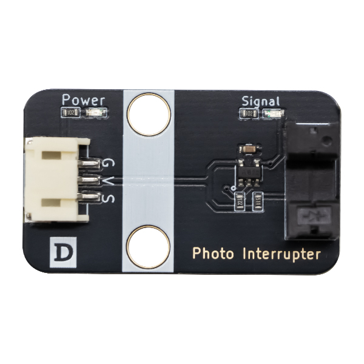

# 红外计数器模块

## 实物图



## 概述

红外对射计数传感器是一种用于检测物体通过的非接触式传感器。它由发射器和接收器两部分组成，通过发射红外光束并检测其是否被物体阻挡来实现计数功能。该传感器具有高精度、抗干扰能力强和安装简便等特点，广泛应用于物流、工业自动化、零售业等场景中，用于自动化计数、流量监控等。

## 模块参数

| 引脚名称 |     描述     |
| :------: | :----------: |
|    G     |     GND      |
|    V     |     VCC      |
|    S     | 信号引脚 |

## 原理图

## 尺寸图

## Arduino示例程序

```c++
#define DIGITAL_PIN 7  // 定义模块数字引脚

int digital_value = 0;  // 定义数字变量,读取红外避障模块数字值

void setup() {
  Serial.begin(9600);          // 设置串口波特率
  pinMode(DIGITAL_PIN, INPUT);  // 设置模块数字引脚为输入
}

void loop() {
  digital_value = digitalRead(DIGITAL_PIN);  // 读取模块数字值
  Serial.print("InfraredObstacleAvoidanceModuleDigital Data:");
  Serial.println(digital_value);  // 打印模块数字值
  delay(200);
}
```

## MicroPython示例程序

### Esp32 MicroPython示例程序

```python
from machine import Pin
import time

digital_pin = 14  # 定义模块数字接口引脚

p2 = Pin(digital_pin, Pin.IN)  
        
while True:
    analog_value = p1.read_u16()  # 读取模块模拟值
    print("InfraredObstacleAvoidanceModuleDigital Data:", p2.value())  # 打印模块数字值
    time.sleep_ms(200)
```

### micro:bit MicroPython示例程序

```python
from microbit import *

digital_pin = pin0  # 定义模块数字接口引脚

while True:
    analog_value = analog_pin.read_analog()  # 读取模块模拟值
    print("Digital Data:", digital_pin.read_digital())  # 打印模块数字值
    sleep(0.2)
```

## micro:bit示例程序

<a href="https://makecode.microbit.org/S65722-49364-86942-21338" target="_blank">动手试一试</a>
