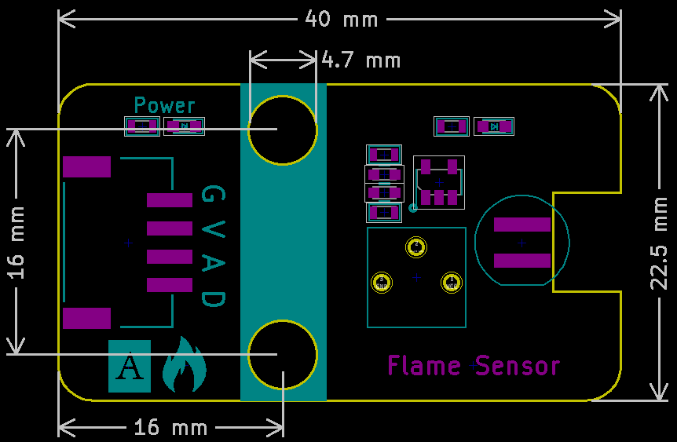

# 火焰传感器

## 实物图


## 概述

 在公共场所，比如酒店，建筑物和其他地方都配备了火灾报警器，那么它如何感知火灾？ 众所周知，当火灾爆发时，会有特别强烈的红外线，该设备可以通过红外线探测火灾。
​  火焰传感器是机器人专门用来搜寻火源的传感器，当然火焰传感器也可以用来检测光线的亮度，只是本传感器对火焰特别灵敏。火焰传感器利用红外线对对火焰非常敏感的特点，使用特制的红外线接受管来检测火焰，然后把火焰的亮度转化为高低变化的电平信号，输入到中央处理器中，中央处理器根据信号的变化做出相应的程序处理。

## 原理图

<a href="zh-cn/ph2.0_sensors/sensors/flame_sensor/flame_sensor_schematic.pdf" target="_blank">查看原理图</a>


## 模块参数

| 引脚名称 |     描述     |
| :------: | :----------: |
|    G     |     GND      |
|    V     |     VCC      |
|    A     | 模拟信号引脚 |
|    D     | 数字信号引脚 |

- 供电电压:3V3/5V

- 连接方式:4PIN防反接杜邦线

- 模块尺寸:40 x 22.5 mm

- 安装方式:M4螺钉兼容乐高插孔固定

## 机械尺寸图



## Arduino示例程序

<a href="zh-cn/ph2.0_sensors/sensors/flame_sensor/flame_sensor.rar" download>下载示例程序</a>

```c
#define FLAMEL_DIGITAL_PIN 7  // 定义火焰传感器数字引脚
#define FLAMEL_ANALOG_PIN A0  // 定义火焰传感器模拟引脚

int flamel_analog_value = 0;   // 定义数字变量,读取火焰模拟值
int flamel_digital_value = 0;  // 定义数字变量,读取火焰数字值

void setup() {
  Serial.begin(9600);                // 设置串口波特率
  pinMode(FLAMEL_DIGITAL_PIN, INPUT);  // 设置火焰传感器数字引脚为输入
  pinMode(FLAMEL_ANALOG_PIN, INPUT);   // 设置火焰传感器模拟引脚为输入
}

void loop() {
  flamel_analog_value = analogRead(FLAMEL_ANALOG_PIN);     // 读取火焰传感器模拟值
  flamel_digital_value = digitalRead(FLAMEL_DIGITAL_PIN);  // 读取火焰传感器数字值
  Serial.print("FlamelAnalog Data:  ");
  Serial.print(flamel_analog_value);  // 打印火焰传感器模拟值
  Serial.print("FlamelDigital Data:  ");
  Serial.println(flamel_digital_value);  // 打印火焰传感器数字值
  delay(200);
}
```

## MicroPython示例程序

### Esp32 MicroPython示例程序

```python
from machine import ADC, Pin
import time

analog_pin = 15  # 定义火焰传感器模拟接口引脚
digital_pin = 14  # 定义火焰传感器数字接口引脚

p1 = ADC(analog_pin)
p2 = Pin(digital_pin, Pin.IN)  
        
while True:
    analog_value = p1.read_u16()  # 读取火焰传感器模拟值
    print("Analog Data:", analog_value)  # 打印火焰传感器模拟值
    print("Digital Data:", p2.value())  # 打印火焰传感器数字值
    time.sleep_ms(200)
```

### micro:bit MicroPython示例程序

```python
from microbit import *

analog_pin = pin1  # 定义火焰传感器模拟接口引脚
digital_pin = pin0  # 定义火焰传感器数字接口引脚

while True:
    analog_value = analog_pin.read_analog()  # 读取火焰传感器模拟值
    print("Analog Data:", analog_value)  # 打印火焰传感器模拟值
    print("Digital Data:", digital_pin.read_digital())  # 打印火焰传感器数字值
    sleep(0.2)
```

## MakeCode示例程序

<a href="https://makecode.microbit.org/_FoqM4TLuUdzW" target="_blank">动手试一试</a>
