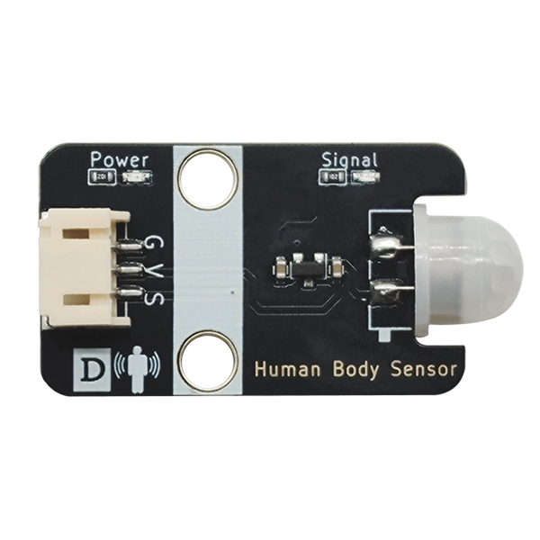
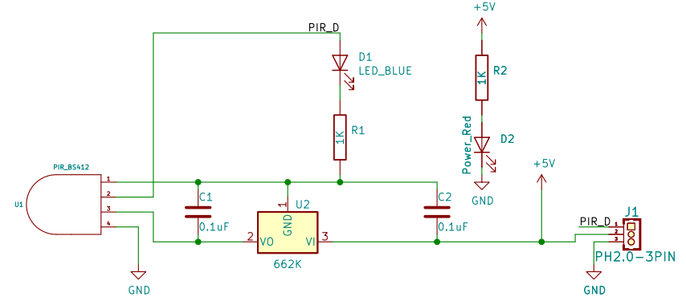
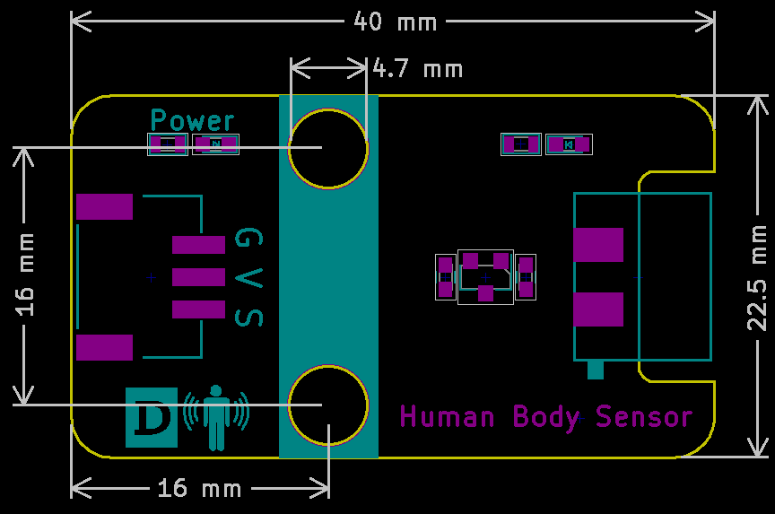

# 人体热释电传感器

## 实物图



## 概述

人体感应模块是基于红外线技术的自动控制产品,灵敏度高，可靠性强，超小体积，超低电压工作模式。广泛应用于各类自动感应电器设备,尤其是干电池供电的自动控制产品。全自动感应，人进入其感应范围则输出高电平，人离开感应范围则自动延时关闭高电平，输出低电平。可重复触发方式：即感应输出高电平后，在延时时间段内，如果有人体在其感应范围活动，其输出将一直保持高电平，直到人离开后才延时将高电平变为低电平，感应模块检测到人体的每一次活动后会自动顺延一个延时时间段（5S），并且以最后一次活动的时间为延时时间的起始点。

## 原理图

<a href="zh-cn/ph2.0_sensors/sensors/human_body_sensor/human_body_sensor_schematic.pdf" target="_blank">查看原理图</a>



## 模块参数

| 引脚名称 |                         描述                          |
| :------: | :---------------------------------------------------: |
|    G     |                          GND                          |
|    V     |                          5V                           |
|    S     | 当前方有人时输出高电平，<br/>当前方没有人时输出低电平 |

- 供电电压:5V
- 连接方式:3PIN防反接杜邦线
- 模块尺寸:40 x 22.5 mm
- 安装方式:M4螺钉兼容乐高插孔固定

## 机械尺寸图



## Arduino示例程序

<a href="zh-cn/ph2.0_sensors/sensors/grayscale_sensor/grayscale_sensor.zip" download>下载示例程序</a>

```c
void setup() {
  Serial.begin(9600);
  pinMode(A3, INPUT);
}

void loop() {
  Serial.println(digitalRead(A3));  // 打印人体热释电传感器数字值
  delay(200);
}
```

## MicroPython示例程序

### Esp32 MicroPython示例程序

```python
from machine import ADC,Pin
import time

digital_pin = 2  # 定义人体热释电传感器数字值引脚
p2 = Pin(digital_pin, Pin.IN)

while True:
    Value = p2.value()  # 读取人体热释电传感器数字值
    print(Value)  # 打印人体热释电传感器数字值
    time.sleep_ms(200)
```

### micro:bit MicroPython示例程序

```python
from microbit import *

while True:
    p = pin8.read_digital() # 读取传感器数字值
    print(p) # 打印传感器数字值
    sleep(1000)
```

## MakeCode示例程序

<a href="https://makecode.microbit.org/_Vhka6M8PFXyh" target="_blank">动手试一试</a>
