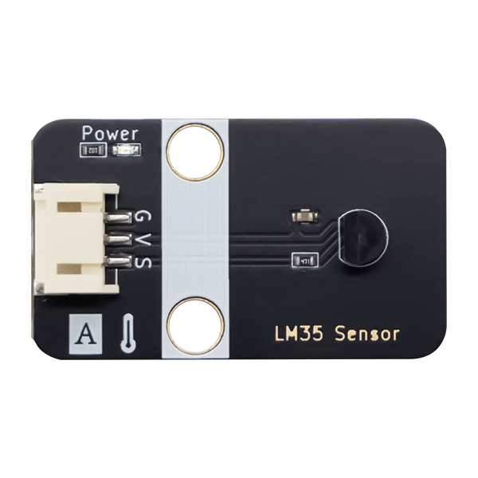

# LM35温度传感器

## 实物图



## 概述

LM35是精密集成电路温度传感器的温度传感器，其输出电压与摄氏温度成线性比例。 因此，LM35远远优于绝对标度线性温度传感器。LM35系列传感器在生产时已经过校准，输出电压对应于摄氏温度，因此应用非常方便。LM35系列传感器的灵敏度为10.0 mV /℃，精度在0.4℃至0.8℃（-55℃至+ 150℃温度范围），重现性高，输出阻抗低。线性输出和内部校准精度使读出或控制电路接口易于使用。

## 原理图

## 尺寸图

## 模块参数

- 可在摄氏温度下直接校准
- +10.0 mV /℃线性比例
- 可确保0.5℃（25℃）的精度
- 工作温度范围为-55℃至+ 150℃
- 它可以长距离应用
- 工作电压范围，从4v到30v
- 低功耗，低于60 uA
- 非线性数据仅为±1/4℃
- 当通过1mA电流时，输出阻抗仅为0.1Ω
- 当通过1mA电流时，输出阻抗仅为0.1Ω

## Arduino 示例程序

```c++
int temp_pin = A0;  // 模拟引脚线LM35 接2线
int value = 0;
int data = 0;
float voltage = 0.0;

void setup() {
  Serial.begin(9600);  // 初始化串行波特率9600
}

void loop() {
  value = analogRead(temp_pin);  // 读取模拟原始数据
  voltage = ((float)value) / 1023;
  voltage = voltage * 5;  // 读取模拟原始数据
  data = voltage * 100;    // 将模拟值转换为实际电压
  Serial.print("Current Temp : ");
  Serial.print(data);
  Serial.println("C");
  delay(500);  // 延迟0.5 s
}
```

## MicroPython示例程序

### Esp32 MicroPython示例程序

```python
from machine import ADC,Pin
import time

analog_pin = 15  # 定义传感器模拟接口引脚

p1 = ADC(analog_pin)
    
while True:
    analog_value = p1.read_u16()  # 读取传感器模拟值
    print("Temperature:",analog_value/4095*3.3*100)  # 打印传感器温度值
    time.sleep_ms(200)
```

### micro:bit  MicroPython示例程序

```python
from microbit import *

analog_pin = pin1  # 定义热敏传感器模拟接口引脚

while True:
    analog_value = analog_pin.read_analog()  # 读取热敏传感器温度值
    print("Temperature::", analog_value/1023*3.3*100)  # 打印传感器温度值
    sleep(0.2)
```

## MakeCode示例程序

<a href="https://makecode.microbit.org/S16109-73952-58076-43616" target="_blank">动手试一试</a>
